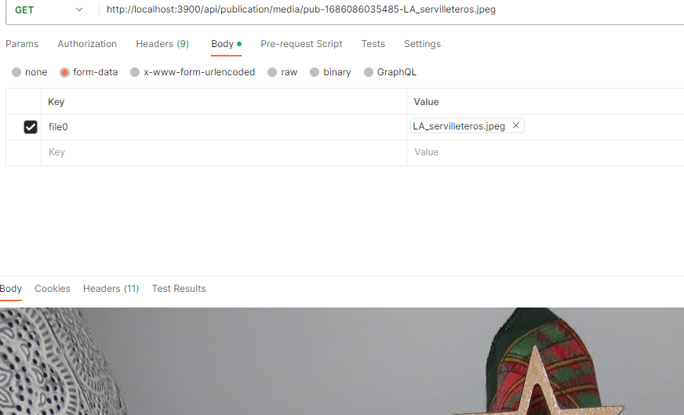

# API-REST RED SOCIAL

### 1. Comprobar que tenemos instalados *node* y *npm*

### 2. Ejecutar *npm init* para crear el *package.json* *(seguir los pasos de la terminal)*

### 3. Instalar dependencias y paquetes en este caso:

    - Express (HTTP, endpoints..) -----------> npm install express
    - Mongoose (Base de datos) --------------> npm install mongoose
    - Mongoose Pagination (Paginacion) ------> npm install mongoose-pagination
    - Multer (Subida de archivos) -----------> npm install multer
    - Moment JS (manipulación de fechas) ----> npm install moment
    - Validator (validar info) --------------> npm install validator
    - Bcrypt (encriptacion - contraseñas) ---> npm install bcrypt
    - JWT Simple (autenticación) ------------> npm install jwt-simple
    - Cors (peticiones entre dominios) ------> npm install cors
    - Nodemon (monitorización - desarrollo) -> npm install nodemon --save-dev

 

### 4. Configuramos *nodemon* para que vaya refrescando el servidor cuando hay cambios o cada vez que guardamos, hace funciones de *monitoreo*:

En el **package-json**, apartado de scripts añadimos:

    "start": "nodemon index.js"

Nodemon internamente ejecutara **npm**, así cuando ejecutemos **npm start** arrancará a través de **nodemon**.

En este punto ya podemos crear el archivo **index.js**.

 

### 5. Para más comodidad crearemos un *.bat* para arrancar *MongoDB*, y arrancar el proyecto en sí. Con esto nos evitaremos tener que acceder a las rutas y arrancarlo manualmente cada vez que vayamos a trabajar.

Tienen que estar ejecutándose para poder trabajar correctamente.

 

### 6. Empezaremos conectándonos a la *base de datos*

Para ello podemos empezar creando una carpeta **database** y un archivo **connection.js**.

Empezamos importando **mongoose**, creamos una función asíncrona que espera la conexión al servidor o si falla que nos saque un mensaje de error.

La *uri* del método **connect** de **mongoose** la podemos obtener de **Mongo Compass**, a la cual le añadimos el nombre de la base de datos a la que nos vamos a conectar.

Si hace falta como segundo parámetro podemos añadir opciones como un objeto **json** entre las llaves **{ }**.

Podemos comprobar si estamos conectados añadiendo un **clg** que nos indique que estamos conectados, si no lo estamos saltará el error que hemos configurado en el **catch**.

Para poder usar la conexión en el **index** y acceder a la base de datos, debemos exportar el método **connection**.
    
 
 
### 7. Conectarse a la base de datos desde *index.js*

Primero importamos las dependencias, de momento la conexión.

Si hemos exportado la conexión de la *Forma 1*, para importar el método **connection**, o un método específico, en caso de que estemos trabajando con otro fichero y tenga más de uno, usaremos:

    const { nombre_metodo } = require('ruta_archivo')

En caso de que hayamos exportado con la *Forma 2*, que solo sirve para cuando exportemos un único método, podemos usar:

    const nombre_metodo = require('ruta_archivo')

Una vez importado para usarlo, lo llamámos como a cualquier función porque lo estamos importando:

    nombre_metodo()

Una vez llamado al método de conexión, en la consola que tenemos abierta con el **nodemon** veremos los mensajes de la conexión.
    
 
 
### 8. Crear servidor de *Node* con *Express*

En **index.js** importamos **express** con:

    const express = require('express')

No se especifica ruta porque es un módulo que a estas alturas existe en el *node modules*.

También nos hará falta importar **cors**:

    const cors = require('cors')

A continuación crearemos el objeto del servidor con la función principal de **express** y también crearemos una constante para el puerto que vayamos a utilizar:

    const app = express()
    const puerto = 3900

Luego configuraremos el cors usando un **middleware**.

Un **middleware** es lo que se ejecuta antes de los **endpoints** que va a contener nuestra **API**.

En estos **middlewares** irá todo el código previo a la ejecución de la **API** en sí, como pueden ser configuraciones por ejemplo.

    app.use(cors())
    
 
 
### 9. Convertir los datos del *body* a objetos *json*

Haremos la conversión también en un **middleware** para que se haga la conversión antes de arrancar la **API**.

    app.use(express.json())

También será necesario convertir los datos que nos lleguen por **urlencoded**, que quiere decir, datos que nos lleguen de algún formulario.

    app.use(express.urlencoded({extended: true}))

Con estas conversiones de datos obtendremos objetos usables por **javascript** para poder tratarlos.

En este punto podemos crear una ruta de prueba para hacer comprobaciones, ya que por el momento no tenemos ninguna ruta definida.

Definiremos una ruta tipo **get** para poder ver los datos que nos devuelve, que recibirán como **callback** 2 parámetros, **req** y **res** *(request y response)*.

    app.get('/ruta-prueba', (req, res) => {
        return res.status(200).json({
            'id':1,
            'nombre': 'Juan Carlos',
            'web': 'jcweb.es'
        })
    })

Una vez definida tendremos que poner al servidor a escuchar peticiones y podremos probar la ruta que acabamos de crear.

    app.listen(puerto, () =>{
        console.log('Servidor de node corriendo en el puerto: ', puerto)
    })

Una vez comprobamos por consola que todo está correcto y se muestra nuestro mensaje, podemos probar la ruta en el navegador o utilizando *Postman*, en este caso con la ruta:

    http://localhost:3900/ruta-prueba

Y esto nos debería devolver el objeto **JSON** que hemos creado a mano en la función de **callback** que hemos creado dentro de la definición de la ruta.
    
 
 
### 10. Crear controladores de prueba

Los controladores van a tener la lógica general de cada una de las rutas, diferentes acciones que van a representar a una ruta concreta y van a tener las funcionalidades pertinentes para cada una de ellas, como pueden ser guardar datos en la base de datos, obtener resultados de la misma, etc.

Para empezar vamos a englobar todos estos controladores en una carpeta llamada **controllers**, donde vamos a ir creando los diferentes controladores.

Crearemos un archivo para cada controlador, y su nombre será el mismo que el de su entidad.

Por ejemplo, si tenemos una entidad llamada **user** en nuestra base de datos, crearemos un archivo para el controlador con el mismo nombre.

Una vez creados los archivos necesarios crearemos métodos de prueba para cada uno de ellos, y con esto podremos dejar configuradas las rutas y los aspectos más importantes. Más tarde configuraremos las funcionalidades de cada uno de ellos para que realmente actúen como nosotros queramos.

Un ejemplo de método de prueba podría ser:

    const pruebaUser = (req, res) => {
        return res.status(200).send({
            message: 'Mensaje enviado desde: controllers/user.js'
        })
    }

    module.exports = {
        pruebaUser
    }

El cual también debemos exportar para poder utilizar los métodos importándolos desde otro archivo.

Este mismo método de prueba nos puede servir para el resto de archivos que hayamos creado.
    
 
 
### 11. Creación de rutas

Una vez tengamos los datos de prueba en nuestros archivos, vamos a crear las rutas. Para empezar podemos crear una carpeta nueva en nuestro proyecto con el nombre **routes** donde guardaremos todas las rutas.

Dentro de esta carpeta crearemos tantos archivos como controladores, o instancias de la base de datos, vayamos a tener. Cada uno de estos archivos va a contener las rutas que tienen relación con su entidad.

Una vez tengamos los archivos, lo primero que vamos a hacer, es importar las librerías necesarias y el controlador correspondiente:

    const express = require('express')
    const router = express.Router()
    const nombre_controlador = require(ruta_controlador)

Para el caso de nuestro controlador **user** importamos:

    const express = require('express')
    const router = express.Router()
    const UserController = require('../controllers/user')

Una vez hecho esto, para definir las rutas, debemos utilizar el objeto del **router** junto con el método **http** que nos interese, para las pruebas usaremos **get**, y a continuación, como parámetros nos pide el fragmento de ruta que vamos a crear y el método del controlador que hemos creado anteriormente.

Para el caso del controlador **user**, utilizando el método **get**:

    router.get('/prueba-usuario', UserController.pruebaUser)

Después solo nos quedaría exportar el **router**:

    module.exports = router

Esta misma configuración de ruta nos vale para crear las rutas de prueba de los demás controladores en los archivos de la carpeta **routes** que acabamos de crear.

Para poder acceder a las rutas que acabamos de crear, tenemos que configurar las rutas dentro del archivo **index.js**

Primero importamos las rutas que hemos exportado anteriormente, para las rutas de **user** quedaría así:

    const UserRoutes = require('./routes/user')

Después cargaremos las rutas en el **middleware** como habíamos hecho con las de prueba, pero ahora, como lo que tenemos que hacer es cargarlas dentro de **express** usaremos el método **use** y también añadiremos un prefijo para cada ruta, en el caso de **user** haríamos lo siguiente:

    app.use('/api', UserRoutes)

Con esto ya podríamos acceder a las rutas que hemos creado, comprobamos antes de nada que en la consola no tengamos ningún error y ya podemos pasar al navegador o a *Postman* para comprobar que las rutas cargan correctamente. Ojo, se tiene que añadir a la ruta el prefijo que hemos creado, en este caso el **/api**:

    http://localhost:3900/api/prueba-usuario
    
 
 
### 12. Crear los modelos

Para empezar crearemos una nueva carpeta con nombre **models** y dentro irán los archivos del modelo de cada una de las instancias que tengamos.

Los **modelos** son objetos que van a definir la estructura que van a tener los documentos, se usan como intermediarios con la base de datos.

Para nuestro caso, de ejemplo, vamos a crear de momento **user.js** dentro de la carpeta **models** que acabamos de crear.

Dentro de este nuevo archivo vamos a definir el esquema de usuario que vamos a utilizar para guardar los datos en la **BBDD**.

Comenzaremos importando los métodos necesarios, en este caso, **Schema** y **model** de **mongoose**

    const {Schema, model} = require('mongoose')

Con esto ya podemos empezar a crear nuestra estructura, para ello debemos usar el método **Schema** que acabamos de importar y pasarle como parámetro un objeto en formato **JSON** con los atributos que vamos a necesitar:

    const UserSchema = Schema({
        name:{
            type: String,
            required: true
        },
        surname: String,
        nick:{
            type: String,
            required: true
        },
        email:{
            type: String,
            required: true
        },
        password:{
            type: String,
            required: true
        },
        role: {
            type: String,
            default: "role_user"
        },
        image:{
            type: String,
            default: "default.png"
        },
        created_at:{
            type: Date,
            default: Date.now
        }
    })
    module.exports = model('User', UserSchema, 'users')

Los campos que contienen la propiedad **required:true** van a ser obligatorios. Por otro lado, los que contengan **default:'valor'**, van a tener un valor por defecto, esto quiere decir que si no le pasamos nada va a tomar ese valor definido.

El campo **image**, está definido como **String**, porque lo que vamos a guardar va a ser el nombre de la imagen que va a estar almacenado en nuestro sistema de archivos del servidor, y con él vamos a poder llamar a la imagen para que se muestre.

En el campo **created_at**, establecemos que se trata de un campo tipo fecha y en con la propiedad **default: Date.now** establecemos que por defecto guarde la hora actual del momento en que se crea, en este caso el usuario.

Por último tenemos que exportarlo con **model**, para poder importar el modelo donde lo vayamos a utilizar y trabajar con él.

Como parámetros pasaremos un **nombre** para el modelo, no tiene porque coincidir con el nombre del esquema que acabamos de crear. Como segundo parámetro le pasamos el **esquema**, y como tercer parámetro, y opcional, le pasaremos un nombre para la **colección**. Por defecto, si no pasamos este último parámetro, **mongoose** capturará el nombre que le hemos dado, lo formateará a minúsculas y lo pluraliza quedando como **users** en nuestro caso.

En esta colección de datos se van a guardar los datos del tipo de modelo que hayamos creado.
    
 
 
### 13. Utilizar el modelo

Vamos a dirigirnos al controlador que corresponda, en nuestro caso el de **user.js** de la carpeta **controllers**.

Aquí vamos a crear un método con un mensaje para probar que todo funciona correctamente.

    const register = (req, res) => {
        return res.status(200).json({
            message: 'Registro de usuarios'
        })
    }

Una vez creado el método debemos añadirlo a la exportación para poder utilizarlo.

    module.exports = {
        pruebaUser,
        register
    }

A continuación, vamos a ir al archivo **user.js** de la carpeta **routes** y vamos a definir la nueva ruta para este método que acabamos de crear, en esta caso va a ser de tipo **get** y le indicaremos el **path** de la ruta con un nombre indicativo y llamaremos en él al método creado.

    router.get('/register', UserController.register)

Comprobaremos en la terminal que no tengamos errores y ya podemos comprobar que funciona desde el navegador o desde *Postman* con la **url**:

    http://localhost:3900/api/register

En este punto hemos cambiado el prefijo de las rutas para que sean más claros:

    (archivo index.js)
    app.use('/api/user', UserRoutes)
    app.use('/api/publication', PublicationRoutes)
    app.use('/api/follow', FollowRoutes)

Ahora que ya hemos comprobado que la ruta funciona correctamente podemos configurar nuestro método para que haga lo apropiado, en este caso *registrar usuarios*.
    
 
 
### 14. Método para registrar usuarios

Lo primero que vamos a hacer es cambiar la ruta que hemos creado anteriormente de **get** a **post**, ya que lo que vamos a hacer es insertar datos en la **BBDD**.

Antes de nada, lo que tenemos que hacer es importar el modelo de usuarios que hemos creado con:

    const User = require('../models/user')

Una vez hecho esto necesitamos recoger los parámetros que nos llegan por la petición.

Para ello vamos a crear una variable que guardará los parámetros que llegan por **post** con **req.body**.

    let params = req.body

Y esta variable la podemos pasar al **return** para ver el resultado mediante *Postman*, por ejemplo, cuando accedamos a la **url**.

Si actualizamos la **url**, veremos que **params** contendrá un objeto vacío, pero si vamos a la pestaña de **body** y enviamos datos como ***x-www-form-urlencoded***, que es como van a llegar los datos del formulario, veremos como se va llenando.

Los datos que hemos definido con algún valor por defecto no hace falta mandarlos.

Una vez tengamos los datos correctamente en nuestra variable **params**, podemos comprobar que llegan los datos que hemos establecido como requeridos con un **if** y enviar un mensaje si no se están pasando correctamente los datos o falta alguno de ellos.

    if(!params.name || !params.email || !params.nick || !params.password){
        return res.status(400).json({
            status: 'error',
            message: 'Faltan datos por enviar',
        })
    }

Esto nos devolverá un error, cuando falten datos requeridos.
    
 
 
### 15. Control de usuarios duplicados

Para controlar que no tengamos usuarios repetidos los que vamos a hacer es usar el método **find** pero de manera condicional con **$or**, para que todo lo que pongamos dentro del array se evalúe como **or**, en nuestro caso, si un **email** o un **nick**, existen tanto en la variable **params** como en el objeto de usuarios **User** que es donde estamos haciendo la busqueda, quiere decir que el usuario ya existe por lo tanto no se tendrá que guardar.

Si usamos un método como **find**, para evaluar una condición, deberemos, mediante una promesa **.then** comprobar el resultado, justo después de la condición del **find** establecida.

En la promesa estableceremos un **callback** que tendrá como parámetro el objeto que nos devuelve la búsqueda con **find** y después de ejecutar todo el código de la promesa capturaremos el posible error con un **catch**.

También podríamos usar un **async await** para que espere al resultado del **find** antes de continuar.

Si nos devuelve un error, retornaremos un mensaje con un **status 500**, por ejemplo, y en formato **json**, también podríamos utilizar **send**, en lugar de **json**, que establecerá el **content-type** adecuado automáticamente.

i no hay error y nos devuelve algún objeto **(users && users.length >= 1)**, quiere decir que ha encontrado un usuario, bien sea con el **email** o el **nick**, y tampoco lo podemos guardar porque estaría duplicado, así que podemos devolver un estado **200**, porque no hay errores, pero con un mensaje de usuario duplicado.

    User.find({ $or: [
        {email: params.email.toLowerCase()},
        {nick: params.nick.toLowerCase()}

    ]}).then((users) => {
        if(users && users.length >= 1){
            return res.status(200).send({
                status: 'success',
                message: 'El usuario ya existe'
            })
        }
        ...
        [resto del código, aquí irá el hash de la contraseña y el guardado]
        ...
    })
    .catch((error) => {
        return res.status(500).json({
            status: 'error',
            message: 'Error en la consulta de usuarios',
            error
    })
    
 
 
### 16. Cifrar contraseña con Bcrypt

Empezaremos importando las dependencias para poder usar **bcrypt**.

    const bcrypt = require('bcrypt')

A continuación, usaremos el método de **bcrypt**, **hash**. A este método debemos pasarle los datos a cifrar como primer parámetro, como segundo parámetro el número de cifrados que queremos que haga **saltOrRounds**, por defecto son 10.

Esto lo podemos guardar en una variable, que en este caso llamaremos **pwd**, pero para que no nos de error, debemos indicarle que será **asíncrono** con un **await**, lo que nos lleva a declarar la función que lo envuelve, que será donde hemos declarado el **then** de la promesa como **async**.

    * Línea de la declaración del "then":
        .then(async(users) => { ...

    * Cifrado de la contraseña
        let pwd = await bcrypt.hash(params.password, 10)

Esto hará un cifrado del password que tendrá una salida similar a esta:

    $2b$10$sbwbXV1I6ceMuC1ZEDgyQ.uygvLrAbAsV7GdifMYfkpD7mMw79/Zm
    *Lo podemos comprobar si hacemos un clg a pwd

Ahora podremos asignar a **params.password** el valor de la variable **pwd** que contendrá el password cifrado y posteriormente crear el objeto de usuario, ya con la contraseña cifrada.

    * Asignación de la contraseña cifrada
        params.password = pwd

    * Crear el objeto de usuario
        let user_to_save = new User(params)

Una vez tengamos el objeto creado y comprobemos que nos lo devuelve correctamente y que no tenemos ningún error por consola, ya podemos guardar el usuario en la base de datos.

Para guardar el usuario usaremos el método **save** que nos guardará el objeto que hemos creado, en este caso **user_to_save**.

Después de usar el método **save**, con una promesa **then**, evaluaremos que no haya errores.

En caso de que haya algún error, retornará un error con **status 500**, por ejemplo, y si todo es correcto, devolveremos la respuesta del registro de usuario correcto.

    user_to_save.save()
        .then(userStored => {
            // Usuario guardado correctamente
            return res.status(200).json({
                status: 'success',
                message: 'Usuario registrado correctamente',
                user: userStored
            })
        }).catch(error => {
            return res.status(500).send({
                status: 'error',
                message: 'Error al guardar el usuario'
            })
        })

Ya podemos prescindir de la devolución de los **params** que teníamos y del objeto que habíamos creado, que nos servían para ir viendo el estado del método.
    
 
 
### 17. Crear el Login

Ahora que tenemos usuarios, podemos crear el método de **login** para los usuarios.

Crearemos un nuevo método que llamaremos **login**, que tendrá como parámetros, **req** y **res**, que ya los vimos en la anterior.

Esta función debe devolver, los datos del usuario si está identificado correctamente, o un **token** de **JWT**, en cualquier caso nos servirá para verificar que el usuario es correcto y se puede **loguear**.

Por el momento para probar que funciona correctamente vamos a devolver un mensaje con un estado **200** como hemos hecho anteriormente, vamos a configurar las rutas, y ver que todo funciona correctamente antes de programar la funcionalidad del método.

    return res.status(200).send({
        status: 'success',
        message: 'Desde Login'
    })

Recuerda que debemos exportar el módulo, y para la ruta debemos configurar en nuestro archivo de **user.js** de la carpeta **routes**, la nueva ruta con la que vamos a acceder.

    router.post('/login', UserController.login)

Ahora ya podemos comprobar que en la consola no tenemos errores y que recibimos el mensaje que hemos configurado al acceder a la ruta creada.
    
 
 
### 18. Funcionalidad de Login

Ya tenemos la ruta funcionando así que podemos empezar a formar el método de **login**.

Para ello lo primero que vamos a hacer, es recoger los datos del **body**, los que recibimos en la petición, es exactamente igual que en el caso anterior.

    let params = req.body

También debemos comprobar que nos llegan los datos solicitados, para este caso, vamos a comprobar si llega un **email** y un **password**, si no vamos a devolver un error.

    if(!params.email || !params.password){
        return res.status(400).send({
            status: 'error',
            message: 'Faltan datos por enviar'
        })
    }

Ahora vamos a buscar si existe el usuario en nuestra base de datos con el método **find**, como ya hemos comprobado anteriormente, si usamos **callbacks** nos va a dar un error **mongoose**, vamos a hacerlo mediante promesas, pero también podríamos usar **async await** para lo mismo.

Con el método **select**, que no habíamos visto aún, podemos, por ejemplo, establecer **created_at** a **false** o **0** y evitaremos que se devuelva en el objeto resultante, aquí podríamos restringir información para que no la pueda ver un usuario.

Por seguridad restringimos la visualización del **password** más adelante.

    User.findOne({ email: params.email })
        .select({"created_at": 0})
        .then((user => {
            if (!user) {
                return res.status(404).send({
                    status: 'error',
                    message: 'No existe el usuario'
                })
            }
            // Comprobar su contraseña

            // Devolver Token

            // Devolver datos usuario

            return res.status(200).send({
                status: 'success',
                message: 'Desde Login',
                user // Añadido para pruebas
            })
        }))
        .catch((error => {
            return res.status(404).send({
                status: 'error',
                message: 'No existe el usuario'
            })
        }))

Dentro del **then**, si hay **email** pero no es correcto, nos devolverá un error, si no nos devuelve un error lo que haremos será comprobar que la contraseña sea correcta y gestionar el **token**, pero por el momento vamos a comprobar que nos devuelve el usuario correctamente y no tenemos errores por consola.
    
 
 
### 19. Comprobar que coincide la contraseña

Para comprobar que coincide la contraseña introducida con la que tenemos almacenada en el usuario usaremos el método de **bcrypt**, **compareSync()**.

A este método deberemos pasarle los dos datos, en nuestro caso **params.password**, que corresponde a la introducida, y **user.password**, que será la que tenemos almacenada en nuestra base de datos de usuarios.

Todo esto podemos guardarlo en una variable, en este caso será nuevamente **pwd**, y con esto podremos hacer un condicional que verifique si concuerdan o no las contraseñas. En el caso de que no concuerden devolvemos un error al usuario.

    let pwd = bcrypt.compareSync(params.password, user.password)

    if(!pwd){
        return res.status(400).send({
            status: 'error',
            message: 'Password incorrecto'
        })
    }
    
 
 
### 20. Generar un token JWT

El **token** nos servirá para acceder de forma segura a los datos de la **API** desde el **front-end**, con esto conseguiremos que solo los usuarios identificados puedan hacer uso del sistema y acceder a las rutas que estamos creando, funcionará a modo de sesión.

Generar el **token**, va a ser una función o **helper** que vamos a poder llamar cuando nos haga falta, así que vamos a aislarlo en otro directorio, y accederemos a él cuando queramos.

Por el momento vamos a crear una nueva carpeta llamada **services**, o **helpers** o el nombre identificativo que queramos.

Lo primero que vamos a hacer será importar las dependencias necesarias, en este caso **jwt-simple** y **moment**, que las hemos instalado al principio del proyecto.

    const jwt = require('jwt-simple')
    const moment = require('moment')

A continuación, vamos a crear la **clave secreta**, esta clave es la que nos va a permitir dar acceso a los usuarios identificados, es con la que controlaremos el acceso al **back-end** desde el **front-end**.

Como es una **clave secreta** podemos complicarla todo lo queramos a la hora de crearla.

    const secret = 'CLAVE_SECRETA_red_SociAL_552345'

Con esta **clave secreta** ciframos y desciframos el **token**.

Ahora ya podemos crear el método para la creación del **token**.

Como ya hemos comentado que el **token** va a funcionar como sesión, vamos a almacenar aquí datos del objeto de usuario y vamos a configurar una fecha de creación del **token**, **iat**, y una fecha de expiración **exp**.

Estas dos propiedades las crearemos con **moment** y en formato de fecha **unix** para este caso.

    const create_token = (user) => {
        const payload = {
            id: user._id,
            name: user.name,
            surname: user.surname,
            nick: user.nick,
            email: user.email,
            role: user.role,
            image: user.image,
            iat: moment().unix(),
            exp: moment().add(90, 'days').unix()
        }
        return jwt.encode(payload, secret)
    }

La propiedad **exp**, indica que el token expira en 90 días, y le tenemos que pasar también el formato que será también **unix**.

Devolveremos en este caso un objeto **JWT** codificado, pasándole al método **encode** de **JWT**, los datos que va a cargar, **payload** y la clave secreta, **secret**.

Por último, exportamos el método creado y la clave secreta que la vamos a necesitar más adelante para hacer la autenticación usando el **token**.

    module.exports = {
        secret,
        create_token
    }
    
 
 
### 21. Usar nuestro token

Para utilizar nuestro **token** empezaremos importandolo en el método donde vayamos a utilizarlo, en este caso lo vamos a hacer en el archivo **user.js** 
de la carpeta **controller**.

    const jwt = require('../services/jwt')

Ahora ya podemos utilizarlo para que nos cree un **token**, antes de nada, en nuestra devolución de donde teníamos el mensaje de ***Desde Login*** y enviamos todo el objeto de usuario para pruebas, vamos a hacer unos cambios.

Cambiaremos primero el mensaje, en nuestro caso va a mostrar "***Identificado Correctamente***", ya que va a ser el mensaje que se verá cuando todo el login sea correcto. También vamos a limitar la salida del objeto de usuario para que nos muestre, el **id**, el **nombre** y el **nick** de momento, y vamos a añadir que nos muestre el **token** que vamos a crear.

    return res.status(200).send({
        status: 'success',
        message: 'Identificado Correctamente',
        user: {
            id: user._id,
            name: user.name,
            nick: user.nick
        },
        token
    })

Ahora podemos configurar la obtención del **token**, y veremos el resultado en la devolución, junto con el mensaje y el objeto simplificado del usuario.

Crearemos una variable, que llamaremos **token** y usaremos el método **create_token()** que acabamos de crear y le pasaremos el objeto de usuario.

    const token = jwt.create_token(user)

Si comprobamos la salida de este **token**, veremos que cada vez que lo generamos se crea un **token** distinto y cifrado.
    
 
 
### 22. Middleware de autenticación

Vamos a crear ahora un **middleware** para autenticarnos antes de acceder a las rutas. Estos **middlewares** los podremos añadir en la declaración de las rutas para aquellas rutas que creamos convenientes, en este caso para comprobar que el usuario está autenticado antes de acceder a la ruta.

Para ello vamos a crear, también, estos **middlewares** aislados del resto del código, y los importamos y usaremos cuando sea necesario.

Así pues, crearemos otra carpeta con el nombre que queramos, en nuestro caso la llamaremos **middlewares**, y dentro de ella crearemos un archivo llamado **auth.js**, que hará las comprobaciones.

Primero de todo, como siempre, importamos las dependencias y módulos necesarios, en este caso necesitaremos **jwt-simple**, **moment**, la librería que hemos creado en services y la clave secreta que tenemos guardada en esa librería.

    const jwt = require('jwt-simple')
    const moment = require('moment')
    const libjwt = require('../services/jwt')
    const secret = libjwt.secret

Ahora ya podemos crear la función para la autenticación, en este caso la exportamos directamente declarando la función con el método **exports.nombre_de_la_funcion**, ya que va a ser lo único que vamos a exportar, y pasándole como parámetros, **req**, **res** y **next**.

**Next** nos va a servir para pasar a la siguiente acción en el cual está aplicado este **middleware**, en este caso a ejecutar el método definido en la ruta, donde también vamos a llamar al **middleware**.

    exports.auth = (req, res, next) => {
        ...

Dentro de esta función, lo primero que tenemos que hacer es comprobar que nos llegan las ***cabeceras de autenticación***, para ello crearemos una condición que devuelva un error si estas cabeceras no existen.

    if(!req.headers.authorization){
        return res.status(403).send({
            status: 'error',
            message: 'Falta cabecera de autenticación'
        })
    }

El siguiente paso, será sanear el **token**. El **token** puede llegar formateado con comillas simples **( ' )** o dobles **( " )**, así que lo que tenemos que hacer es asegurarnos de que llega limpio, y esto lo haremos con una *expresión regular*.

    let token = req.headers.authorization.replace(/['"]+/g, '')

La *expresión regular*, busca caracteres de comilla simple y doble en cualquier posición y las reemplaza con **.replace()** por nada, así que sencillamente las eliminará.

Ahora que tenemos el **token** saneado tenemos que decodificarlo, esto lo haremos dentro de un bloque **try-catch**, ya que es probable que ocurra algún error.

Si obtenemos un error, entraremos en el bloque **catch** y devolveremos un error como los vistos hasta el momento indicando que el **token** no es válido con un mensaje.

Si no, guardaremos el **token** decodificado en una variable utilizando el método **decode()** de **jwt** y pasándole el **token** que hemos saneado y la **clave secreta** que la tenemos importada.

A continuación, deberemos comprobar que el **token** no haya ***expirado***, y para ello crearemos una condición evaluando la ***fecha de expiración*** del **token** con la fecha actual usando **moment()**. Si queremos forzar este error para comprobar que funciona, estableceremos "***(-1, 'days'*)**", lo que provocará que siempre haya expirado.

También tenemos que añadir los datos del usuario a la **request**, lo que nos proporcionará los datos del usuario en la **request** de cualquier método donde usemos **req**. Acordémonos que gracias al **token** tendremos los datos del usuario como si se tratase de una variable de tipo sesión así que eso hacemos en este paso.

    try {
        let payload = jwt.decode(token, secret)

        // Expiración token
        if (payload.exp <= moment().unix()) {
            return res.status(401).send({
                status: 'error',
                message: 'Token expirado'
            })
        }
        req.user = payload

    } catch (error) {
        return res.status(404).send({
            status: 'error',
            message: 'Token no válido'
        })
    }

Y por último, ejecutamos el método **next** para que la ejecución pase a la siguiente acción o método disponible.

    next()
    
 
 
### 22. Usando el middleware

Para usar el **middleware**, en este caso para que compruebe la autenticación del usuario antes de acceder a la ruta, vamos a importarlo en **user.js** de nuestra carpeta de **routes**.

    const mid_auth = require('../middlewares/auth')

Y a continuación, llamamos a **auth**, como parámetro de la definición de rutas, antes de la llamada al método de **UserController**. Lo haremos para probarlo en la ruta de prueba.

    router.get('/prueba-usuario', mid_auth.auth, UserController.pruebaUser)

Necesitaremos para comprobarlo, hacer el **login** por un lado, desde la ruta de **login** que tenemos creada con un usuario válido y por otro la ruta a la que acabamos de aplicarle el método **auth**.
**Capturas pestañas Postman**

Pero ahora si accedemos a la ruta de prueba nos dirá que faltan las cabeceras porque no estamos autenticados, así que lo que tenemos que hacer es añadir a **headers** un **header** nuevo con el nombre de **Authorization** y como valor añadirle el **token** que tenemos en la pestaña de **login**. Con esto veremos el mensaje de prueba que hicimos al principio del proyecto.

Ahora bien, vamos a comprobar que en la **request** tenemos guardados los datos del usuario con el que hemos hecho el login. Para ello solo tenemos que añadir en la devolución de nuestro método de prueba, después del mensaje una propiedad que contenga la **req**.

    const pruebaUser = (req, res) => {
        return res.status(200).send({
            message: 'Mensaje enviado desde: controllers/user.js',
            user: req.user
        })
    }

Y ya podemos ver que tenemos los datos disponibles.

En resumen, podemos añadir este método de **auth** a todas las rutas que necesiten autenticación previa por parte del usuario.
    
 
 
### 23. Método para recoger datos de un usuario

Vamos ahora, a recuperar los datos del perfil de un usuario, para ello podemos crear un nuevo método en **user.js** de la carpeta **controller** que recibirá, a través de la url, el **id** del usuario, hará la consulta y devolverá el resultado de la misma.

Comenzaremos por crear la ruta con la que vamos a trabajar. En nuestro archivo de **user.js** de la carpeta **routes** crearemos esta ruta como **get**, ya que lo que va a hacer es recoger los datos.

A esta ruta le vamos a pasar como parámetro el **id** del usuario, así que lo indicamos con "**( : )**" en la definición del **path**, y también le pasaremos el método de autenticación que creamos anteriormente, ya que para ver los perfiles necesitaremos haber hecho **login**.

    router.get('/profile/:id', mid_auth.auth, UserController.profile)

Una vez creada la ruta podemos crear nuestro método, que recibirá como parámetros **req** y **res**. Cómo recibimos los datos por **url** y no mediante la sesión utilizaremos **req.params.id**, que recogerá el **id** de la **url**.

Para la consulta usaremos el método **findById**, pasándole como parámetro el **id**, y mediante promesas gestionaremos tanto los errores como el resultado en caso de que no haya ninguno, como hemos hecho en anteriores métodos.

También usaremos el método **select** para filtrar los campos que no queremos mostrar del objeto de usuarios ya que hay algunos de ellos que no se deberían mostrar, como el **password** por ejemplo.

    const profile = (req, res) => {
        const id = req.params.id

        User.findById(id)
            .select({password: 0, role: 0})
            .then((userProfile => {
                if(!userProfile){
                    return res.status(404).send({
                        status: 'error',
                        message: 'El usuario no existe'
                    })
                }

                return res.status(200).send({
                    status: 'success',
                    user: userProfile
                })
            }))
            .catch (e => {
                return res.status(500).send({
                    status: 'error',
                    message: 'Error al buscar el usuario',
                })
            })
    }
    
 
 
### 24. Listado de usuarios paginado

Ahora vamos a crear un método para devolver los usuarios, pero con **paginación**, esto quiere decir que nos va a devolver los usuarios en función del número de página en el que nos encontremos.

Empezaremos, como hasta ahora, creando la ruta en **user.js** de la carpeta **routes**. En este caso como parámetro en el **path** de la ruta, vamos a pasar parámetro opcional con **( ? )** al final de la declaración, lo que indicará que si no existe ese parámetro en la ruta, la página por defecto será la 1.

    router.get('/list/:page?', mid_auth.auth, UserController.list)

Para la creación de este método con paginación, necesitaremos antes de nada importar **mongoose-pagination** que nos proporciona la funcionalidad que queremos.

    const mon_pagination = require('mongoose-pagination')

Empezaremos por controlar en qué número de página estamos, recordemos que este valor siempre tiene que estar en formato **int**, así que tendremos que convertirlo con **parseInt** para asegurarnos de que siempre sea así, ya que los valores que pasamos por la url siempre se van a tratar como **string**.

    let page = 1
    if(req.params.page){
        page = req.params.page
    }
    page = parseInt(page)

Ahora podemos hacer la consulta con **mongoose-pagination**. Tenemos que tener en cuenta que le tenemos que pasar la ***página actual*** y el ***número de ítems por página***. Para ello podemos crear una nueva variable que almacene este último valor.

    let itemsPage = 1

Esto indicará que tendremos 1 usuario por página.

A continuación, vamos a determinar el número de usuarios con el método **find**. Lo único que haremos será hacer una búsqueda de todos los usuarios y almacenar su valor en una variable para poder usarla luego.

    let total = 0 

    User.find()
        .then(users => {
            total = users.length
        })

Usando de nuevo el método **find** buscaremos todos los usuarios, y con **sort** los ordenaremos, en este caso, por su campo **_id**. A continuación usaremos el método **paginate** y le indicaremos la página actual con la variable **page** que hemos creado anteriormente y el número de ítems por página con la variable **itemsPage**.

Mediante una ***promesa***, como hemos hecho en casos anteriores comprobaremos los errores que pueda haber, incluyendo que no se reciban usuarios, y devolveremos los usuarios, la página actual y el número de ítems.

El código completo quedaría de la siguiente manera.

    const list = (req, res) => {
        // Controlar en qué página estamos
        let page = 1
        if (req.params.page) {
            page = req.params.page
        }
        page = parseInt(page)

        // Consulta con mongoose paginate
        let itemsPage = 1

        User.find().sort('_id').paginate(page, itemsPage)
            .then((users  => {
                if (!users) {
                    return res.status(404).send({
                        status: 'error',
                        message: 'No se encontraron usuarios'
                    })
                }

                return res.status(200).send({
                    status: 'success',
                    users,
                    page,
                    itemsPage,
                    total,
                    pages: Math.ceil(total / itemsPage)
                })

            }))
            .catch(error => {
                return res.status(500).send({
                    status: 'error',
                    message: 'Error al consultar usuarios',
                    error
                })
            })
    }

Cuando probemos el código en ***Postman*** por ejemplo, podemos cambiar en la ***url*** el número de la ***página*** y veremos que nos cambia el resultado mostrado. Si no tenemos más usuarios nos devolverá un objeto vacío.

Para poder probar la paginación, en este punto, vamos a crear algún usuario más, en nuestro caso 5 usuarios más.

Si cambiamos el valor de **itemsPage** veremos que podemos tener tantos usuarios como le hayamos indicado en esta variable, en la misma página.
    
 
 
### 25. Actualizar los datos del usuario

Para actualizar los usuarios vamos a usar los datos que tenemos al autenticarnos, aquellos datos que teníamos en la sesión, ya que solo podremos actualizar nuestros propios datos.

Empezaremos como siempre, creando la ruta que en este caso va ser por **put**.

    router.put('/update', mid_auth.auth, UserController.update)

Ahora que tenemos la ruta configurada lo primero que vamos a hacer será recoger los datos que tenemos almacenados en la sesión y los datos nuevos que vamos a recibir del usuario. Los guardaremos en una variable cada uno.

    let userData = req.user
    let userUpdate = req.body

Podemos también, opcionalmente, eliminar datos que no nos interesen mostrar ahora mismo, o que no se van a actualizar.

    delete userUpdate.iat
    delete userUpdate.exp
    delete userUpdate.role
    delete userUpdate.image

Luego, tendremos que comprobar, cómo hemos hecho con el registro de usuarios, si el usuario ya existe en la base de datos. Para ello volveremos a utilizar **$or**, y comprobaremos que el **nick** y el **email** no estén ya registrados en otro registro de otro usuario.

Crearemos una variable **userIsset** inicializada a **false**, recorreremos el objeto de usuario y comprobaremos que el **id** del usuario sea el mismo que estamos editando, para poder cambiarlo si no devolveremos un mensaje de que ya existe.

    User.find({
        $or: [
            { email: userUpdate.email.toLowerCase() },
            { nick: userUpdate.nick.toLowerCase() }

        ]
    }).then(async (users) => {
        let userIsset = false

        users.forEach(user => {
            if (user && user._id != userData.id) userIsset = true
        });

        if (userIsset) {
            return res.status(200).send({
                status: 'success',
                message: 'El usuario ya existe'
            })
        }
        ...

También tendremos que comprobar si nos llega un nuevo **password**, en caso de que llegue lo volveremos a cifrar.

    if (userUpdate.password) {
        let pwd = await bcrypt.hash(userUpdate.password, 10)
        userUpdate.password = pwd
    }

Ahora solo nos queda buscar los datos del usuario y actualizarlos, lo haremos con el método **findByIdAndUpdate**, es similar a como hemos guardado usuarios anteriormente, deberemos tener en cuenta los posibles errores que podremos tener.

    User.findByIdAndUpdate(userData.id, userUpdate, { new: true })
        .then((userUpdated => {
            if(!userUpdated){
                return res.status(404).json({
                    status: 'error',
                    message: 'Error usuario no encontrado',
                })
            }

            // Respuesta correcta
            return res.status(200).send({
                status: 'Succes',
                message: 'Usuario Actualizado Correctamente',
                userUpdated
            })

        })) .catch (error => {
            return res.status(500).json({
                status: 'error',
                message: 'Error al actualizar usuario',
                error
            })
        })
        ...

Con **new:true** como parámetro indicamos que nos devuelva el objeto que acabamos de actualizar.

El código completo del método de actualizar quedaría de la siguiente manera.

    const update = (req, res) => {
        // Recoger info del usuario
        let userData = req.user
        let userUpdate = req.body

        //Eliminar campos sobrantes
        delete userUpdate.iat
        delete userUpdate.exp
        delete userUpdate.role
        delete userUpdate.image

        // Comprobar si el usuario existe
        User.find({
            $or: [
                { email: userUpdate.email.toLowerCase() },
                { nick: userUpdate.nick.toLowerCase() }

            ]
        }).then(async (users) => {
            let userIsset = false

            users.forEach(user => {
                if (user && user._id != userData.id) userIsset = true
            });

            if (userIsset) {
                return res.status(200).send({
                    status: 'success',
                    message: 'El usuario ya existe'
                })
            }

            // Cifrar la contraseña si llega
            if (userUpdate.password) {
                let pwd = await bcrypt.hash(userUpdate.password, 10)
                userUpdate.password = pwd
            }

            // Buscar y actualizar datos
            User.findByIdAndUpdate(userData.id, userUpdate, { new: true })
                .then((userUpdated => {
                    if(!userUpdated){
                        return res.status(404).json({
                            status: 'error',
                            message: 'Error usuario no encontrado',
                        })
                    }

                    // Respuesta correcta
                    return res.status(200).send({
                        status: 'Succes',
                        message: 'Usuario Actualizado Correctamente',
                        userUpdated
                    })

                })) .catch (error => {
                    return res.status(500).json({
                        status: 'error',
                        message: 'Error al actualizar usuario',
                        error
                    })
                })

        }).catch((error) => {
            return res.status(500).json({
                status: 'error',
                message: 'Error en la consulta de usuarios',
                error
            })
        })
    }
    
 
 
### 26. Subida de archivos. Imagen Usuario

Empezaremos creando la nueva ruta para la subida de archivos.

    router.post('/upload', mid_auth.auth, UserController.upload)

En este mismo archivo de rutas vamos a importar **multer**, que lo tenemos instalado desde el principio del proyecto y será el encargado de la subida de archivos al servidor mediante las peticiones.

    const multer = require('multer')

Una vez hecho esto, deberemos configurar **multer**, indicando dónde van a estar almacenados los archivos que se van a subir mediante **multer**, que lo haremos mediante un **middleware**, y que nombre van a tener estos archivos.

Para configurar **multer** necesitaremos hacer uso de su método **diskStorage**. Dentro de este método guardaremos un objeto con 2 propiedades **destination** y **filename**, que como su nombre indica serán, el directorio de destino de los archivos subidos y el nombre de los archivos.

    const storage = multer.diskStorage({
        destination: (req, file, cb) => {
            cb(null, './uploads/avatars')
        },
        filename: (req, file, cb) => {
            cb(null, 'avatar-'+ Date.now() +'-'+ file.originalname)
        }
    })

Tanto **destination** como a **filename**, van a tener como valor una función que recibe como parámetros, **req**, **file** y **cb**. Con el método **cb**, vamos a hacer la configuración en ambos casos, el primer parámetro de error, aquí lo podemos establecer a **null** porque lo vamos a gestionar con la imagen por defecto en su lugar, como segundo parámetro, en el caso de **destination** tendremos la ruta donde se van a guardar las imágenes en este caso, y en el caso de **filename**, tendremos el formato del nombre que se le va a dar. Para este caso concreto estamos usando la fecha para tener nombres únicos y con el método de **file**, **originalname** estamos recuperando el nombre original del archivo que vamos a subir.

Por último, para aplicar esta configuración a **multer** vamos a pasarle un objeto con la variable que contiene la configuración que acabamos de crear.

    const uploads = multer({storage})

Esta variable configurada, será el **middleware** que le tenemos que pasar a la ruta. Y para pasar varios **middlewares** a la misma ruta, tenemos que envolverlas en un **array**. Además a **uploads** debemos indicarle que va a recibir, en este caso un único archivo ***single***, y desde qué campo, este parámetro corresponderá al atributo **name** del formulario desde donde se va a recibir.

    router.post('/upload', [mid_auth.auth, uploads.single('file0')], UserController.upload)

Ahora podemos volver a nuestro **user.js** del controlador y crear un método que nos permita hacer pruebas para ver que se sube la imagen correctamente.

    const upload = (req, res) => {
        return res.status(200).json({
            status: 'Succes',
            message: 'Upload',
            user: req.user,
            file: req.file
        })
    }

Añadimos al **export** el método creado y podemos comprobar que se suben las imagenes desde ***Postman***.

    module.exports = {
        pruebaUser,
        register,
        login,
        profile,
        list,
        update,
        upload
    }

En ***Postman***, lo que vamos a hacer es dirigirnos a la ruta que hemos creado y desde **body**, con **form-data** seleccionado le vamos a indicar que vamos a incluir un **file** y le vamos a poner el nombre que hemos establecido en la configuración de multer para el **name**. Solo nos queda seleccionar la imagen y ver que nos devuelve el objeto con los datos de la imagen, y que en la carpeta que hemos creado para almacenarla la tenemos guardada.

 
    
 
 
### 27. Método Controlador para trabajar con la imagen

Ahora que ya podemos guardar las imágenes, lo que tenemos que hacer es controlar las imágenes que se suben y que se suben bien.

Para ello vamos primero a comprobar que nos llega la imagen, simplemente, dentro de la función **upload** que hemos creado anteriormente, construiremos un condicional.

    if(!req.file){
        return res.status(404).send({
            status: 'error',
            message: 'No se incluye la imagen'
        })
    }

Una vez comprobado esto necesitaremos, conseguir el nombre del fichero que estamos subiendo, esto lo podemos hacer con **req.file** que ya sabemos que vamos a estar recibiendo.

    let img = req.file.originalname

Si queremos comprobar que nos guarda el nombre de la variable correctamente, en la respuesta con estado 200, que ya teníamos creada, la añadiremos y veremos que se añade una propiedad nueva con el nombre original de la imagen.

A continuación, vamos a recuperar la extensión de este nombre de archivo que estamos recuperando. Para ello nos ayudaremos del método **split**, que le indicará que separe en un array el nombre basándose en el punto que hay siempre delante de la extensión. Deberemos escapar este punto.

    const img_split = img.split("\.")
    const extension = img_split[1]

Y como el array quedará con el nombre del archivo por un lado, y la extensión por otro, sabemos que la extensión estará siempre en el índice **[ 1 ]**, así que ya podemos pasar a comprobar la extensión del archivo.

Para comprobar la extensión haremos una condición negando las extensiones que vayamos a aceptar, esto se debe, a que dentro de esta condición, si el archivo no es de ninguna de esas extensiones, lo borraremos y devolveremos un error.

Para el borrado del archivo, vamos a hacer uso del módulo **fs (file-system)**, que se usa para trabajar con archivos, así que antes de la condición vamos a importarlo en la parte superior.

    const fs = require('fs')

Ahora ya podemos crear la condición como hemos indicado anteriormente.

    if(extension != 'png' && extension != 'jpg' && extension != 'jpeg' && extension != 'gif'){

        // Borrar archivo subido
        const file_path = req.file.path
        const del_file = fs.unlinkSync(file_path)

        // Devolver respuesta
        return res.status(400).send({
            status: 'error',
            message: 'Archivo incorrecto'
        })
    }

En este punto podremos comprobar, antes de seguir que si intentamos subir algún archivo que no corresponda con las extensiones anteriores se borrará y no se incluirá en nuestra carpeta **avatars**.

Ahora lo que tenemos que hacer es actualizar la imagen con la imagen seleccionada. Usaremos el método **findByIdAndUpdate**, pasandole el **id** que tenemos en **req.user** e indicando la propiedad que queremos actualizar en forma de objeto. También le vamos a indicar **new: true**, para que nos devuelva los datos actualizados.

A continuación usaremos una ***promesa*** a la que le pasaremos un parámetro que se llamará como nosotros queramos, es este caso **userUpdated**. 

Si no recibimos **userUpdated**, devolveremos un error, de que la imagen no existe o no se ha encontrado y si lo recibimos lo mostraremos en un **return** con estado 200, junto con los datos del archivo que estamos subiendo.

Tendremos que establecer el **catch** para la promesa, por si se devuelve algún otro error.

    User.findByIdAndUpdate(req.user.id, {image: req.file.filename}, {new: true})
        .then((userUpdated => {
            if(!userUpdated){
                return res.status(404).send({
                    status:'error',
                    message: 'Imagen no encontrada'
                })
            }

            // Devolver respuesta
            return res.status(200).json({
                status: 'success',
                user: userUpdated,
                file: req.file
            })
        })).catch (error => {
            return res.status(500).send({
                status: 'error',
                message: 'Error al guardar imagen'
            })
        })

Ahora podemos comprobar que funciona correctamente, que no tenemos errores por consola y lo más importante, que tenemos el nombre de la imagen guardado en la base de datos, y la imagen en nuestra carpeta de **avatars**.
    
 
 
### 28. Obtener el avatar guardado

Para obtener el avatar del usuario vamos a necesitar crear otra ruta, esta será por **get**, puesto que nos va a devolver un resultado, y le pasaremos un parámetro obligatorio que será el archivo de la imagen y el **middleware** de autenticación.

    router.get('/avatar/:file', mid_auth.auth, UserController.avatar)

Una vez tenemos la ruta y comprobamos que funciona, vamos a por el método.

En este método tenemos que conseguir que se nos devuelva la imagen que esté guardada en nuestra base de datos y/o en nuestra carpeta **avatars**. Para ello lo primero que tenemos que conseguir es el parámetro que vamos a pasar por la **url** y también tendremos que obtener la **ruta, o path**, de las imágenes en general y en concreto de la que estamos buscando, esto lo vamos a guardar en 2 variables.

    const file = req.params.file
    const file_path = './uploads/avatars/' + file

A continuación, tendremos que verificar si existe el archivo, y para ello vamos utilizar el método **stat** de **file-system**. Este método requiere que le pasemos la ruta donde se encuentra el archivo y como segundo parámetro tendrá un **callback** que recibirá un error, en caso de que lo haya, y un segundo parámetro que es el que usaremos para comprobar que el archivo existe.

    fs.stat(file_path, (error, exists) => {
        if (!exists) {
            return res.status(404).send({
                status: 'error',
                message: 'No existe la imagen',
                error
            })
        }
        ...

Además, dentro de este mismo **callback** vamos a devolver la imagen en sí utilizando el método de **express**, **sendFile**.

Este método tiene que recibir la ruta de la imagen, pero debe ser una ruta absoluta, así que si le pasamos la que tenemos almacenada en **file_path** nos dará un error.

Para solucionar esto, importamos **path** de la librería de **node** con:

    const path = require('path')

Ahora, utilizando el método **resolve** que contiene **path** podremos indicarle la ruta absoluta de nuestro **file_path** a **sendFile**, ya que **resolve**, busca el archivo en la ruta relativa que le pasamos y la convierte en absoluta.

    return res.sendFile(path.resolve(file_path))

El método completo quedaría de la siguiente forma.

    const avatar = (req, res) => {
        // Obtener parámetro de la url
        const file = req.params.file

        // Montar el path de la imagen
        const file_path = './uploads/avatars/' + file

        // Comprobar que existe el archivo
        fs.stat(file_path, (error, exists) => {
            if (!exists) {
                return res.status(404).send({
                    status: 'error',
                    message: 'No existe la imagen',
                    error
                })
            }

            // Devolver un file
            return res.sendFile(path.resolve(file_path))
        })
    }
    
 
 
### 29. Añadiendo modelo de Follows

Como esta **API**, es para una red social, vamos a implementar unos **follows**, esto nos permitirá seguir a otros usuarios como en cualquier red social actual.

Comenzaremos creando el modelo de **follow**, en la carpeta **models**.

Dentro de este archivo lo primero que tenemos que hacer es importar **Schema** y **model** de la librería de **mongoose**.

A continuación creamos el esquema con el nombre que queramos e indicando que va a ser un **Schema**, y dentro le pasaremos el objeto con los datos que va a almacenar.

En este caso, crearemos **user** y **followed**, que se van a referir al usuario que hace el **follow** y al usuario seguido, y como se van a referir a los usuarios por su **id**, el tipo de estas propiedades va a ser **Schema**.**ObjectId** y se tiene que referenciar al objeto de donde sacaremos esta información que, en este caso es, **User**.

    // Importar dependencias
    const {Schema, model} = require('mongoose')

    // Esquema Follow
    const FollowSchema = Schema({
        user: {
            type: Schema.ObjectId,
            ref: "User"
        },
        followed: {
            type: Schema.ObjectId,
            ref: "User"
        },
        created_at:{
            type: Date,
            default: Date.now
        }
    })

Una vez creado debemos exportar este modelo usando **model** en el **module.exports** e indicando, cómo se va a llamar el modelo, el esquema que va usar, y el nombre de la colección donde se van a almacenar los datos.

    module.exports = model('Follow', FollowSchema, 'follows')

Para poder usarlo, nos dirigimos al archivo de **follow.js** que deberemos tener o crear en la carpeta **controller** y lo importamos.

    const Follow = require('../models/follow')

Anteriormente, en este archivo, creamos unos métodos de prueba con el correspondiente archivo **follow.js** en la carpeta **routes** para comprobar que las rutas principales funcionan correctamente.

    // Importar modelo
    const Follow = require('../models/follow')

    // Acciones de prueba
    const pruebaFollow = (req, res) => {
        return res.status(200).send({
            message: 'Mensaje enviado desde: controllers/follow.js'
        })
    }

    // Exportar acciones
    module.exports = {
        pruebaFollow
    }
    
 
 
### 30. Seguir a un usuario

Vamos a crear el primer método de **follow** que va a consistir en seguir a un usuario. Pero antes vamos a importar el modelo de usuarios porque también nos va a hacer falta.

    const User = require('../models/user')

Como en los métodos anteriores vamos a crear una respuesta de prueba y añadiremos el método a la exportación.

    const save = (req, res) =>{
        return res.status(200).send({
            status: 'success',
            message: 'Follow'
        })
    }

    module.exports = {
        pruebaFollow,
        save
    }

Ahora vamos a crear la ruta para este método, en el archivo **follow.js** de la carpeta **routes**. Debemos recordar que como para las rutas de user, teníamos configurado como prefijo **/api/user**, en **follow** tenemos **/api/follow**.

Además, en el archivo de rutas de follow también importamos el **middleware** de autenticación que creamos para los usuarios para poder comprobar si el usuario está logueado.

    const mid_auth = require('../middlewares/auth')

Ahora ya podemos crear la ruta, y comprobar que funciona en ***Postman***. En este caso será con el método **post** ya que tenemos que guardar la información relativa a la acción de seguir del usuario.

    router.post('/save', mid_auth.auth, FollowController.save)

Si todo va bien, ya podemos construir el método de **save**.

Empezaremos por recoger los datos que nos llegan por el **body** que es donde van a estar los datos del usuario al que vamos a seguir o hacer **follow**.

    const params = req.body

Necesitamos también, recoger los datos del usuario actual, con el que estamos logueados y estos los tenemos en **req.user**.

    const identity = req.user

Ahora crearemos un objeto del modelo **Follow** que creamos anteriormente con los datos de ambos usuarios.

    let user_follow = new Follow({
        user: identity.id,
        followed: params.followed
    })

Y por último, usaremos el método **save**, para guardar este registro en la base de datos, comprobando los posibles errores.

    user_follow.save()
        .then((followStored) => {
            if (!followStored) {
                return res.status(404).send({
                    status: 'error',
                    message: 'Usuario no encontrado'
                })
            }

            return res.status(200).send({
                status: 'success',
                identity: req.user,
                followStored
            })

        }).catch((err) => {
            return res.status(500).send({
                status: 'error',
                message: 'Error al seguir al usuario'
            })
        });

Recordemos que para hacer las pruebas en ***Postman***, en la pestaña **body** debemos introducir los valores para que los recoja sino nos dará continuamente un error porque no está recibiendo nada. En nuestro caso debemos añadir la **key** **followed** y tendremos que copiar un **id** del usuario que vamos a seguir de nuestra base de datos.
    
 
 
### 31. Dejar de seguir a un usuario

Ahora vamos a crear el método para dejar de seguir a un usuario, y como siempre vamos a comenzar por construir una respuesta de prueba.

    const unfollow = (req, res) => {
        return res.status(200).send({
            status: 'success',
            identity: req.user,
        })
    }

Luego, la ruta, que en este caso va a ser por **delete** porque lo que vamos a hacer es eliminar el registro donde tenemos los datos del **follow** que hemos hecho anteriormente, y le vamos a pasar por la ruta el **id** del usuario al que queremos dejar de seguir.

    router.delete('/unfollow/:id', mid_auth.auth, FollowController.unfollow)

Y ahora ya podemos ir a ***Postman***, e indicando que la ruta es por **delete**, comprobamos que la ruta funcione correctamente.

Una vez comprobamos que la ruta está correcta, pasamos a la creación del método. Lo primero será recuperar el **id** del usuario con el que estamos logueados y vamos a hacer la acción de dejar de seguir.

    const user_id = req.user.id

También necesitamos recuperar el **id** que vamos a pasar por la **url**, que se corresponde con el usuario que vamos a dejar de seguir.

    const followed_id = req.params.id

Ahora que tenemos los datos, vamos a utilizar el método **findOneAndRemove**, que equivaldría a hacer una consulta completa de SQL tipo ***SELECT ... FROM ... WHERE***.

A este método le vamos a pasar un objeto con los datos que tiene que buscar dentro de la base de datos, en este caso **user** y **followed**, y luego mediante una promesa vamos a comprobar que llegan los datos y que no hay errores, además de devolver el registro que hemos borrado.

    Follow.findOneAndRemove({
        "user": user_id,
        "followed": followed_id
    }).then((followDeleted) => {
        if(!followDeleted){
            return res.status(404).send({
                status: 'error',
                message: 'Registro no encontrado'
            })
        }

        return res.status(200).send({
            status: 'success',
            identity: req.user,
            followDeleted
        })

    }).catch((err) => {
        return res.status(500).send({
            status: 'error',
            message: 'Error al recuperar el registro',
            err
        }) 
    })

Ahora podemos comprobar, pasando por la **url** alguno de los **id** que tenemos almacenados en la base de datos, que se borran correctamente.
    
 
 
### 32. Siguiendo y mis seguidores

Vamos a crear un par de métodos para los usuarios que seguimos y para los que nos siguen. Primero los crearemos con una respuesta simple para comprobar las rutas. Recordemos que los tenemos que pasar al **module.exports**.

    const following = (req, res) => {
        return res.status(200).send({
            status: 'success',
            message: 'Listado de usuarios que estoy siguiendo'
        })
    }

    const followers = (req, res) => {
        return res.status(200).send({
            status: 'success',
            message: 'Listado de usuarios que me siguen'
        })
    }

A continuación crearemos las rutas correspondientes, que serán por **get**, ya que solo vamos a consultar los seguidores. Las dos tendrán como parámetros opcionales un **id** y **page**.

    router.get('/following/:id?/:page?', mid_auth.auth,FollowController.following)
    router.get('/followers/:id?/:page?', mid_auth.auth,FollowController.followers)

Podemos comprobar si funcionan correctamente accediendo a las rutas sin parámetros, ya que al ser opcionales deberían funcionar igualmente.

Una vez comprobado que las rutas funcionan bien, vamos con las funciones. 

Empezaremos con la de **following**, y lo primero que vamos a hacer es recuperar el **id** del usuario identificado con la **request**.

    let user_id = req.user.id

Ahora bien, tengamos en cuenta, que si llega un **id** por la **url**, esta tendrá prioridad, así que, con un condicional, vemos si llega el **id**, y si es así el **user_id** será el que llega por la **url**.

    if(req.params.id) user_id = req.params.id

También vamos a hacer lo mismo con el número de página que queremos ver, por defecto será la 1 pero si nos llega una página por la **url**, tendrá prioridad.

    let page = 1
    if(req.params.page) page = req.params.page

Estableceremos también, el número de elementos por página que queremos ver, vamos a configurarlo en 5 pero podemos cambiarlo más adelante si lo vemos necesario.

    const items_page = 5

Vamos ahora a buscar los usuarios que sigue nuestro usuario o el indicado por la **url**. Para ello vamos a usar el método **find** pasándole como parámetro el **user_id** y vamos a usar también el método **populate**, que nos mostrará el objeto completo de los parámetros que pasemos, en este caso **user** y **followed**. Si no usamos el **populate**, podremos ver que solo nos va a retornar las **ids**, tanto del usuario seguidor como del seguido.

    Follow.find({user: user_id}).populate('user followed')
        .then((follows) => {
            return res.status(200).send({
                status: 'success',
                message: 'Listado de usuarios que estoy siguiendo',
                follows
            })
        }).catch((err) => {
            return res.status(500).send({
                status: 'error',
                message: 'Error al recuperar los follows',
                err
            })
        })

Si devolvemos la respuesta añadiendo **follows** veremos por ***Postman*** como se nos devuelve el objeto completo en ambos casos. Si quitamos **populate**, podemos hacer la prueba y ver que solo nos devuelve las **ids**, que es lo que tenemos guardado en nuestra base de datos.

Ahora bien, si nos damos cuenta, vemos que nos devuelve parámetros que nos queremos que vean los usuarios como puede ser el **password**, asi que lo que vamos a hacer es pasar como segundo parámetro de **populate**, los campos que queremos o los que no, la única diferencia es que si queremos quitar campos pondremos un signo menos **( - )**, delante del nombre de la propiedad que queremos ocultar.

    .populate('user followed', '-password -role -__v')

Vamos ahora con la **paginación**, vamos a usar el mismo método que usamos para los usuarios, ya que **mongoose** en esta versión no permite algunos **callback**. Lo primero, como en **users**, será buscar el total de **follows**.

    Follow.find()
        .then(follows => {
            total = follows.length
        })

Ahora, si no lo tenemos importado ya, importamos **mongoose-pagination**.

    const pagination = require('mongoose-pagination')

Y pasamos a redefinir el **find** anterior donde añadimos el **populate**, pero añadiendo la paginación y el número de páginas con **Math.ceil(total / items_page)**.

    Follow.find({user: user_id})
        .populate('user followed', '-password -role -__v')
        .paginate(page, items_page)
        .then((follows) => {
            return res.status(200).send({
                status: 'success',
                message: 'Listado de usuarios que estoy siguiendo',
                follows,
                total,
                pages: Math.ceil(total / items_page)   
            })
        }).catch((err) => {
            return res.status(500).send({
                status: 'error',
                message: 'Error al recuperar los follows',
                err
            })
        })

Más adelante mostraremos este método completo.
      
 
   
### 33. Recuperar array de ids de los usuarios que me siguen y que sigo, como usuario identificado

Vamos a crear un archivo independiente en la carpeta **services**, para recuperar los **ids** de los usuarios que siguen a otros usuarios y poder tenerlos disponibles para usarlos luego.

Empezaremos importando el modelo de **Follow** para usarlo en nuestros métodos que crearemos a continuación.

Ahora crearemos un método, en este caso tendrá el nombre **followUserIds**, que lo crearemos **asíncrono**, ya que va a esperar al resultado de varias consultas, y recibirá como parámetro el **id** del usuario, para mostrar el resultado en base a ese **id**.

En este método definiremos una variable que espere el resultado de la primera consulta que vamos a hacer. Básicamente la consulta busca los usuarios que seguimos como usuario identificado. Usaremos el método **select** para mostrar los datos que nos interesan ahora mismo y un **exec()** para ejecutar la consulta. También deberemos envolver este bloque en un **try-catch** porque es susceptible a errores.

Más adelante veremos el código completo.

    const followUserIds = async(identityUserId) => {
        let following = await Follow.find({'user': identityUserId})
                        ..select({'followed': 1, '_id':0})
                        .exec()
        ...

Para comprobar que funciona, haremos un **return**, que devolverá un objeto con la variable que acabamos de crear.

    return {
        following
    }

Importamos en el controlador el archivo que acabamos de crear.

    const followService = require('../services/followService')

Y dentro del método que hemos trabajado anteriormente para la devolución de los usuarios seguidos, **following**, llamaremos a la función guardándola en una variable **asíncrona** para poder devolverla en el resultado y ver su contenido. Para que funcione deberemos establecer el **.then** anterior a **asíncrono** también.

    ...
    .then(async(follows) => {

        let followUserIds = await followService.followUserIds(req.user.id)

        return res.status(200).send({
            status: 'success',
            message: 'Listado de usuarios que estoy siguiendo',
            follows,
            total,
            pages: Math.ceil(total / items_page),
            user: followUserIds
        })
    ...

Ahora podemos ir a ***Postman*** y reenviar la última consulta lo que nos devolverá los **follows** que hemos hecho con el **id** del usuario al que los hemos hecho.

Ahora, con la salida formateada a nuestro gusto, crearemos una segunda variable a la que llamaremos **followers**, que nos mostrará los usuarios que nos siguen. Reutilizamos el mismo **find** que en la variable anterior modificando que ahora buscaremos por **followed** y devolveremos el **user**, con esto conseguimos los usuarios que nos siguen.

    let followers = await Follow.find({ 'followed': identityUserId })
        .select({ 'user': 1, '_id': 0 })
        .exec()

Para comprobarlo, solo tenemos que cambiar el **return** de **following** a **followers** y volver a enviar, o añadirlo al **return** dentro del objeto y en la salida del controlador cambiar las llamadas de la siguiente manera.

    ** Return de followService:
        return {
            following,
            followers
        }

    ** Return del controlador
        return res.status(200).send({
            status: 'success',
            message: 'Listado de usuarios que estoy siguiendo',
            follows,
            total,
            pages: Math.ceil(total / items_page),
            following: followUserIds.following,
            followers: followUserIds.followers
        })

Y en ***Postman*** veremos el resultado con el **id** del usuario que nos sigue.

Ahora vamos a procesar los **arrays** con los resultados para que a la hora de mostrarlos en el **front** sean más fáciles de manejar, por ejemplo con un **indexOf**. Para ello, vamos a guardar en un array vacío todos los **follows** devueltos de las consultas anteriores. Esto nos devolverá 2 arrays, una para cada caso.

    let following_clean = []
        
    following.forEach(follow => {
        following_clean.push(follow.followed)
    })

    let followers_clean = []
    
    followers.forEach(follow => {
        followers_clean.push(follow.user)
    })

Si devolvemos ahora estas 2 nuevas variables y las cambiamos en la salida del controlador veremos que, ahora, el resultado devuelto será el siguiente.

El método completo queda de la siguiente manera:

    const followUserIds = async (identityUserId) => {
        try {
            // Sacar info seguimiento
            let following = await Follow.find({ 'user': identityUserId })
                .select({ 'followed': 1, '_id': 0 })
                .exec()

            let followers = await Follow.find({ 'followed': identityUserId })
                .select({ 'user': 1, '_id': 0 })
                .exec()
            
            // Procesar array de ids
            let following_clean = []
            
            following.forEach(follow => {
                following_clean.push(follow.followed)
            })

            let followers_clean = []
            
            followers.forEach(follow => {
                followers_clean.push(follow.user)
            })

            return {
                following_clean,
                followers_clean
            }
        }
        catch (error) {
            return {}
        }
    }

Estos métodos que vamos creando los deberemos exportar con **module.exports**.

    module.exports = {
        followUserIds,
        followThisUser
    }

También crearemos un método que nos devuelva si un usuario sigue a otro, de manera individual, en el caso de que por ejemplo visitemos un perfil de un usuario, nos indicará si lo seguimos o no, y si ese usuario nos sigue o no.

Vamos a sacar los datos de la misma manera que en el método anterior para comprobar si el usuario el usuario que estamos viendo nos sigue y si lo seguimos también nosotros.

Esta vez, como solo necesitamos obtener un resultado, usaremos el método **findOne**, estableciendo como parámetros el **followed** y el **user** como en el caso anterior.

    let following = await Follow.findOne({ 'user': identityUserId, 'followed': profileUserId })

    let follower = await Follow.findOne({ 'followed': identityUserId, 'user': profileUserId })

Ahora solo nos queda devolver como objeto las variables que acabamos de crear.

    return {
        following,
        follower
    }

Teniendo este método creado, podemos volver al controlador de usuarios para, en el método **profile**, devolver la información de seguimiento de los usuarios. Para ello antes de nada debemos importar el **servicio**, o archivo que acabamos de crear para poder usarlo.

    const followService = require('../services/followService')

Luego podemos dirigirnos al método de **profile** y sacar los datos de seguimiento, estableciendo el **.this** como **asíncrono** y creando la variable con **await** para que espere a recuperar los datos de seguimiento antes de mostrarlos.

    ...
    User.findById(id)
        .select({ password: 0, role: 0 })
        .then((async userProfile => {
            if (!userProfile) {
                return res.status(404).send({
                    status: 'error',
                    message: 'El usuario no existe'
                })
            }

            //Información de seguimiento.
            const followInfo = await followService.followThisUser(req.user.id, id)

            return res.status(200).send({
                status: 'success',
                user: userProfile,
                following: followInfo.following,
                follower: followInfo.follower
            })
        }))
    ...

Veremos por pantalla si accedemos a la ruta de **profile**, que nos servía para ver el perfil completo de un usuario que nos muestra también la información de si seguimos o no a ese usuario.

Ya que estamos añadiendo la información de seguimiento en el controlador de usuarios, vamos a devolverla en los métodos que creamos necesarios con el mismo procedimiento anterior. En este caso lo haremos en el método **list**.
    
 
 
### 34. Método followers

Comenzaremos como con el método **following**, recuperando el usuario, comprobando si llega un usuario por la **url**, y si llega, dándole prioridad, y también estableciendo las páginas del mismo modo.

    let user_id = req.user.id
    if (req.params.id) user_id = req.params.id

    let page = 1
    if (req.params.page) page = req.params.page
    const items_page = 2

Ahora nos tocaría hacer el **find** para el total de **follows** y el de los usuarios, pero en este caso vamos pasarle el usuario seguido que seremos nosotros como usuario logueado.

    // Total de follows
    Follow.find()
        .then(follows => {
            total = follows.length
        })

    // Buscar en follow, popular los datos de los usuarios y paginar
    Follow.find({ followed: user_id })
        .populate('user', '-password -role -__v')
        .paginate(page, items_page)
        .then(async (follows) => {

            let followUserIds = await followService.followUserIds(req.user.id)

            return res.status(200).send({
                status: 'success',
                message: 'Listado de usuarios que me siguen',
                follows,
                total,
                pages: Math.ceil(total / items_page),
                following: followUserIds.following,
                followers: followUserIds.followers
            })
        }).catch((err) => {
            return res.status(500).send({
                status: 'error',
                message: 'Error al recuperar los follows',
                err
            })
        })

Podemos comprobarlo con la ruta **followers** que hemos creado anteriormente.
    
 
 
### 35. Controlador de publicaciones

Vamos a empezar a crear la parte de las publicaciones. Para ello empezaremos creando el modelo en la carpeta **models**, en este caso se va a llamar **publication.js**, para seguir con las mismas nomenclaturas que hasta el momento.

    const {Schema, model} = require('mongoose')

    const publicationSchema = Schema({
        // Usuario que ha creado la publicación
        user:{
            type: Schema.ObjectId,
            ref: 'User'
        },
        text:{
            type: String,
            required: true
        },
        file: String,
        created_at:{
            type: Date,
            defalut: Date.now
        }
    })

    module.exports = model('Publication', publicationSchema, 'publications')

Ahora para usarlo tenemos que importarlo en nuestro controlador, **publication.js** de la carpeta **controllers** para empezar a crear los métodos pertinentes.

    const Publication = require('../models/publication')
    
 
 
### 36. Guardar publicación

Podemos empezar por crear el método que guardará las publicaciones. Para ello vamos a crear un método básico, que reciba una **req** y una **res** y devuelva un mensaje con un estado 200, para comprobar la ruta que vamos a crear a continuación.

No nos olvidemos de que tenemos que pasar el método al **module.exports** para poder usarlo.

    const save = (req, res) => {
        return res.status(200).send({
            status: 'success',
            message: 'Guardar publicación'
        })
    }

Ahora podemos dirigirnos al archivo **publication.js** de nuestra carpeta **routes** y crear la ruta. En este archivo ya tenemos importadas las librerías principales y una ruta de prueba que hemos creado antes para comprobar que funcionaba correctamente, así que ahora mismo, con la nueva ruta y habiendo importado la autenticación, el código está de la siguiente manera.

    //Importar librerías y controlador
    const express = require('express')
    const router = express.Router()
    const PublicationController = require('../controllers/publication')
    const mid_auth = require('../middlewares/auth')

    // Definir rutas
    router.get('/prueba-publication', PublicationController.pruebaPublication)
    router.post('/save', mid_auth.auth, PublicationController.save)

    // Exportar el router
    module.exports = router

Ahora podemos ir a ***Postman*** a comprobar que la ruta funciona correctamente. Recordemos que las rutas de **publication** tienen el prefijo **publication** que configuramos en el archivo **index**. 

En este punto podremos ver que el resultado concuerda con el **return** que hemos configurado en el controlador, pero tengamos en cuenta que para las posteriores consultas deberemos tener configurados los parámetros que hemos creado en el modelo, así que podemos ponerlos ya, en la pestaña **body** de ***Postman*** en **x-www-form-urlencoded**. En este caso con pasar el texto tendremos suficiente, porque las imágenes las vamos a controlar desde un método a parte.

Ahora podemos empezar a crear el método como tal. Lo primero que haremos será recoger los datos que nos llegan por el **body**, en este caso **text**, si no nos llega **text** devolveremos un error.

    const params = req.body

    if(!params.text){
        return res.status(400).send({
            status: 'error',
            message: 'Debes enviar texto para la publicación'
        })
    }

Cuando nos llegue bien el texto de la publicación lo que haremos será crear y rellenar el objeto que creamos en el modelo, añadiendo también el **id** del usuario logueado.

    let newPublication = new Publication(params)
    newPublication.user = req.user.id

Y lo que queda es guardar el objeto de la publicación en la base de datos. Para ello utilizaremos el método **save** y a continuación, en una ***promesa***, evaluaremos si recibimos bien los datos que vamos a almacenar y controlamos con un **catch** el posible error que nos pueda dar.

    newPublication.save()
        .then((publicationStored => {
            if(!publicationStored){
                return res.status(404).send({
                    status: 'error',
                    message: 'Error al publicar'
                })
            }

            return res.status(200).send({
                status: 'success',
                message: 'Publicación guardada',
                publicationStored
            })
        }))
        .catch(error => {
            return res.status(500).send({
                status: 'error',
                message: 'Error al guardar la publicación',
                error
            })
        })

Podemos, ahora, pasar a probar de nuevo el método, con la misma ruta que habíamos probado antes para ver si nos devuelve correctamente la respuesta esperada.

    
 
 
### 37. Recuperar una publicación

Vamos a crear el método para recuperar una publicación concreta.

Empezamos como siempre creando el método con una respuesta de prueba para crear y comprobar la ruta.

    const detail = (req, res) => {
        return res.status(200).send({
            status: 'success',
            message: 'Detail publication'
        })
    }

Y configuramos la ruta por **get** con un parámetro obligatorio que será el **id** de la publicación que queremos obtener.

    router.get('/detail/:id', mid_auth.auth, PublicationController.detail)

Para probar la ruta podemos quitar el parámetro **id** y ver que funciona correctamente antes de seguir.

A continuación, vamos a configurar el método. Empezaremos por obtener el **id** que nos va a llegar por la **url**.

    const publicationId = req.params.id

Y después, utilizaremos el método **findById** con una ***promesa*** para retornar la publicación o los errores en caso de que los haya.

    Publication.findById(publicationId)
        .then((publicationStored => {
            if (!publicationStored) {
                return res.status(400).send({
                    status: 'error',
                    message: 'No se puede obtener la publicación'
                })
            }

            // Devolver respuesta
            return res.status(200).send({
                status: 'success',
                message: 'Detail publication',
                publication: publicationStored
            })

        }))
        .catch(error => {
            return res.status(500).send({
                status: 'error',
                message: 'Error al obtener la publicación',
                error
            })
        })

Ahora podemos ir a ***Postman***, poner el **id** de la publicación que guardamos anteriormente en la base de datos y veremos cómo nos devuelve la publicación.
    
 
 
### 38. Eliminar publicaciones.

Como en los casos anteriores, vamos a crear una respuesta de prueba en el método de eliminar publicaciones que llamaremos **remove**.

    const remove = (req, res) => {
        return res.status(200).send({
            status: 'success',
            message: 'Eliminar publicación'
        })
    }

Lo exportamos en **module.exports** y creamos la ruta correspondiente. En este caso será por **delete** y también recibirá el **id** como parámetro obligatorio. Recordemos que podemos sacar el **id** de la ruta para probarla o pasar un **id** en la **url**, ya que ahora mismo no va a ser eliminada la publicación aún.

    router.delete('/remove/:id', mid_auth.auth, PublicationController.remove)

Una vez comprobado que la ruta funciona correctamente, vamos a crear el método como tal.

Comenzaremos por recuperar el **id** que nos llega por la **url** como hemos hecho en el método anterior.

    const publicationId = req.params.id

Ahora vamos a utilizar el método **findOneAndRemove** teniendo en cuenta que las únicas publicaciones que vamos a poder eliminar son las creadas por nosotros como usuarios identificados y que además, el **_id**, que es el **id** almacenado en la base de datos coincida con el que pasamos por la **url**.

    Publication.findOneAndRemove({
        'user': req.user.id,
        '_id': publicationId
    }).then((publicationRemoved => {
        if (!publicationRemoved) {
            return res.status(400).send({
                status: 'error',
                message: 'No se ha encontrado la publicación a eliminar'
            })
        }

        // Devolver respuesta
        return res.status(200).send({
            status: 'success',
            message: 'Eliminar publicación',
            publication: publicationId
        })
    }))
        .catch(error => {
            return res.status(500).send({
                status: 'error',
                message: 'No se ha podido eliminar la publicación',
                error
            })
        })

Podemos probar la ruta con el **id** de la única publicación que tenemos y ver que nos devuelve el **id** de la publicación eliminada. También podemos ir a ***Mongo Compass*** y comprobar que la hemos eliminado de la base de datos.

Antes de pasar a crear el siguiente método que va a ser el de listar las publicaciones de nuestro usuario identificado vamos a añadir varias publicaciones con ese usuario para poder ver luego los resultados.
    
 
 
### 39. Listar publicaciones de un usuario.

En este método vamos a listar o mostrar todas las publicaciones del usuario con el que estamos identificados.

Empezaremos como siempre creando una respuesta de prueba para posteriormente probar la ruta. En este caso devolveremos también el usuario para ver con el que estamos logueados.

    const user = (req, res) => {
        return res.status(200).send({
            status: 'success',
            message: 'Lista publicaciones usuario',
            user: req.user
        })
    }

Crearemos ahora la ruta correspondiente por **get** y pasando como parámetro el **id** que será el del usuario y opcionalmente el número de página.

    router.get('/user/:id', mid_auth.auth, PublicationController.user)

Si comprobamos la ruta nos debe devolver el mensaje y el usuario identificado que corresponderá con el **id** pasado por la **url**.

Vamos a construir el método, primero recuperaremos el **id** del usuario pasado por la **url**, estableceremos las páginas indicando que por defecto va a ser la 1, pero si pasamos una página por la **url**, cambiará el número de página al valor introducido.

También haremos una variable con el número de registros que se mostrarán en cada página.

    const userId = req.params.id

    let page = 1
    if (req.params.page) page = req.params.page
    const items_page = 2

Luego, haremos un **find** para definir el total de elementos que vamos a tener en base al **id** del usuario.

    Publication.find({user: userId})
        .then((publications => {
            total = publications.length
        }))

Y por último crearemos el **find**, ordenandolo de forma descendente, de manera que las publicaciones más antiguas sean las primeras. Si queremos que se ordenen por fecha, como es el caso, pero ascendentemente, quitaremos el signo **( - )** de delante de la propiedad pasada al **sort** que en este caso es **created_at**.

También ***popularemos*** el usuario para que se muestre la información de quien ha hecho la publicación, en este caso vamos a hacer que no se muestren ni el **role**, ni el **password** ni el campo **__v**.

Y por último antes de crear la ***promesa*** que controla los errores y devuelve el resultado, haremos la paginación, pasandole a **paginate** la página y los registros por página que hemos establecido anteriormente.

    Publication.find({ user: userId })
        .sort('-created_at')
        .populate('user', '-password -__v -role')
        .paginate(page, items_page)
        .then((publications => {
            if (!publications || publications.length <= 0) {
                return res.status(404).send({
                    status: 'error',
                    message: 'No se han encontrado publicaciones'
                })
            }

            // Devolver respuesta
            return res.status(200).send({
                status: 'success',
                message: 'Lista publicaciones usuario',
                publications: publications,
                page,
                total,
                pages: Math.ceil(total / items_page)
            })
        }))
        .catch(error => {
            return res.status(500).send({
                status: 'error',
                message: 'Error al obtener las publicaciones',
                error
            })
        })

Ahora si vamos a ***Postman***, podemos ver las publicaciones del usuario identificado, ordenadas por fecha, sus datos en cada publicación y los números de página con el total.
    
 
 
### 40. Subir imágenes.

Para configurar la subida de archivos vamos a utilizar el mismo método que tenemos en el archivo **user.js** de la carpeta de **routers**, así que podemos copiar el bloque completo y la constante de **uploads**, pero vamos a realizar un par de cambios.

El primero va a ser cambiar la ruta de destino de los archivos, vamos a crear una carpeta dentro de **uploads** que llamaremos **publications** en este caso, y en **destination** de nuestro método vamos a cambiar la ruta de **avatars** por **publications**. También vamos a cambiar el nombre de los archivos en la propiedad **filename** del mismo método, solo cambiaremos el prefijo **avatar** por **pub**. La constante de **uploads** queda como está.

    const storage = multer.diskStorage({
        destination: (req, file, cb) => {
            cb(null, './uploads/publications')
        },
        filename: (req, file, cb) => {
            cb(null, 'pub-'+ Date.now() +'-'+ file.originalname)
        }
    })

    const uploads = multer({storage})

Debemos también importar **multer** para que funcione el almacenamiento.

    const multer = require('multer')

Para el controlador, vamos a hacer algo parecido, vamos a buscar el método **upload** del archivo **user.js** en la carpeta **controllers** y lo vamos a copiar entero.

Lo primero que vamos a añadir es la recuperación del **id** de la publicación que nos hará falta ahora.

    const publicationId = req.params.id

El resto de comprobaciones a priori son correctas pero debemos cambiar el **findByIdAndUpdate**. Para empezar cambiaremos el modelo de búsqueda por el de **Publication** y los parámetros del find debemos cambiarlos para que busque por el usuario identificado y por el **id** de la publicación que ya tenemos en la variable que acabamos de crear.

Lo que sí debemos hacer es importar **file system**.

    const fs = require('fs')

También vamos a cambiar los nombres del parámetro del **then** y la respuesta para que sean concordantes con el contenido.

    ...
    Publication.findByIdAndUpdate({'user': req.user.id, '_id': publicationId}, { file: req.file.filename }, { new: true })
    .then((publicationUpdated => {
        if (!publicationUpdated) {
            return res.status(404).send({
                status: 'error',
                message: 'Imagen no encontrada'
            })
        }

        // Devolver respuesta
        return res.status(200).json({
            status: 'success',
            publication: publicationUpdated,
            file: req.file
        })
    ...

Ahora ya podemos crear la ruta para la subida de archivos, va a ser pos **post** y va a tener la **autenticación** y el **middleware** de **multer** que ya habíamos creado para las subidas de archivos y que tenemos en la constante **uploads**.

    router.post('/upload/:id', [mid_auth.auth, uploads.single('file0')], PublicationController.upload)

Usamos **single** en el **middleware**, para indicarle que vamos a subir un único archivo y **file0** corresponderá al nombre del **name** del campo de la imagen.

Ahora si vamos a ***Postman*** y comprobamos la ruta que acabamos de crear, pasandole el **id** de una de las publicaciones que tenemos creadas, y por **form-data** un archivo con la **key** **file0**, veremos que nos muestra un objeto con la actualización, añadiendo la imagen que hemos seleccionado, veremos también que se añade a la carpeta de **publications** de **uploads** y también a la base de datos.

 

### 41. Devolver archivos multimedia.

Para este método también vamos a copiar otro método de **user.js**, en este caso el de **avatar** que nos devolvía los avatares de los usuarios, pero con algunas modificaciones.

Debemos tener también importado, a parte del **file-system**, que ya lo importamos antes, **path**.

    const path = require('path')

Primero le vamos a cambiar el nombre por **media** y lo vamos a pasar a la exportación, luego tenemos que fijarnos que para obtener la ruta completa debemos cambiar el directorio por el de **publications**, el resto del método queda igual.

    const media = (req, res) => {
        // Obtener parámetro de la url
        const file = req.params.file

        // Montar el path de la imagen
        const file_path = './uploads/publications/' + file

        // Comprobar que existe el archivo
        fs.stat(file_path, (error, exists) => {
            if (!exists) {
                return res.status(404).send({
                    status: 'error',
                    message: 'No existe la imagen',
                    error
                })
            }

            // Devolver un file
            return res.sendFile(path.resolve(file_path))
        })
    }

Ahora vamos a crear la ruta para este método en el archivo **publication.js** de la carpeta **routes**, será por **get** ya que solo queremos devolver la imagen en este caso. Para esta ruta vamos a devolver como parámetro obligatorio el **file** y vamos a pasarle la autenticación.

    router.get('/media/:file', mid_auth.auth, PublicationController.media)

Ahora ya podemos ir a ***Postman*** y comprobar que todo funcione correctamente.

    
 
 
### 42. Listar publicaciones de los usuarios que seguimos. (Feed)

Vamos a hacer ahora el **feed** de publicaciones, será como la página principal donde veremos las publicaciones de los usuarios que seguimos.

Empezaremos creando una respuesta de prueba, como siempre.

    const feed = (req, res) =>{
        return res.status(200).send({
            status: 'success',
            message: 'Feed publicaciones'
        })
    }

La pasamos al **export** y pasamos a crear la ruta, en este caso será por **get** y le pasaremos como parámetro únicamente **page** para hacer la paginación, y la autenticación.

    router.get('/feed/:page?', mid_auth.auth, PublicationController.feed)

Ahora podemos comprobar que la ruta funciona correctamente y pasar a crear el método completo.

Empezaremos por recuperar la página actual y establecer los elementos por página que vamos a mostrar.

    let page = 1
    if(req.params.page) page = req.params.page
    
    let items_page = 5

Ahora necesitaremos obtener un array con los **ids** de los usuarios que seguimos como usuarios identificados. Si recordamos esto ya lo dejamos configurado en pasos anteriores, concretamente en el fichero de **followService** de la carpeta **services**, en el cual definimos un método, que es el que vamos a usar de **followUserIds**, así que lo vamos a importar.

    const followService = require('../services/followService')

Ahora ya podemos usarlo, para obtener el **array de ids** que necesitábamos para el método de **feed**. Antes de nada, como esta llamada va a ser **asíncrona** debemos definir el método **feed** con **async** y la variable que creamos para obtener el array con **await**. También vamos a envolver esta parte en un **try-catch** puesto que es susceptible a errores.

Dentro de este mismo **try** tendremos el **return** con la respuesta, y añadiremos la variable que acabamos de crear para comprobar si nos llega bien la información.

    const feed = async(req, res) =>{
        // Recuperar la página actual y establecer elementos por página
        let page = 1
        if(req.params.page) page = req.params.page
        
        let items_page = 5

        // Obtener array de ids de los usuarios que sigo como identificado
        try {
            const myFollows = await followService.followUserIds(req.user.id)

            return res.status(200).send({
                status: 'success',
                message: 'Feed publicaciones',
                myFollows: myFollows.following_clean
            })
        } catch (error) {
            return res.status(500).send({
                status: 'error',
                message: 'No se han encontrado las publicaciones',
                error
            })
        }
    }

Podemos comprobarlo desde ***Postman***.

Podemos pasar ahora, a hacer el **find** con los datos del array que extraemos de **following_clean**, posteriormente los ordenaremos, popularemos y paginaremos la devolución.

Vamos a aprovechar para hacer este **find** de manera **asíncrona**, ya que la función en sí ya lo es. Para ello vamos a definir el **find** dentro de una constante y, al **find**, como condición le vamos a pasar los usuarios del array que son los que seguimos. Pasamos la constante que acabamos de crear para comprobar que efectivamente me devuelve las publicaciones de los usuarios a los que sigo.

    const publications = await Publication.find({
        user: myFollows.following
    })

    return res.status(200).send({
        status: 'success',
        message: 'Feed publicaciones',
        myFollows: myFollows.following,
        publications
    })

Si alguno de los usuarios a los que seguimos tiene alguna publicación, la veremos en ***Postman***.

 

Ahora podemos añadir la **populación** de los datos de los usuarios de las publicaciones, **ordenarlos** y hacer la **paginación**. El método completo quedaría de la siguiente manera.

    const feed = async (req, res) => {
        // Recuperar la página actual y establecer elementos por página
        let page = 1
        if (req.params.page) page = req.params.page

        let items_page = 5

        // Obtener array de ids de los usuarios que sigo como identificado
        try {
            const myFollows = await followService.followUserIds(req.user.id)

            // Find para el total de publicaciones
            await Publication.find({ user: myFollows.following })
                .then((publications => {
                    total = publications.length
                }))

            // Find a publicaciones, ordenar, popular y paginar
            const publications = await Publication.find({
                user: myFollows.following
            }).populate('user', '-password -role -__v -email')
                .sort('-created_at')
                .paginate(page, items_page)

            if (!publications || publications <= 0) {
                return res.status(404).send({
                    status: 'error',
                    message: 'Los usuarios que sigues aún no tienen publicaciones'
                })
            } else {
                return res.status(200).send({
                    status: 'success',
                    message: 'Feed de publicaciones',
                    following: myFollows.following,
                    page,
                    total,
                    pages: Math.ceil(total / items_page),
                    publications
                })
            }
        } catch (error) {
            return res.status(500).send({
                status: 'error',
                message: 'No se han encontrado las publicaciones del feed'
            })
        }
    }
    
 
 
### 43. Contadores

Vamos a añadir unos **contadores** de publicaciones y usuarios que nos siguen y seguimos. Lo vamos a hacer en el controlador de usuarios, **user.js** de la carpeta **controllers**.

Crearemos un nuevo método que recupere el **id** del usuario identificado, o si llega otro por parámetro muestre los datos de ese usuario.

Para el siguiente paso necesitaremos importar los modelos de **Follow** y **Publication**.

Una vez importados, recuperaremos los datos filtrando los segun el **id** del usuario que estemos tratando y devolveremos los 3 resultados.

    const counters = async(req, res) => {
        // Recuperamos el id del usuario identificado
        let userId = req.user.id

        // Si nos llega un id por la url cambiamos el valor
        if(req.params.id){
            userId = req.params.id
        }

        try {
            // Recuperamos los datos para los contadores
            const following = await Follow.count({'user': userId})
            const followed = await Follow.count({'followed': userId})
            const publications = await Publication.count({'user': userId})

            // Devolvemos los 3 resultados.
            return res.status(200).send({
                userId,
                following: following,
                followed: followed,
                publications: publications
            })
        } catch (error) {
            return res.status(500).send({
                status: 'error',
                message: 'Error en los contadores'
            })
        }
    }

Ahora pasamos a crear y comprobar la ruta. En este caso será por **get**, le pasaremos como parámetro el **id** y la autenticación.

    router.get('/counters/:id', mid_auth.auth, UserController.counters)

Y el resultado será el siguiente.

    
 
 
### 44. Modificaciones.
Vamos a ver unas modificaciones para mejorar el código para ya pasar a crear el **front**.

Vamos a dirigirnos a los archivos de **user.js** y **publication.js** de la carpeta **routers** y vamos a quitar de las rutas donde trabajamos con las imágenes, la autenticación. De este modo devolverá una imagen si el nombre es correcto aunque no estemos identificados.

    router.get('/avatar/:file', UserController.avatar)
    router.get('/media/:file', PublicationController.media)

La siguiente modificación la haremos en **user.js** de **controllers**. Nos vamos a dirigir al método **update** y en el **if** donde ciframos la contraseña vamos a añadir un **else** borrando la contraseña del objeto en el caso de que no llegue, para que ***no la sobreescriba vacía*** y en el **find** siguiente encuentre la que había anteriormente.

    // Cifrar la contraseña si llega
    if (userUpdate.password) {
        let pwd = await bcrypt.hash(userUpdate.password, 10)
        userUpdate.password = pwd
    } else {
        delete userUpdate.password
    }

Ya tenemos nuestra API lista para empezar a crear la parte de **front**.