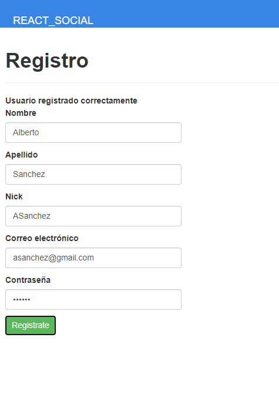
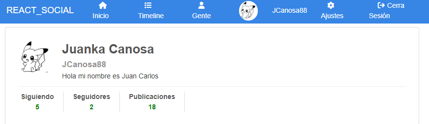

# Front Red Social

<br>

### 1. Pasos previos

Comenzamos con la parte del **front** para nuestra red social.

Vamos a usar ***React + Vite*** para desarrollar el front así que vamos a ir configurando el entorno.

Lo primero que tenemos que hacer es crear el directorio e indicarle a **vite** como se va a llamar la carpeta, y que tecnología vamos a usar. Para ello nos dirigimos a la carpeta que contendrá el directorio del proyeto y ejecutamos:s

    npm create vite@latest

La creación mediante **vite** tiene incluido una interfaz de consola ***( cli )***, que nos va a ir pidiendo los datos, primero nos pedirá el nombre del proyecto, que será el del directorio, en nuestro caso **front_proyecto_red_social**, luego veremos una lista para seleccionar el **framework** que vamos a utilizar, para este proyecto, como hemos indicado anteriormente **React**, y por último nos pedirá el lenguaje que vamos a usar, en nuestro caso **JavaScript**.

Ahora, **vite**, creará los archivos y directorios necesarios para poder iniciar el proyecto. También veremos por pantalla los siguientes pasos que tenemos que dar para arrancar el proyecto, que serán:

    cd front_proyecto_red_social  // Dirigirnos al directorio
    npm install                   // Instalar dependencias con npm
    npm run dev                   // Arrancar el proyecto

Cuando arranquemos el proyecto, si todo es correcto debiriamos ver una salida en la consola similar a esta:

    VITE v4.3.9  ready in 794 ms

    ➜  Local:   http://localhost:5173/
    ➜  Network: use --host to expose
    ➜  press h to show help

Si nos dirigimos a la ruta proporcionada veremos que nuestro proyecto está arrancado y listo para empezar a trabajar.

*Debemos tener en cuenta que para ir viendo los cambios que vamos realizando deberemos tener arrancado el proyecto en todo momento*.


<br>

### 2. Instalando dependencias necesarias.

Ahora que ya tenemos arrancado **vite**, vamos a continuar instalando dependencias que vamos a usar en nuestro proyecto. Por norma general, en este tipo de proyectos vamos a crear rutas para poder ir navegando entre las diferentes vistas que vamos a ir creando así que vamos a instalar **react-router-dom**.

    npm install react-router-dom

Si queremos ver las depencias que tenemos instaladas podemos dirigirnos al archivo **package.json** para ver el listado y sus versiones.

De momento no vamos a instalar ninguna más, si hace falta añadiremos las que vayamos a utilizar más adelante.

<br>

### 3. Estructura de directorios

Para empezar a estructurar un poco los directorios. Para trabajar con **React** debemos tener en cuanta unos aspectos previos.

- El archivo **index.html**, es uno de los archivos principales del proyecto, en el podemos ver que tenemos un **div** con un **id="root"**, que es el contenedor principal, el que contendrá los **componentes** que vamos a crear posteriormente.

- La carpeta **src**, es nuestra carpeta principal de trabajo, en ella van a estar todos los **componentes**, **rutas** y demás archivos que vamos a ir creando y viendo a continuación.

- Archivos **App.css** e **index.css**, estos archivos los crea **vite** cuando creamos el proyecto desde la terminal. Podemos modificar cualquiera de los 2 para dar estilos a nuestro proyecto. Luego veremos algunos cambios, por el momento podemos darles un vistazo y ver que contiene cada uno.

- Archivo **App.jsx**, este archivo es el que muestra el contenido principal de nuestro proyecto, aquí vamos a importar nuestros **componentes** para que se visualicen.

- Archivo **main.jsx**, desde este archivo es desde donde arrancamos **App.jsx** que contendrá nuestros componentes, aquí también están cargadas, por ejemplo, las hojas de estilo CSS.

Por convención, todos los archivos que sean **componentes** deben ir, dentro de nuestra carptea **src**, en un directorio llamado **components**.

Dentro de este directorio, para nuestro caso, vamos a crear los siguientes subdirectorios, **layout**, **follow**, **publication** y **user**, de momento, así tendremos los componentes ordenados según pertenezcan a una u otra sección de nuestro proyecto.

Dentro del mismo directorio **src**, podemos crear también varias carpetas más que vamos a ir utilizando a lo largo del proyecto, como pueden ser **context**, donde crearemos los contextos, más adelante veremos que son, **helpers**, donde tendremos funciones reutilizables para utilizar en diferentes partes del código, **hooks**, donde vamos a tener **hooks** que podemos ir creando a medida para reutilizarlos, también en diferentes sitios y **router**, donde tendremos la configuración de las rutas de nuestro proyecto.

Estos directorios no es necesario que se creen al principio, los podemos ir creando a medida que nos vayan haciendo falta, pero ya que sabemos que es muy probable que acabemos utilizándolos, los podemos dejar ya creados.

<br>

### 4. Preparando área de trabajo.

Vamos ahora a limpiar un poco, los archivos que no nos hacen falta, o a modificar los que tenemos creados antes de empezar a trabajar.

Lo primero que vamos a hacer para este caso es borrar tanto el import de **index.css** del archivo **main.jsx**, así como elminar el propio archivo **index.css** puesto que no lo vamos a utilizar, por que lo que vamos a hacer aqui es traer un archivo **css** que ya tenemos configurado en otro directorio. Podríamos, además eliminar el modo estricto de este mismo archivo simplemente eliminando las dos lineas **<React.StrictMode>**, para que nos sea más fácil el desarrollo.

También nos vamos a dirigir al archivo **App.jsx** y vamos a hacer la misma operación pero con el archivo **App.css**, elminiamos el import y el archivo.

En este mismo archivo, también eliminaremos el import de los logos de **React** y el de **Vite**. También vamos a limpiar el contenido que tenemos por defecto en **App.jsx**, es decir, eliminamos la **const** del contador y el contenido que tenemos en el **return**, podemos dejar por ejemplo un título o un párrafo de momento para que muestre algo por pantalla.

Como hemos dicho, para este caso, vamos a reutilizar un archivo **CSS** que ya teníamos creado, pero también podríamos haber dejado uno de los que hemos eliminado, o los dos, e ir modificando estos mismos.

Dentro de la carpeta **assest** es donde hemos ubicado tanto los archivos **CSS** en su respectiva carpeta como las **fuentes** y las **imagenes**. Ahora vamos a importar en **App.jsx** las **fuentes** y los **CSS**.

    import './assets/fonts/fontawesome-free-6.1.2-web/css/all.css'
    import './assets/css/normalize.css'
    import './assets/css/styles.css'
    import './assets/css/responsive.css'

Ahora si vamos a ver nuestro navegador con el proyecto arrancado veremos que se ha modificado un poco el estilo del título o lo que hayamos escrito, variando la fuente por defecto.

<br>

### 5. Creando la navegación

Antes de empezar con la navegación vamos a dirigirnos a la carpeta **layout** que creamos dentro de **components** y vamos a crear dos directorios más dentro de ella.

El primero lo vamos a nombrar como **public**, aquí van a ir los componentes que se verán sin estar logueados, y el segundo se va a llamar **private**, por ejemplo, estos componentes van a ser los que veamos una vez logueados.

Empezaremos con los componentes de **private**, creando un nuevo componente con el nombre **Header.jsx**, que es el que va a contener la estructra del *header*, el título y la navegación en este caso.

La navegación la vamos a tener en otro componente separada, quedando asi el título en **Header.jsx** y la navegación en un nuevo componente con el nombre de **Nav.jsx**.

Una vez separado el código de la navegación deberemos importarlo y usar el componente de **Nav** dentro de **Header**.

El código de **Nav.jsx**, quedaría de momento así:

    import React from 'react'
    import avatar from '../../../assets/img/user.png'

    export const Nav = () => {
        return (
            <nav className="navbar__container-lists">

                <ul className="container-lists__menu-list">
                    <li className="menu-list__item">
                        <a href="#" className="menu-list__link">
                            <i className="fa-solid fa-house"></i>
                            <span className="menu-list__title">Inicio</span>
                        </a>
                    </li>

                    <li className="menu-list__item">
                        <a href="#" className="menu-list__link">
                            <i className="fa-solid fa-list"></i>
                            <span className="menu-list__title">Timeline</span>
                        </a>
                    </li>

                    <li className="menu-list__item">
                        <a href="#" className="menu-list__link">
                            <i className="fa-solid fa-user"></i>
                            <span className="menu-list__title">Gente</span>
                        </a>
                    </li>

                </ul>

                <ul className="container-lists__list-end">
                    <li className="list-end__item">
                        <a href="#" className="list-end__link-image">
                            
                        </a>
                    </li>

                    <li className="list-end__item">
                        <a href="#" className="list-end__link">
                            <span className="list-end__name">Nick</span>
                        </a>
                    </li>

                    <li className="list-end__item">
                        <a href="#" className="list-end__link">
                            <i className='fa-solid fa-gear'></i>
                            <span className="list-end__name">Ajustes</span>
                        </a>
                    </li>

                    <li className="list-end__item">
                        <a href="#" className="list-end__link">
                            <i className='fa-solid fa-arrow-right-from-bracket'></i>
                            <span className="list-end__name">Cerra Sesión</span>
                        </a>
                    </li>

                </ul>
            </nav>
        )
    }

Fíjate que hemos importado la imagen del **avatar** y la usamos más abajo en la etiqueta **img**, y también, en que tenemos varias clases de **font-awesome** que son las que nos insertan entre otras cosas los iconos de ***ajustes*** y ***cerrar sesión*** por ejemplo.

Y el código en **Header.jsx**, hasta el momento quedaría así:

    import React from 'react'
    import { Nav } from './Nav'

    export const Header = () => {
        return (
            <header className="layout__navbar">

                <div className="navbar__header">
                    <a href="#" className="navbar__title">NGSOCIAL</a>
                </div>

                <Nav />

            </header>
        )
    }

Para comprobar el resultado podemos cargar el componente **Header** en el archivo **App.jsx**, en este caso dentro de un **div** con **className='layout'** y veremos en el navegador la barra de navegación junto con el título definido.

Código actual de **App.jsx**:

    import { useState } from 'react'
    import { Header } from './components/layout/private/Header'

    function App() {


    return (
        <div className='layout'>
            <Header />
        </div>
    )
    }

    export default App

Captura del navegador donde se ve la barra de navegación:


<br>

### 6. Navegación publica (no logueados)

Vamos ahora a crear otra barra de navegación pero para cuando aún no hayamos hecho el login. Más adelante cuando hagamos las rutas controlaremos la entrada a un componente o a otro en función de si se está identificado o no.

Empezaremos creando dos componentes nuevos, esta vez dentro de la carpeta public, con el mismo nombre que teniamos para la barra de navegación de **private**, que van a ser **Header.jsx** y **Nav.jsx**.

Este nuevo **Header.jsx** va a ser idéntico al otro, así que podemos copiarlo entero y pegarlo en el nuevo componente.

El **Nav.jsx**, en cambio, va a tener algunas modificaciones. Por el momento lo copiamos entero, y vamos a eliminar el último **ul** completo. Tambíen vamos a cambiar los iconos y los nombres de cada **li**, dejando solo dos de ellos y cambiando las clases de las etiquetas ***i*** que hacen referencia a los iconos por ```fa-user```, en el primer caso, y ```fa-users``` en el segundo.

También cambiaremos los textos a ***Login*** y ***Registro***, respectivamente, quedando el código del componente **Nav.jsx** de la siguiente manera.

    <nav className="navbar__container-lists">

        <ul className="container-lists__menu-list">
            <li className="menu-list__item">
                <a href="#" className="menu-list__link">
                    <i className="fa-solid fa-user"></i>
                    <span className="menu-list__title">Login</span>
                </a>
            </li>

            <li className="menu-list__item">
                <a href="#" className="menu-list__link">
                    <i className="fa-solid fa-users"></i>
                    <span className="menu-list__title">Registro</span>
                </a>
            </li>
        </ul>
    </nav>

Si ahora cambiamos la ruta de nuestro App.jsx para que haga referencia al **Header.jsx** de la carpeta **public** tendremos como resultado la misma barra que anteriormente pero solo con estos dos enlaces o botones.

    import { Header } from './components/layout/public/Header'


<br>

### 7. Configuración de rutas

Vamos a configurar las primeras rutas. Para empezar crearemos en la carpeta **router** un nuevo archivo con el nombre **Routing.jsx**.

En este componente lo primero que vamos a hacer será importar los componentes de ***react-router-dom*** necesarios por el momento.

    import { Routes, Route, BrowserRouter, Navigate } from 'react-router-dom'

Ahora antes de seguir, y para que se nos vayan importando los componentes que vamos a usar automáticamente, vamos a crear los componentes que usaremos en el grupo de rutas que haremos a continuación.

Crearemos un nuevo componente en **public**, con el nombre de **PublicLayout.jsx**, este componentes contendrá el **layout** principal que creamos anteriormente para los usuarios no logueados.

    import React from 'react'
    import { Outlet } from 'react-router-dom'
    import { Header } from './Header'

    export const PublicLayout = () => {
        return (
            <>
                {/* LAYOUT */}
                <Header />

                {/* Contenido principal */}
                <section className='layout__content'>
                    <Outlet />
                </section>
            </>
        )
    }

Como verás, en el contenido principal, hemos creado un section con la clase **layout__content** que ya tenemos definida en la hoja de estilos, y además hemos utilizado el componente **Outlet** de ***react-router-dom*** que se encarga de renderizar el componente necesario en base a la ruta que utilicemos. Por ejemplo, si tenemos las rutas ***/home*** y ***/contact***, **Outlet** cargará el componente con el mismo nombre cuando se lo indiquemos por la ***url***.

Vamos a crear también dos componentes más, que corresponderán con los enlaces o botones que tenemos en la navegación de **public**. Así pues, dentro de la carpeta **user**, crearemos los componentes **Login** y **Register** que de momento van a tener la estructura básica de **React**. *(rafc)*

    import React from 'react'

    export const Login = () => {
        return (
            <div>Login</div>
        )
    }

    import React from 'react'

    export const Register = () => {
        return (
            <div>Register</div>
        )
    }

Volvemos ahora a nuestro componente **Routing.jsx** y vamos a configurar el grupo de rutas.

    <BrowserRouter>
        <Routes>

            <Route path='/' element={<PublicLayout/>}>
                <Route index element={<Login/>} />
                <Route path='login' element={<Login/>} />
                <Route path='registro' element={<Register/>} />
            </Route>

        </Routes>
    </BrowserRouter>

Nuestro grupo de rutas, va a cargar en la ruta raíz ( / ), el **PublicLayout** que contiene la navegación. También hemos establecido como componente principal de este grupo de rutas ***( index )***, el componente de **Login**, esto hara que cada vez que accedamos a la ruta raíz se cargue el componente **Login** siempre y cuando no estemos logueados.

Luego, hemos creado una ruta para **/login** con el componente **Login** por si se da el caso de que accedemos con esta ruta y también hemos creado la ruta **/registro** con el componente **Register** que creamos anteriormente.

En este punto debemos comporbar que se han importado correctamente todos los componentes, si no deberemos hacerlo manualmente.

El código de **Routing.jsx** hasta este punto quedaría de la siguiente manera.

    import React from 'react'
    import { Routes, Route, BrowserRouter, Navigate } from 'react-router-dom'
    import { PublicLayout } from '../components/layout/public/PublicLayout'
    import { Login } from '../components/user/Login'
    import { Register } from '../components/user/Register'

    export const Routing = () => {
        return (
            <BrowserRouter>
                <Routes>

                    <Route path='/' element={<PublicLayout/>}>
                        <Route index element={<Login/>} />
                        <Route path='login' element={<Login/>} />
                        <Route path='registro' element={<Register/>} />
                    </Route>

                </Routes>
            </BrowserRouter>
        )
    }

Y en el navegador deberiamos ver lo como se carga el texto de *Login* y *Register* cuando accedemos a las rutas porque ya se están cargando esos componentes.


<br>


<br>

### 8. Adaptando componentes Login y Register

Como acabamos de ver cuando cargamos los componentes **Login** y **Register** se nos muestra el texto que tenemos establecido en el **div** de cada componente, y además mal posicionado, vamos a arreglar esto.

Para ambos casos vamos a hacer lo mismo. Primero crearemos un **header** que contendrá el título y gracias a la maquetación que ya tenemos establecida, cambiará el aspecto del título, esto lo haremos dentro de un par de etiquetas **fragment**.

Además vamos a incluir tambien un **div** con la clase **content__posts** que contendrá lo relativo a cada uno de los componentes y que veremos más adelante.

    import React from 'react'

    export const Register = () => {
    return (
        <>
        <header className="content__header content__header--public">
            <h1 className="content__title">Registro</h1>
        </header>

        <div className="content__posts">


        </div>
        </>
    )
    }

Como hemos indicado anteriormente, este mismo código es el que va a ir en el componente **Login** solo deberemos cambiar el título.

Ahora bien, vemos que el texto ya ha cambiado, pero sigue posicionandose mal asi que vamos a modificar un poco los estilos para solucionarlo.

Concretamente, nos vamos a dirigir a **styles.css** que lo tenemos en la carpeta **assests** y vamos a buscar la clase **layout**. Aquí simplemente vamos a cambiar en **grid-template-rows**, el ***8%*** por ***60px***, con esto conseguimos posicionar el título y que los botones de la barra queden accesibles.

Vamos a dejar tambien configurados los botones. Ahora mismo no hacen nada por que lo que tenemos es una etiqueta ***a*** en la que el ***href*** no está configurado, esto lo encontramos en el componente **Nav.jsx** de **public**.

    <nav className="navbar__container-lists">

        <ul className="container-lists__menu-list">
            <li className="menu-list__item">
                <a href="#" className="menu-list__link">
                    <i className="fa-solid fa-user"></i>
                    <span className="menu-list__title">Login</span>
                </a>
            </li>

            <li className="menu-list__item">
                <a href="#" className="menu-list__link">
                    <i className="fa-solid fa-users"></i>
                    <span className="menu-list__title">Registro</span>
                </a>
            </li>
        </ul>
    </nav>

Pues bien, vamos a cambiar estas dos etiquetas ***a*** por la etiqueta ***Navlink***, si la escribimos debería importarnosla directamente, sino lo haremos a mano, esta etiqueta pertenece a **react-router-dom**.

También tenemos que cambiar el ***href*** por un ***to*** que hará que vayamos a la ruta indicada en él sin necesidad de reacargar la página.

    <nav className="navbar__container-lists">

        <ul className="container-lists__menu-list">
            <li className="menu-list__item">
                <NavLink to='/login' className="menu-list__link">
                    <i className="fa-solid fa-user"></i>
                    <span className="menu-list__title">Login</span>
                </NavLink>
            </li>

            <li className="menu-list__item">
                <NavLink to='/registro' className="menu-list__link">
                    <i className="fa-solid fa-users"></i>
                    <span className="menu-list__title">Registro</span>
                </NavLink>
            </li>
        </ul>
    </nav>

Ahora ya podemos probar los botones, comprobando que nos cambia la ruta en la barra de navegación y que se visualiza el texto correspondiente en cada caso.


<br>

### 9. Grupo de rutas private

Antes de comenzar a crear el grupo de rutas de la parte privada, a la que accederemos solo si hemos hecho login, vamos a crear un par de componentes más que son los que vamos a cargar en esta parte.

Para empezar vamos a tener el componente principal, desde el que se van a cargar los demás componentes como habíamos hecho con la parte publica.

A este componentes le hemos puesto el nombre de **PrivateLayout.jsx**, estará en la carpeta **private** y contendrá, más o menos, lo mismo que **PublicLayout.jsx**, pero añadiendo un **Sidebar** que tendremos cargado cuando hagamos login.

    import React from 'react'
    import { Outlet } from 'react-router-dom'
    import { Header } from './Header'
    import { Sidebar } from './Sidebar'

    export const PrivateLayout = () => {
        return (
            <>
                {/* LAYOUT */}
                <Header />

                {/* Contenido principal */}
                <section className='layout__content'>
                    <Outlet />
                </section>

                {/* Barra lateral */}
                <Sidebar />
            </>
        )
    }

Como ves hemos cargado e importado el componente **Sidebar.jsx**, pero aún no lo hemos creado. Esto lo podemos hacer así y marcará un error hasta que lo creemos, o podemos crearlo antes para que lo importe directamente.

Este componente **Sidebar.jsx** va a estar ubicado, también en **private** y va a contener unos datos estáticos de prueba sobre el perfil del usuarios, luego le daremos funcionalidad.

    import React from 'react'
    import avatar from '../../../assets/img/user.png'

    export const Sidebar = () => {
        return (
            <aside className="layout__aside">
                <header className="aside__header">
                    <h1 className="aside__title">Hola, Juan Carlos</h1>
                </header>

                <div className="aside__container">
                    <div className="aside__profile-info">
                        <div className="profile-info__general-info">
                            <div className="general-info__container-avatar">
                                
                            </div>

                            <div className="general-info__container-names">
                                <a href="#" className="container-names__name">Juan Carlos Canosa</a>
                                <p className="container-names__nickname">VictorWeb</p>
                            </div>
                        </div>

                        <div className="profile-info__stats">

                            <div className="stats__following">
                                <a href="#" className="following__link">
                                    <span className="following__title">Siguiendo</span>
                                    <span className="following__number">10</span>
                                </a>
                            </div>
                            <div className="stats__following">
                                <a href="#" className="following__link">
                                    <span className="following__title">Seguidores</span>
                                    <span className="following__number">13</span>
                                </a>
                            </div>


                            <div className="stats__following">
                                <a href="#" className="following__link">
                                    <span className="following__title">Publicaciones</span>
                                    <span className="following__number">17</span>
                                </a>
                            </div>
                        </div>
                    </div>


                    <div className="aside__container-form">
                        <form className="container-form__form-post">

                            <div className="form-post__inputs">
                                <label htmlFor="post" className="form-post__label">¿Que estas pesando hoy?</label>
                                <textarea name="post" className="form-post__textarea"></textarea>
                            </div>

                            <div className="form-post__inputs">
                                <label htmlFor="image" className="form-post__label">Sube tu foto</label>
                                <input type="file" name="image" className="form-post__image" />
                            </div>

                            <input type="submit" value="Enviar" className="form-post__btn-submit" disabled />
                        </form>
                    </div>
                </div>
            </aside>
        )
    }

Ahora ya podríamos crear el grupo de rutas, pero nos falta el componente principal, **Feed.jsx**, este componente lo vamos a crear en la carpeta **publication**, donde estarán los demás componentes principales que iremos creando.

En **Feed.jsx**, tendremos también datos de prueba, simulando publicaciones de usuarios.

    import React from 'react'
    import avatar from '../../assets/img/user.png'

    export const Feed = () => {
        return (
            <>
                <header className="content__header">
                    <h1 className="content__title">Timeline</h1>
                    <button className="content__button">Mostrar nuevas</button>
                </header>

                <div className="content__posts">
                    <div className="posts__post">
                        <div className="post__container">
                            <div className="post__image-user">
                                <a href="#" className="post__image-link">
                                    
                                </a>
                            </div>

                            <div className="post__body">
                                <div className="post__user-info">
                                    <a href="#" className="user-info__name">Juan Carlos Canosa</a>
                                    <span className="user-info__divider"> | </span>
                                    <a href="#" className="user-info__create-date">Hace 1 hora</a>
                                </div>

                                <h4 className="post__content">Hola, buenos dias.</h4>

                            </div>
                        </div>

                        <div className="post__buttons">
                            <a href="#" className="post__button">
                                <i className="fa-solid fa-trash-can"></i>
                            </a>
                        </div>

                    </div>

                    <div className="posts__post">
                        <div className="post__container">
                            <div className="post__image-user">
                                <a href="#" className="post__image-link">
                                    
                                </a>
                            </div>

                            <div className="post__body">
                                <div className="post__user-info">
                                    <a href="#" className="user-info__name">Juan Carlos Canosa</a>
                                    <span className="user-info__divider"> | </span>
                                    <a href="#" className="user-info__create-date">Hace 1 hora</a>
                                </div>

                                <h4 className="post__content">Hola, buenos dias.</h4>
                            </div>
                        </div>

                        <div className="post__buttons">
                            <a href="#" className="post__button">
                                <i className="fa-solid fa-trash-can"></i>
                            </a>
                        </div>
                    </div>


                    <div className="posts__post">
                        <div className="post__container">
                            <div className="post__image-user">
                                <a href="#" className="post__image-link">
                                    
                                </a>
                            </div>

                            <div className="post__body">
                                <div className="post__user-info">
                                    <a href="#" className="user-info__name">Juan Carlos Canosa</a>
                                    <span className="user-info__divider"> | </span>
                                    <a href="#" className="user-info__create-date">Hace 1 hora</a>
                                </div>

                                <h4 className="post__content">Hola, buenos dias.</h4>
                            </div>
                        </div>

                        <div className="post__buttons">
                            <a href="#" className="post__button">
                                <i className="fa-solid fa-trash-can"></i>
                            </a>
                        </div>
                    </div>

                    <div className="posts__post">
                        <div className="post__container">
                            <div className="post__image-user">
                                <a href="#" className="post__image-link">
                                    
                                </a>
                            </div>

                            <div className="post__body">
                                <div className="post__user-info">
                                    <a href="#" className="user-info__name">Juan Carlos Canosa</a>
                                    <span className="user-info__divider"> | </span>
                                    <a href="#" className="user-info__create-date">Hace 1 hora</a>
                                </div>

                                <h4 className="post__content">Hola, buenos dias.</h4>
                            </div>
                        </div>

                        <div className="post__buttons">
                            <a href="#" className="post__button">
                                <i className="fa-solid fa-trash-can"></i>
                            </a>
                        </div>
                    </div>
                </div>

                <div className="content__container-btn">
                    <button className="content__btn-more-post">
                        Ver mas publicaciones
                    </button>
                </div>
            </>
        )
    }

Hecho esto, podemos, ahora sí, crear el grupo de rutas para el área privada, ahora mismo accederemos desde la **url** sin ningún tipo de autenticación pero más adelante haremos que sea obligatorio loguearse.

El ***path*** principal de este grupo de rutas va a ser **/social**, es decir, todas las rutas de private tendrán este "prefijo". Por ejemplo, podriamos tener ***"/social/feed"*** o ***"/social/publication"***.

También tendremos, dentro del grupo de rutas, como **index** la carga del componente **Feed.jsx** que se va a mostar cada vez que hagamos login y una ruta a **feed** que cargará el mismo componente.

    <Route path='/social' element={<PrivateLayout />}>
        <Route index element={<Feed />} />
        <Route path='feed' element={<Feed />} />
    </Route>

Ahora podemos ir al navegador y dirigirnos a ***/social*** o ***/social/feed*** y veremos los datos de prueba que hemos constriudo anteriormente maquetados con el **CSS** que tenemos aplicado.


<br>

### 10. Rutas de error 404

Vamos ahora a configurar una ruta de error para cuando el usuario ponga una ruta que no existe.

Tenemos varias opciones para hacer esto, podríamos crear un componente a parte en el que tengamos la estructura principal pero mostrando el error por pantalla, por ejemplo. Podríamos también crear el código en la creación de la misma ruta como vamos a hacer, y también podemos elegir si mostramos un link para volver al inicio o hacemos una redirección.

Vamos a exponer los dos casos, del link o la redirección, y luego elegiremos uno.

Código de la ruta de error con en el que se muestra el título de error y un enlace para volver al inicio.

    <Route path='*' element={
        <>
        <p>
            <h1>Error 404</h1>
            <Link to='/'>Volver al inicio</Link>
        </p>
        </>
    } />


Mismo código anterior que nos redirige al inicio. Como se puede ver simplemente cambiamos la etiqueta **Link** por **Navigate**. Podemos dejar el título de error por si no nos redirige automáticamente.

    <Route path='*' element={
        <>
        <p>
            <h1>Error 404</h1>
            <Navigate to='/'>Volver al inicio</Navigate>
        </p>
        </>
    } />

En mi caso concreto me gusta más que redirija al usuario así que lo dejaré con **Navigate**.

<br>

### 11. Formulario de registro

Vamos ahora a empezar con todo lo relacionado con el login de usuarios.

Lo primero que vamos a hacer es nuestro formulario de registro, para ello podemos consultar los campos necesarios en el modelo de usuarios de nuestra **API**. Tenemos que tener en cuenta que los atributos ***name*** de nuestros ***inputs*** deben coincidir con los campos del modelo.

    import React from 'react'

    export const Register = () => {
    return (
        <>
        <header className="content__header content__header--public">
            <h1 className="content__title">Registro</h1>
        </header>

        <div className="content__posts">
            <form className='register-form'>
            <div className="form-group">
                <label htmlFor="name">Nombre</label>
                <input type="text" name='name' />
            </div>

            <div className="form-group">
                <label htmlFor="surname">Apellido</label>
                <input type="text" name='surname' />
            </div>

            <div className="form-group">
                <label htmlFor="nick">Nick</label>
                <input type="text" name='nick' />
            </div>

            <div className="form-group">
                <label htmlFor="email">Correo electrónico</label>
                <input type="email" name='email' />
            </div>

            <div className="form-group">
                <label htmlFor="password">Contraseña</label>
                <input type="password" name='password' />
            </div>

            <input type="submit" value="Registrate" className='btn btn-success' />

            </form>
        </div>
        </>
    )
    }

Ahora que tenemos el formulario creado podemos dirigirnos a la ruta de ***registro*** y comprobar que se ve correctamente.


<br>

### 12. Hook para manejar formularios

Para enviar los datos de los formularios, como el que acabamos de crear, por ejemplo, vamos a crear un ***hook*** que vamos a poder utilizar cada vez que tengamos uno.

Un ***hook***, no deja de ser un componente más, pero en vez de devolver datos en formato ***JSX***, va a retornar un ***objeto*** con un estado o lo que corresponda.

Para trabajar con un ***hook*** deberemos crear una serie de funciones que a su vez trabajen con un estado.

Para este caso, como parámetro, vamos a pasar un objeto vacío que vamos a llamar **initialObj** y que va a ir cambiando junto con la información del formulario.

Para comprobar lo que estamos tratando lo que vamos a hacer es crear un estado, pasándole el **initialObj** de la siguiente manera.

    const [form , setForm] = useState(initialObj)

Esto debería importarnos el **useState** autómaticamante, si no podemos hacerlo a mano.

    import React, { useState } from 'react'

A continuación vamos a hacer una función a la que le vamos a pasar como parámetro **target** que sería el evento que va a recibir, y para hacer la comprobació, simplemente vamos a hacer un **console.log(target)**.

    const changed = ({target}) => {
        console.log(target)
    }

Luego, tenemos que devolver en el **return** que recuerda que será un objeto, el **form** que hemos creado que es el estado como tal y la función **changed**.

    return {
        form,
        changed
    }

Nos vamos ahora al componente **Register** y creamos el **useForm** para poder hacer las primeras comprobaciones, desestructurando como objeto lo que nos devuelve el propio **useFrom**.

    const {form, changed} = useForm({})

Recuerda que si no nos importa el **useForm** automáticamente deberemos hacerlo nosotros.

    import { useForm } from '../../hooks/useForm'

A continuación lo que vamos a hacer es añadir el evento ***onChange={changed}*** a todos los inputs que tengamos, y echo esto si nos vamos al navegador, cada vez que escribamos algo en un campo nos indicará el **target** del campo en el que estamos.


Ahora que sabemos que el evento captura el **target** correspondiente, ya tenemos acceso a todas sus propiedades o métodos. En este caso vamos a poder capturar el **name** y el **value** para rellenar el objeto que enviaremos al pulsar el botón de **Registrate**.

Para comprobar ahora que se va rellenando el objeto como queremos vamos a crear la funcionalidad de **changed**. Nos dirigimos al componente o hook **useForm** y vamos a crear una constante en la que vamos a desestructurar el **target** para extraer los campos **name** y **value**.

    const {name, value} = target

Luego, haremos un **setForm** para ir rellenado el estado **form**, para ello a **setForm** le pasamos un objeto con lo que ya tengamos en **form** o una copia de **form**, es lo mismo, y una propiedad, ***clave-valor*** con lo que quiero añadir, donde la clave será el **name** y el valor será **value**.

    setForm({
        ...form,
        [name]: value
    })

Si hacemos ahora un **console.log(form)** y volvemos al navegador, veremos como se va rellenado el objeto con los valores de cada **input** añadiendo como *clave* el **name** de cada campo.


Ya podemos dar por finalizado el **hook** quitando este último **console.log** por que ya estamos recibiendo los datos que nos interesan en **Register**.

    import React, { useState } from 'react'

    export const useForm = (initialObj = {}) => {

        const [form , setForm] = useState(initialObj)

        const changed = ({target}) => {
            const {name, value} = target

            setForm({
                ...form,
                [name]: value
            })
        }

        return {
            form,
            changed
        }
    }

Ahora para completar esto y guardar el usuario, vamos a añadir el evento **onSubmit** al formulario indicándole que ejecute una función que llamaremos **saveUser** y que vamos a crear a continuación.

    ...
        <form className='register-form' onSubmit={saveUser}>
    ...

Crearemos ahora en **Register** el método **saveUser**, pasándole como parametro el evento, en el primero prevenimos que se actualice la página con **e.preventDefault()** y crearemos una variable que guardará el contenido de **form**, que debería ser el objeto con los datos del formulario.

    const {form, changed} = useForm({})

    const saveUser = (e) => {
        e.preventDefault()
        
        let newUser = form

        console.log(newUser)
    }

Para acabar de comprobar que nos llegan bien los datos cuando hacemos click en **Registrate** y ver que se ejecuta el método y nos devuelve los datos del formulario haremos un **console.log** de la variable **newUser**.


Este objeto es el que mandaremos más adelante a la **API** haciendo una petición con **fetch**.

<br>

### 13. Guardar registro usuario en la base de datos

Para poder guardar el usuario en la base de datos, debemos hacer un **fetch** al endpoint correspondiente. Para empezar lo que vamos a hacer, si no lo hemos hecho antes, es arrancar el **backend** con el **.bat** que creamos en el proyecto de la **API**.

Una vez comprobemos que está funcionando correctamente vamos a hacer el **fetch**, pero para ello vamos a necesitar la **URL** completa. Para no tener la **URL** como tal en todos los **fetch** que vamos a ir haciendo, nos vamos a crear un **helper** que nos autocomplete la parte común de todas las rutas a las que vamos a hacer el **fetch**.

Vamos a crear un nuevo archivo en la carpeta **helpers** que llamaremos **Global.jsx**, por ejemplo. Este archivo, como ya hemos dicho antes contendrá la **URL** "principal" de nuesta **API**.

    export const Global = {
        url: 'http://localhost:3900/api/'
    }

Ahora que tenemos la parte común de la ruta, vamos a crear el **fetch** dentro del método **saveUser** que hemos creado antes en **Register.jsx**. Recordemos que, en este método, habíamos previsto la recarga de la página y creado una variable con la información recogida del formulario.

Para poder hacer le **fetch** primero estableceremos el método como ***asíncrono***, ya que tenemos que esperar a que se efectue la petición para que guarde el usuario.

Luego crearemos una constante con el **fetch** al que le tenemos que pasar la **URL** completa como primer parámetro y las ***opciones*** como segundo parámetro en formato objeto.

    const request = await fetch(Global.url + 'user/register', {
      method: 'POST',
      body: JSON.stringify(newUser),
      headers: {
        'Content-type': 'application/json'
      }
    })

Si no sabemos, o no nos acrodamos del **endpoint** al que tenemos que hacer referencia, podemos ir al proyecto de la **API** y consultar las rutas, en este caso las de **user.js**.

Las opciones, como se puede ver son, en este caso, el método **HTTP**, **POST**, en este caso porque vamos a guardar datos y ya definimos la ruta con este mismo método, el **body**, el cual convertimos a **JSON** con **stringify** y los **headers**, que en este caso no nos harían falta pero siempre está bien indicar el tipo de datos que va a recibir.

Ahora vamos a comprobar que todo ha salido bien y que se guarda el usuario en la base de datos a través de la **API**. Crearemos una constante que nos guarde el resultado de **request.json()** y podemos hacer un **console.log** para ver el resultado por consola.

    const data = await request.json()
    console.log(data)


Ahora que sabemos que ya se nos guardan los usuarios, podemos crear un estado nuevo para mostrar un mensaje al usuario por pantalla e indicarle si se ha registrado correctamente o no.

    const [ saved, setSaved ] = useState('not_sended')

Con este nuevo estado, vamos a evaluar si el **status** de **data** nos devuelve **success** o **error** y a mostrar un mensaje en consecuencia.

    if(data.status == 'success'){
      setSaved("saved")
    } else {
      setSaved("error")
    }

Y para mostrar el mensaje, dentro del **return**, encima del formulario podemos mostrar el mensaje correspondiente de forma condicional.


    {saved == 'saved' ?
        <strong className='alert alert-success'> 'Usuario registrado correctamente'</strong>
        : ''}

    {saved == 'error' ?
        <strong className='alert alert-error'> 'Error al registrar usuario'</strong>
        : ''}

Luego añadiremos los estilos a estas alertas, pero ya podemos comprobar si funcionan.



*En este punto, nos podemos dar cuenta, que si el usuario ya existe, también nos devuelve un **success** porque así lo hemos definido en la **API**, pero esto es incorrecto. Basta con buscar el método de rigistro en **user.js** de la carpeta **controller** de nuestro proyecto de la **API** y cambiar el **status** a **error**.*

El código completo de **Register.jsx** en este punto quedaría de la siguiente manera.

    import React, { useState } from 'react'
    import { useForm } from '../../hooks/useForm'
    import { Global } from '../../helpers/Global'

    export const Register = () => {

    const { form, changed } = useForm({})
    const [saved, setSaved] = useState('not_sended')

    const saveUser = async (e) => {
        // Prevenir actualización pantalla y recoger datos
        e.preventDefault()
        let newUser = form

        // Guardar usuario en backend
        const request = await fetch(Global.url + 'user/register', {
        method: 'POST',
        body: JSON.stringify(newUser),
        headers: {
            'Content-type': 'application/json'
        }
        })

        const data = await request.json()

        if (data.status == 'success') {
        setSaved("saved")
        } else {
        setSaved("error")
        }

    }

    return (
        <>
        <header className="content__header content__header--public">
            <h1 className="content__title">Registro</h1>
        </header>

        <div className="content__posts">

            {saved == 'saved' ?
            <strong className='alert alert-success'> 'Usuario registrado correctamente'</strong>
            : ''}

            {saved == 'error' ?
            <strong className='alert alert-error'> 'Error al registrar usuario'</strong>
            : ''}

            <form className='register-form' onSubmit={saveUser}>
            <div className="form-group">
                <label htmlFor="name">Nombre</label>
                <input type="text" name='name' onChange={changed} />
            </div>

            <div className="form-group">
                <label htmlFor="surname">Apellido</label>
                <input type="text" name='surname' onChange={changed} />
            </div>

            <div className="form-group">
                <label htmlFor="nick">Nick</label>
                <input type="text" name='nick' onChange={changed} />
            </div>

            <div className="form-group">
                <label htmlFor="email">Correo electrónico</label>
                <input type="email" name='email' onChange={changed} />
            </div>

            <div className="form-group">
                <label htmlFor="password">Contraseña</label>
                <input type="password" name='password' onChange={changed} />
            </div>

            <input type="submit" value="Registrate" className='btn btn-success' />

            </form>
        </div>
        </>
    )
    }

<br>

### 14. Estilos a las alertas

Vamos a darles estilos a las alertas que acabamos de crear así los tendremos preparados para futuros usos.

En nuestro archivo **styles.css** de la carpeta **assets/css**, añadiremos al final del archivo las siguientes reglas, las cuales podremos modificar en caso de que los creamos necesario.

    .alert {
        width: 58%;
        display: block;
        padding: 10px;
        margin-bottom: 10px;
        color: white;
        border-radius: 3px;
    }

    .alert-success{
        background-color: #5cb85c;
        border: 1px solid green;
    }

    .alert-error{
        background-color: rgb(243, 43, 43);
        border: 1px solid #ac2925;
    }

<br>

### 15. Formulario de Login

Vamos a por el formulario de login. Este formulario va a ser muy sencillo ya que solo necesitamos dos campos **email** y **password**.

Siguiendo el esquema del formulario de registro, en nuestro componentes **Login.jsx** crearemos el siguiente formulario.

    <div className="content__posts">
        <form className='form-login'>

            <div className="form-group">
                <label htmlFor="email">Email</label>
                <input type="email" name='email' />
            </div>

            <div className="form-group">
                <label htmlFor="password">Contraseña</label>
                <input type="password" name='password' />
            </div>

            <input type="submit" value='Identifícate' className='btn btn-success' />

        </form>
    </div>

Y obtendremos el siguiente resultado.


<br>

### 16. Recogiendo datos del formulario de login

Para recoger los datos del formulario de login vamos a user el mismo **hook** que cremos para el registro. 

Crearemos una constante desestructurando lo que vamos a recibir, que en este caso es **form** y **changed**, esto lo vamos a igular a **useForm** con un objeto vacío por defecto.

    const { form, changed } = useForm({})

Recuerda que si no se nos importa el **hook** deberemos importarlo a mano.

    import { useForm } from '../../hooks/useForm'

Ahora, como en el caso del registro, vamos a definir el método **onChange** en los inputs, indicando que ejecte el método **changed** que importamos de **useForm**.

    <div className="form-group">
        <label htmlFor="email">Email</label>
        <input type="email" name='email' onChange={changed}/>
    </div>

    <div className="form-group">
        <label htmlFor="password">Contraseña</label>
        <input type="password" name='password' onChange={changed}/>
    </div>

Y también vamos a user el método **onSubmit** en la etiqueta **form** para que ejecute el método **loginUser** que vamos a crear ahora mismo.

    ...
        <form className='form-login' onSubmit={loginUser}>
    ... 

Ahora, para comprobar que nos está recogiendo bien los datos del formulario antes de continuar, crearemos el método **loginUser** que será asíncrono porque haremos una petición después, le pasaremos un evento ***( e )*** como parámetro, haremos un **preventDefault** para eviatar la recarga de la página y un **console.log(form)** para ver por consola lo que nos devuelve al enviar los datos.

    const loginUser = async(e) => {
        e.preventDefault()

        console.log(form)
    }


<br>

### 17. Identificar al usuario

Para identificar al usuario lo primero que vamos a hacer es guardar el objeto con los datos que recogemos del formulario.

    const userToLogin = form

Una vez hecho esto vamos a crear la petición **fetch** tal y como hemos hecho en el caso del registro pero al **endpoint** correspondiente, que en este caso es **user/login**. Recuerda que lo podemos consultar en los archivos de rutas del proyecto de la **API**.

    const request = await fetch(Global.url + 'user/login', {
      method: 'POST',
      body: JSON.stringify(userToLogin),
      headers: {
        'Content-Type': 'application/json'
      }
    })

Recordemos que si no se nos importa **Global** automáticamente, deberemos hacerlo a mano.

    import { Global } from '../../helpers/Global'

Hecho esto vamos a guardar el resultado de la petición en otra constante y con un **console.log** comprobamos lo que nos devuelve por consola.

    const data = await request.json()
    console.log(data)


Ahora que hemos comprobado que recibimos correctamente la respueta, podemos crear las alertas tal y como hicimos en registro. Primero crearemos un **useState** para manejar el estado, y luego comprobaremos lo que nos llega y asignaremos al estado que acabamos de crear un valor u otro en función de la respuesta.

    if (data.status == 'success') {
      setLogued('login')
    } else {
      setLogued('error')
    }

A continuación podemos mostrar las alertas condicionalmente, encima del fomulario.

    {logued == 'login' ?
        <strong className='alert alert-success'>Usuario identíficado correctamente</strong>
        : ''}

    {logued == 'error' ?
        <strong className='alert alert-error'>Error al indentificar al usuario</strong>
        : ''}

Ahora, una vez comprobado que las alertas funcionan correctamente, vamos a **persistir** los datos del usuario en el navegador para poder usarlos más adelante, en el **feed** por ejemplo.

Para ello tendremos que almacenar los datos que recibimos de la petición en el **localStorage**, y lo haremos dentro del **if** en el que comporbamos si la respuesta es correcta o no.

    if (data.status == 'success') {
      localStorage.setItem('token', data.token)
      localStorage.setItem('user', JSON.stringify(data.user))

      setLogued('login')
    } else {
      setLogued('error')
    }

Esto, nos guardará en el **localStorage** el **token** que lo recibimos como **string** y un objeto con los datos del usuario, al tratarse de un objeto debemos convertirlo a formato **string** con **JSON.stringify** para que los datos se envien correctamente.

A la hora de usar estos datos deberemos hacer un **JSON.parse** para volver a tener el objeto con los datos del usuario y poder trabajar con él, pero eso lo veremos más adelante.


<br>

### 18. Crear Context para recuperar datos del localStorage.

Para bloquear o dar acceso a rutas privadas como **/social**, que solo debería estar accesible con un usuario logueado, vamos a crear un contexto.

Este contexto, guardará y comprobará la información del usuario que hemos guardado en el **localStorage** mediante una petición **AJAX** al ***backend*** que nos dará o no acceso en función de si el **token** es correcto o no.

Para ello vamos a crear, de momento, a modo de ejemplo, un componente en la capeta context, al que llamaremos **AuthProvider.jsx**, y en el usaremos el **createContext** que tendrá dicha información, por el momento vamos a introducir un texto y veremos como pasamos esta información al componente que nos interese.

    import React, { createContext, useState, useEffect } from 'react'

    const AuthContext = createContext()

    export const AuthProvider = ({children}) => {

        const [compartido, setCompartido] = useState('Info compartida en los componentes')

        return (s
            <AuthContext.Provider value={{compartido}}>
                {children}
            </AuthContext.Provider>
        )
    }

    export default AuthContext

Al componente **AuthProvider**, debemos pasarle un componente hijo, **children** en este caso. También crearemos un estado donde por defecto incluiremos de momento un texto para hacer las pruebas.

En el ***return***, devolveremos el componente como tal que tendrá como valores, el estado que hemos creado, y como contenido el componente hijo.

Para hacer más sencillo la llamada al contexto, vamos a crear un **hook** que nos permita acceder a sus propiedades o valores.

    import React, { useContext } from 'react'
    import AuthContext from '../context/AuthProvider'

    const useAuth = () => {
        return useContext(AuthContext)
    }

    export default useAuth

También deberemos envolver los componentes del **Routing.jsx** con el contexto para que puedan recibir la información. Estos serán los componentes hijos.

    import React from 'react'
    import { Routes, Route, BrowserRouter, Navigate, Link } from 'react-router-dom'
    import { PublicLayout } from '../components/layout/public/PublicLayout'
    import { Login } from '../components/user/Login'
    import { Register } from '../components/user/Register'
    import { PrivateLayout } from '../components/layout/private/PrivateLayout'
    import { Feed } from '../components/publication/Feed'
    import { AuthProvider } from '../context/AuthProvider'

    export const Routing = () => {
    return (
        <BrowserRouter>
        <AuthProvider>
            <Routes>

            <Route path='/' element={<PublicLayout />}>
                <Route index element={<Login />} />
                <Route path='login' element={<Login />} />
                <Route path='registro' element={<Register />} />
            </Route>

            <Route path='/social' element={<PrivateLayout />}>
                <Route index element={<Feed />} />
                <Route path='feed' element={<Feed />} />
            </Route>

            <Route path='*' element={
                <>
                <p>
                    <h1>Error 404</h1>
                    <Navigate to='/'>Volver al inicio</Navigate>
                </p>
                </>
            } />

            </Routes>
        </AuthProvider>
        </BrowserRouter>
    )
    }

Ahora vamos a probarlo, por ejemplo en el componente **Feed.jsx**. Lo que debemos hacer es crear una constante en este componente que recoja como objeto el estado que hemos configurado en el **Context**, en este caso **{compartido}** y lo haremos a través del **hook** **useAuth()** que acabamos de crear.

    const { compartido } = useAuth()
    console.log(compartido)

Si hacemos el **console.log** de compartido veremos por la consola, desde la ruta de **Feed** que es **/social**, que podemos acceder a la información del **Context** que acabamos de crear.


<br>

### 19. Configuración del Context. Obtener token y datos del usuario.

Ante de empezar vamos a borrar el **useAuth()** y el **console.log** de **Feed.jsx**, y también el estado de prueba, ***compartido***, que hemos creado en **AuthProvider.jsx**.

Ahora, lo primero que haremos es crear un nuevo estado en **AuthProvider.jsx** que llamaremos **auth**, y que va a tener por defecto un objeto vacío.

    const [ auth, setAuth ] = useState({})

Luego usaremos un **useEffect()**, que llamará a una función, que ahora crearemos cada vez que se cargue el componente.

    useEffect(() => {
        authUser()
    }, [])

Bien, ahora, en la función es donde vamos a hacer la petición **Ajax** con un **fetch** como ya hemos hecho anteriromente.

Primero guardaremos en dos constantes los datos que tenemos en el **localStorage**.

    const authUser = async() => {
        const token = localStorage.getItem('token')
        const user = localStorage.getItem('user')
    ...

A continuación, comprobaremos que recibimos estos datos, si no detendremos la ejecución.

    if(!token || !user){
        return false
    }

Luego, como tenemos los datos en formato **string** dentro del **localStorage** tenemos que volver a convertirlos para poder trabajar con ellos, y además recogeremos un una variable el **id** del usuario para pasarlo luego mediante la **url**.

    const userObj = JSON.parse(user)
    const userId = userObj.id

Ahora ya podemos hacer la petición, y esta vez será a la ruta ***user/profile/:id***, que nos devuelve el perfil completo del usuario, esto podemos comprobarlo con las rutas del proyecto de la **API**.

    const request = await fetch(Global.url + 'user/profile/' + userId, {
        method: 'GET',
        headers: {
            "Content-Type": "application/json",
            "Authorization": token
        }
    })

Como opciones, pasaremos el **method** que en este caso es **GET**, y como **headers**, pasamos el **content-type** y en este caso, debemos pasar la **Authorization** que será el **token**, porque si revisamos la ruta de nuestra, podemos ver que estamos evaluando con el método de autenticación que creamos en el backend, que el usuario esté logueado.

    router.get('/profile/:id', mid_auth.auth, UserController.profile)

Ahora podemos guardar los datos que recibimos en una variable y ***setear*** el **auth** para que contenga esta información.

    const data = await request.json()
    setAuth(data.user)

Nos queda, pasar como valores en el ***return*** de nuestro **AuthContext.Provider**, el **auth** y el **setAuth**, para exportarlos y poder usarlos mediante el **hook** que creamos anteriormente.

    return (
        <AuthContext.Provider 
        value={{
            auth,
            setAuth
        }}>
            {children}
        </AuthContext.Provider>
    )

La función completa quedaría por el momento de esta forma.

    const authUser = async() => {
        // Sacar datos del usuario del localstorage
        const token = localStorage.getItem('token')
        const user = localStorage.getItem('user')

        // Comporbar si tenemos el token y el user
        if(!token || !user){
            return false
        }

        // Transformar los datos en un objeto JS
        const userObj = JSON.parse(user)
        const userId = userObj.id

        // Petición Ajax que compruebe el token y me devuelva todos los datos del usuario.
        const request = await fetch(Global.url + 'user/profile/' + userId, {
            method: 'GET',
            headers: {
                "Content-Type": "application/json",
                "Authorization": token
            }
        })

        const data = await request.json()

        // Setear el estado de auth
        setAuth(data.user)
    }

Para comprobar que recibimos esta información vamos a ir a nuestro componente **Sidebar.jsx**, que es donde se muestran los datos del perfil del usuario identíficado, y crearemos una constante que desestructure lo que estamos exportando del contexto, en este caso con **auth** tendremos suficiente.

    const { auth } = useAuth()
    console.log(auth)

Y con un **console.log**, verificaremos, que efectivamente recibimos todos los datos del perfil del usuario identíficado.


Ahora, que tenemos los datos, podemos borrar el **console.log**, y por el momento podemos mostar los nombres y apellidos que traemos como datos del **backend** utilizando **auth**.

    ...
        <h1 className="aside__title">Hola, {auth.name}</h1>
    ...
    ...
        <div className="general-info__container-names">
            <a href="#" className="container-names__name">{auth.name} {auth.surname}</a>
            <p className="container-names__nickname">{auth.nick}</p>
        </div>
    ...

También podemos cambiar la **imagen**, pero tendremos que hacer una condición para verificar si el usuario tiene o no foto de perfil. Esto lo haremos con una condicion ternaria mostrando la **imagen** por defecto en caso de que la propiedad **image** de **auth**, tenga como valor **default.png**, si no mostraremos la imagen indicandole la ruta completa.

    {auth.image != 'default.png' &&  }

    {auth.image == 'default.png' &&  }

Puede, que veamos por consola un error que nos indica que no encuentra **undefinded** en la ruta de **avatares** que le hemos indicado, esto se debe al tiempo que tarda en recibir los datos de la petición, luego podremos solucionar este error.

<br>

### 20. Contadores del usuario identificado.

Ya que tenemos los datos del perfil del usuario, vamos a recoger también los contadores para dejar el sidebar completo.

Lo primero, como en el anterior caso, va a ser crear un estado para almacenar los datos de los contadores.

    const [ counters, setCounters ] = useState({})

Luego, dentro de la misma función **authUser**, vamos a hacer otra petición, esta vez a la ruta de contadores, que si revisamos el archivo de rutas de usuario va a ser **user/counters/:id**, así que la petición va a ser muy parecida.

    const requestCounters = await fetch(Global.url + 'user/counters/' + userId, {
        method: 'GET',
        headers: {
            "Content-Type": "application/json",
            "Authorization": token
        }
    })

Una vez hecho esto, guardaremos los datos en otra constante, y setearemos el estado que acabamos de crear.

        const dataCounters = await requestCounters.json()
        setCounters(dataCounters)

Solo nos queda pasar el estado al ***return*** y ya tendremos los datos disponibles para aplicarlos en **Sidebar.jsx**.

    return (
        <AuthContext.Provider 
        value={{
            auth,
            setAuth,
            counters,
            setCounters
        }}>
            {children}
        </AuthContext.Provider>
    )

En **Sidebar.jsx**, añadiremos al **useAuth** el estado de **counters** que acabamos de exportar.

    const { auth, counters } = useAuth()
    console.log(counters)

Y si hacemo un **console.log**, veremos como recibimos los datos de los contadores a través de la petición.


Ahora podemos, como hemos hecho con los datos de los usuarios, usar **counters** para mostrar los datos en el sidebar, donde corresponda.

    <div className="stats__following">
        <a href="#" className="following__link">
            <span className="following__title">Siguiendo</span>
            <span className="following__number">{counters.following}</span>
        </a>
    </div>

    <div className="stats__following">
        <a href="#" className="following__link">
            <span className="following__title">Seguidores</span>
            <span className="following__number">{counters.followed}</span>
        </a>
    </div>


    <div className="stats__following">
        <a href="#" className="following__link">
            <span className="following__title">Publicaciones</span>
            <span className="following__number">{counters.publications}</span>
        </a>
    </div>

<br>

### 21. Restringir acceso a la parte publica si estamos identificados, con el Context y los datos de localStorage.

Vamos ahora a restringir el acceso al login y al registro para un usuario identificado. Se entiende que para acceder a estos dos formularios tendriamos que haber cerrado sesión antes, sino no tendría lógica volver a loguearse.

Para ello vamos a usar el **hook** del contexto que creamos, y que tiene los datos de autentícación del usuario. Así que nos dirigímos a **PublicLayout.jsx** de nuestra carpeta **public** y creamos una constante con **auth** en formato objeto.

    const { auth } = useAuth()

Ahora, haremos una condición que muestre el **Outlet**, que será el componente que cargará desde las rutas, ya sea **Login.jsx** o **Register.jsx**, si no existe un **_id** en **auth**. Y si existe que nos redireccione a **/social** porque ya estaremos logueados.

    <section className='layout__content'>
        {!auth._id ? 
            <Outlet />
        : 
            <Navigate to='/social'/>
        }
    </section>

Con esto ya podemos comprobar que si intentamos acceder a la ruta de **login** ahora mismo no nos va a dejar, pero si borramos del **localStorage** el **token** y los datos de usuario si nos dejará.

<br>

### 22. Restringir acceso a la parte privada si no estamos identificados, con el Context y los datos de localStorage.

Vamos a hacer lo mismo, pero ahora para restringir la parte privada, a la que solo pueden acceder los usarios identificados.

Para ello nos dirigimos a **PrivateLayout.jsx** de nuestra carpeta **private**, y hacemos lo mismo que antes pero con la condición justamente al revés, sin negarla.

    const { auth } = useAuth()

    ... 

    <section className='layout__content'>
        {auth._id ?
            <Outlet />
            :
            <Navigate to='/login' />
        }
    </section>

Y con esto, si intentamos acceder sin haber hecho login, y sin tener ningún dato en el **localStorage** el navegador nos va a redireccionar a **/login**.

<br>

### 23. Pantalla de carga.

Para solucionar los fallos de la obtención de datos, los que nos salían por ejemplo al cargar la imagen del perfil, o los objetos vacios de los datos que aún no habíamos recibido, vamos a crear una *"pantalla de carga"*, que se mostrará mientras no tenemos los datos disponibles.

Esta pantalla de carga, por la velocidad de carga que tenemos ahora mismo, prácticamente no se va a ver, pero si tenemos un sistema más lento, o accedemos a algún servidor remoto que tarde más en cargar, podremos visaulizarla.

Por el momento vamos a ir a nuestro componente **AuthProvider.jsx**, el del ***context*** y crearemos un nunevo estado al que llamaremos **loading** y por defecto lo establecemos a ***true***.

    const [ loading, setLoading ] = useState(true)

Luego vamos a ir al final de la función y después de setear los datos del usuario y de los contedores setearemos el **loading** a **false**.

    setAuth(data.user)
    setCounters(dataCounters)
    setLoading(false)

Luego, lo añadiremos al los valores de **AuthContext.Provider**, para que se exporten y poder usarlo, en este caso en el coponente **PrivateLayout.jsx**.

    return (
        <AuthContext.Provider 
        value={{
            auth,
            setAuth,
            counters,
            setCounters
            loading
        }}>
            {children}
        </AuthContext.Provider>
    )

Por último nos dirigimos a **PrivateLayout.jsx**, añadimos loading a la llamada de **useAuth()**.

    const { auth, loading } = useAuth()

Y hacemos en el **return** una condición que nos devuelva un **h1** con el texto **Cargando...** si **loading** es **true** y sino, que nos muestre el contenido.

    if (loading) {
        return <h1>Cargando...</h1>
    } else {

        return (
            <>
                {/* LAYOUT */}
                <Header />

                {/* Contenido principal */}
                <section className='layout__content'>
                    {auth._id ?
                        <Outlet />
                        :
                        <Navigate to='/login' />
                    }
                </section>

                {/* Barra lateral */}
                <Sidebar />
            </>
        )
    }

Con esto lo que vamos a conseguir es que se va a mostrar **Cargando...** hasta que obtenga todos los datos de la petición y caundo los tengamos que muestre el contenido completo.

Si vamos a **/social** con un usuario logueado y actualizamos varias veces el navegador podremos apreciar como se muestra por un instante el texto que hemos establecido, y en la consola ya no tendremos los errores ni los objetos vacíos.

Ahora bien, si eliminamos del **localStorage** el **token** y el **usuario**, veremos que en vez de regirigirnos al login, la página se queda con el texto **Cargando...**. Esto lo podemos arreglar cambiando el estado **loading** a **false**, dentro de la comprobación de si tenemos **token** y **usuario**, ya que si no los tenemos no tiene que cargar nada, solo nos tiene que redirigir.
    
    ...
        if(!token || !user){
            setLoading(false)
            return false
        }
    ...
    
<br>

### 24. Redireccionamiento al loguearnos

Hasta ahora, si hacíamos login con cualquier usuario y queríamos acceder al **feed**, teníamos que poner **/social** en la url. Esto lógicamente debería ser automático, así que vamos a hacerlo.

Vamos a dirigirnos a nuesto componente **Login** y lo primero que vamos a hacer es importar la propiedad **setAuth** de **useAuth**, con esto lo que haremos es establecer el **auth** con los datos del usuario que está haciendo login y dejarlos guardados en nuestro contexto a modo de sesión.

    const { setAuth } = useAuth()

Ahora vamos a buscar la condición del **status success**, que es donde estamos haciendo el guardado de datos en el **localStorage** y vamos, primero a setear el **auth** y a continuación a hacer un **setTiemout** con un **window.location.reload**, para que se vea por un momento la alerta de que nos hemos autenticado correctamente y luego nos redirija a **/social**.

   if (data.status == 'success') {
      localStorage.setItem('token', data.token)
      localStorage.setItem('user', JSON.stringify(data.user))
      setLogued('login')

      // Setear datos en el auth
      setAuth(data.user)

      // Redirección
      setTimeout(() => {
        window.location.reload()
      }, 1000);

    } else {
      setLogued('error')
    }

Ahora podemos hacer login con cualquier usuario que tengamos en la base de datos y comprobar que funciona correctamente.

<br>

### 25. Cerrar sesión

Para poder cerrar sesión vamos a crear un nuevo componente al que llamaremos **Logout.jsx**, en nuestra carpeta **user**, y una nueva ruta en el grupo de rutas privadas importando y usando el componente que acabamos de crear.

    <Route path='logout' element={<Logout />} />

Ahora vamos a ir al **Nav.jsx** de nuestra carpeta **private** y localizaremos el botón de **Cerrar sesión** que, en este caso, lo tenemos al final del componente, y vamos a configurarlo para que nos lleve a la ruta **/social/logout**.

    <li className="list-end__item">
        <NavLink to="/social/logout" className="list-end__link">
            <i className='fa-solid fa-arrow-right-from-bracket'></i>
            <span className="list-end__name">Cerra Sesión</span>
        </NavLink>
    </li>

Una vez hecho esto, si desde le **feed** pulsamos el botón de **Cerrar sesión** veremos el contenido del componente que ahora mismo es un texto.

Vamos a configurar ahora el componente para que nos haga correctamente el cierre de la sesión. Empezaremos por importar **setAuth** y **setCounters**, usando el **useAuth**, esto lo hacemos porque vamos a tener que vaciarlos, ya que en este punto contienen los datos que hemos recogido del usuario al iniciar sesión.

    const { setAuth, setCounters } = useAuth()

Vamos a usar también, el **hook**, **useNavigate**, con el que haremos la redirección al **login**.

    const navigate = useNavigate()

*Recuerda que tenemos que tener importados todos los **hooks** que vamos a ir utilizando, si no se importan automáticamente deberemos hacerlo a mano.*

Ahora para vaciar el **localStorage**, el **auth**, el **counters** y redireccionar al usuario vamos a hacer un **useEffect**. 

Dentro de este **useEffect**, primero vaciaremos el **localStorage** y despues estableceremos **auth** y **counters** como un objeto vacío. A continuación usaremos el **navigate** y le indicaremos que haga la redirección a **/login**.

    useEffect(() => {
        // Vaciar el localStorage
        localStorage.clear()

        // Setear estados globlales a vacio
        setAuth({})
        setCounters({})

        // Redirección a Login
        navigate('/login')

    }, [])

Con esto ya tendríamos el cierre de sesión finalizado, si lo probarmos podemos comprobar que, efectivamente, nos redirige al login. 

<br>

### 26. Funcionalidad de los demás enlaces.

Nos queda por configurar los demás enlaces, a parte de **Cerrar sesión** que lo acabamos de hacer.

Para empezar vamos a crear dos componentes nuevos en la carpeta de **user**, uno será **People.jsx**, al que nos vamos a dirigir desde el enlace de **Gente**, y el otro será **Config.jsx**, que será para el enlace de **Ajustes**. Los enlaces **Inicio** y **Timeline**, van a dirigir al usuario al **feed**.

Una vez creados estos dos componentes, vamos ahora a crear las rutas para cada uno. Para ello con vamos al componente **Routing.jsx** y creamos los enlaces en el área privada como hemos hecho anteriormente.

    <Route path='people' element={<People />} />
    <Route path='config' element={<Config />} />

Ahora, asegurandonos de que se han importado correctamente los componentes necesarios, vamos al archivo **Nav.jsx** de nuestra carpeta **private** y como hemos hecho con **Cerrar sesión**, configuramos el resto de enlaces, menos **Nick**, de momento.

    <ul className="container-lists__menu-list">
        <li className="menu-list__item">
            <NavLink to='/social' className="menu-list__link">
                <i className="fa-solid fa-house"></i>
                <span className="menu-list__title">Inicio</span>
            </NavLink>
        </li>

        <li className="menu-list__item">
            <NavLink to='/social' className="menu-list__link">
                <i className="fa-solid fa-list"></i>
                <span className="menu-list__title">Timeline</span>
            </NavLink>
        </li>

        <li className="menu-list__item">
            <NavLink to='/social/people' className="menu-list__link">
                <i className="fa-solid fa-user"></i>
                <span className="menu-list__title">Gente</span>
            </NavLink>
        </li>

    </ul>

    <ul className="container-lists__list-end">
        <li className="list-end__item">
            <a href="#" className="list-end__link-image">
                
            </a>
        </li>

        <li className="list-end__item">
            <a href="#" className="list-end__link">
                <span className="list-end__name">Nick</span>
            </a>
        </li>

        <li className="list-end__item">
            <NavLink to='/social/config' className="list-end__link">
                <i className='fa-solid fa-gear'></i>
                <span className="list-end__name">Ajustes</span>
            </NavLink>
        </li>
        <li className="list-end__item">
            <NavLink to="/social/logout" className="list-end__link">
                <i className='fa-solid fa-arrow-right-from-bracket'></i>
                <span className="list-end__name">Cerra Sesión</span>
            </NavLink>
        </li>
    </ul>

Ahora ya podemos ir al navegador y comprobar que todos los enlaces funcionan correctamente.

<br>

### 27. Configurar barra navegación con avatar y nick.

Para mostrar en la barra de navegación la imagen del **avatar** y el **nick** del usuario, vamos a usar los datos que tenemos alamacenados al iniciar sesión, en el **hook useAuth**.

Vamos a ir al componente **Nav.jsx** de la carpeta **private** y lo primero que haremos será recoger **auth** del **hook**, como siempre importándolo.

    import useAuth from '../../../hooks/useAuth'
    ...
    const { auth } = useAuth()

Y ahora ya podemos obtener el nick del usuario y la imagen del avatar utilizando **auth.**, pero para la imagen usaremos la misma condicion que usamos anteriormente en el componente **Sidebar.jsx**.

    <li className="list-end__item">
        <a href="#" className="list-end__link-image">

            {auth.image != 'default.png' && }

            {auth.image == 'default.png' && }

        </a>
    </li>

    <li className="list-end__item">
        <a href="#" className="list-end__link">
            <span className="list-end__name">{auth.nick}</span>
        </a>
    </li>

Recordemos que para que esto funcione, debemos importar también **Global**, y una vez hecho veremos que nos aparece la imagen y el nick en la barra de navegación.

    import { Global } from '../../../helpers/Global'

<br>


<br>

### 28. Formulario de ajustes

Vamos a trabajar ahora, con el componente **Config.jsx**, el cual tendrá un formluario muy parecido al de registro, que nos permitirá editar los campos del usuario identifícado.

Por el momento vamos a crear la estructura básica y luego veremos como rellenaremos los campos con los datos actuales del usuario.

    import React, { useState } from 'react'

    export const Config = () => {

    const [saved, setSaved] = useState('not_saved')

    const updateUser = (e) => {
        e.preventDefault()

    }

    return (
        <>
        <header className="content__header content__header--public">
            <h1 className="content__title">Ajustes</h1>
        </header>

        <div className="content__posts">
            {saved == 'saved' ?
            <strong className='alert alert-success'>Usuario editado correctamente</strong>
            : ''}

            {saved == 'error' ?
            <strong className='alert alert-error'>Error al editar usuario</strong>
            : ''}

            <form className='config-form' onSubmit={updateUser}>
            <div className="form-group">
                <label htmlFor="name">Nombre</label>
                <input type="text" name='name' />
            </div>

            <div className="form-group">
                <label htmlFor="surname">Apellido</label>
                <input type="text" name='surname' />
            </div>

            <div className="form-group">
                <label htmlFor="nick">Nick</label>
                <input type="text" name='nick' />
            </div>

            <div className="form-group">
                <label htmlFor="bio">Biografía</label>
                <textarea name="bio" />
            </div>

            <div className="form-group">
                <label htmlFor="email">Correo electrónico</label>
                <input type="email" name='email' />
            </div>

            <div className="form-group">
                <label htmlFor="password">Contraseña</label>
                <input type="password" name='password' />
            </div>

            <div className="form-group">
                <label htmlFor="file0">Avatar</label>
                <div className="avatar">
                {/* Mostrar imagen */}
                </div>
                <input type="file" name='file0' id='file' />
            </div>
            <br/>

            <input type="submit" value="Actualizar" className='btn btn-success' />

            </form>
        </div>
        </>
    )
    }

También hemos creado un estado para las alertas y la función para el **onSubmit** del formulario aunque ahora mismo no hace nada.


<br>

### 29. Rellenar formulario con los datos actuales del usuario.

Vamos a rellenar todos los campos del usuario identíficado en nuestro formulario de ajustes menos la contraseña.

Para ello tenemos varias formas de hacerlo, pero ya que tenemos los datos en **auth**, como ya hemos visto anteriormente, vamos a sacarlos de ahí.

    const { auth } = useAuth()

Hecho esto en los **inputs** de nuestro formualrio vamos a añadir una propiedad de **React** que se llama **defaultValue**, y como su nombre indica establece el valor por defecto de un campo.

*Ejemplo con el input de nombre*

    <div className="form-group">
        <label htmlFor="name">Nombre</label>
        <input type="text" name='name' defaultValue={auth.name} />
    </div>

Esto se deberá hacer en todos los inputs del formulario menos en la contraseña y en la imagen, que ahora veremos como la podemos obtener.

El campo de contraseña como hemos dicho quedará vacío por defecto, pero para la imagen podemos usar las mismas condiciones que teniamos en el **Sidebar.jsx**. Primero importamos **Global** para la ruta y luego hacemos la condición dentro del **div** donde mostraremos la imagen.

    import { Global } from '../../helpers/Global'

    ...

    <div className="form-group">
        <label htmlFor="file0">Avatar</label>
        <div className="general-info__container-avatar">

            {auth.image != 'default.png' && }

            {auth.image == 'default.png' && }
    </div>

El formualrio de ajustes ahora mismo nos debería de quedar de esta manera.


<br>

### 30. Creando objeto con los datos del formulario

Para guardar los nuevos datos del usuario, debemos capturar los datos que nos llegan del formulario de ajustes. Para ello vamos a usar el **target**, que nos va a devolver el **name** y el **value** de cada campo.

Como esto es probable que lo volvamos a usar, y para que nos sea más comodo de usar, vamos a crear un **helper** que devuelva el objeto del formulario ya creado. Entonces, en la carpeta **helpers**, crearemos un nuevo archivo que llamaremos **SerializeForm.jsx**.

En este nuevo archivo exportaremos una función, que tendrá como parametro el **target** que recibimos del formulario, en este caso lo llamaremos **form**.

Con este **target** que recibimos crearemo un nuevo objeto **FormData** que es el que vamos a recorrer con un **for** con el **name** y el **value** ya desestructurados, sino recibiriamos un array de dos elementos.

Finalmente guardaremos en un objeto vacío, el **name** como clave, y el **value** como valor, y retornariamos este objeto completo.

    export const SerializeForm = (form) => {
        
        const formData = new FormData(form)

        const completeObj = {}

        for(let [name,value] of formData){
            completeObj[name] = value
        }

        return completeObj
    }

Ahora ya tenemos nuetro objeto formado con pares de clave valor, con los datos del formulario. Lo que vamos a hacer ahora, desde nuestro componente **Config.jsx** y dentro de nuestra función **updateUser** es recoger y guardar en una variable el objeto y borrar, en este caso la imagen, ya que nos devuelve información que no nos vale.

    const updateUser = (e) => {
        e.preventDefault()

        // Recoger datos del formulario
        let newDataUser = SerializeForm(e.target)
        delete newDataUser.file0

    }

Si queremos ver el objeto completo que nos devuelve **SerializeForm**, podemos envolverlo en un **console.log** y ver el resultado en la consola, o directemente hacer el **console.log** a la variable **newDataUser**.

<br>

### 32. Guardar y actualizar información del usuario

Vamos a guardar la nueva información del usuario. Para ello dentro de nuestra función **updateUser**, vamos a hacer una petición **AJAX** a la cual le pasaremos los nuevos datos y nos devolverá un **status** que usaremos tanto para mostrar las alertas como para actulizar los datos en la vista.

Antes de nada deberemos hacer que nuestra función sea asíncrona para que podamos hacer el **await** y esperar los datos que vamos a recibir.

    const request = await fetch(Global.url + 'user/update', {
      method: 'PUT',
      body: JSON.stringify(newDataUser),
      headers:{
        "Content-Type": "application/json",
        "Authorization": localStorage.getItem('token')
      }
    })

    const data = await request.json()

Una vez tenemos la petición, vamos a evaluar con un **if** el resultado. Si es **success** lo primero que haremos será cambiar el estado de **saved** por **saved** para la alerta. Luego cabiaremos los datos que tenemos en **auth**, con **setAuth** para que se actualicen.

Pero si comprobamos lo que nos devuelve esto, vemos que tenemos tambien la contraseña que no queremos que se muestre por seguridad, así que tenemos dos opciones. O bien vamos a la API y borramos del **return** el **password**, o como haremos aqui, antes de guardar el **auth** borraremos del resultado de la **request** el **password**.

    if(data.status == 'success'){
      delete data.user.password
      setAuth(data.user)
      setSaved('saved')
      
    } else {
      setSaved('error')
    }

<br>

### 33. Actualizar imagen del perfil

Vamos ahora a actualizar la imagen que es lo que nos quedaba del formulario de **Config.jsx**. Para empezar vamos a capturar el **input** de tipo **file** en el que seleccionamos la imagen, como tenemos un **id** asignado, usaremos un **querySelector** para referenciar este **input**.

    const fileInput = document.querySelector('#file')

Ahora vamos a comprobar con una condición si el estado de la respuesta anterior, ***data*** es ***success*** y además si recibimos una imagen del **input**. 

    if(data.status == 'success' && fileInput.files[0]){
    ...

Si se cumple esta condición recogeremos la imagen del **input** en un **FromData** y luego haremos una petición a **user/upload** que es el **endpoint** que creamos para la subida de imagenes, pasando el **formData** como **body**, que ya tiene el formato correcto, y el **token** en los **headers**. Como verás ahora hacemos referencia a una constante con nombre **token**, y es que la hemos creado arriba para no estar llamando continuamente al **localStorage**.

    // Recoger token de localStorage
    const token = localStorage.getItem('token')

    ... 

    // Recoger fichero
    const formData = new FormData()
    formData.append('file0', fileInput.files[0])

    // Petición para la imagen
    const uploadRequest = await fetch(Global.url + 'user/upload', {
    method: 'POST',
    body: formData,
    headers:{
        'Authorization': token
    }
    })
      
    const uploadData = await uploadRequest.json()

También vamos a guardar el resultado de la petición en una variable para volver a comprobar el estado y setear el **auth** y el **saved**. Esto lo volvemos a hacer porque ahora solo comprueba el **input** de la imagen.

    if(uploadData.status == 'success'){
        delete uploadData.user.password
        setAuth(uploadData.user)
        setSaved('saved')

    } else {
        setSaved('error')
    }

Ahora ya podemos comporbar si la imagen se cambia en todos los lugares donde se muestra y también comprobamos que podemos hacer cualquier cambio en cualquier campo al mismo tiempo y se hará correctamente.


<br>

### 34. Estructura de People.jsx

Vamos a crear ahora la estructura del componente **People.jsx**, esta estructura va a ser muy parecida a la de **Feed.jsx** pero con algunos cambios.

Por el momento, podemos copiar todo el **fragment** de **Feed.jsx** y copiarlo en **People.jsx**, pero vamos a dejar un solo **div** de contenido de momento y los vamos a cambiar a **article**.

También debemos importar **avatar** para que no nos de error y le vamos a añadir dos botones, uno que sustituye al de eliminar y que llamaremos **Seguir** y otro que será el de **Dejar de seguir** que por el momento va a estar comentado, ya que en función de si seguimos o no al usuario mostrará uno u otro.

    import React from 'react'
    import avatar from '../../assets/img/user.png'

    export const People = () => {
    return (
        <>
        <header className="content__header">
            <h1 className="content__title">Gente</h1>
            <button className="content__button">Mostrar nuevas</button>
        </header>

        <div className="content__posts">
            <article className="posts__post">
            <div className="post__container">
                <div className="post__image-user">
                <a href="#" className="post__image-link">
                    
                </a>
                </div>

                <div className="post__body">
                <div className="post__user-info">
                    <a href="#" className="user-info__name">Juan Carlos Canosa</a>
                    <span className="user-info__divider"> | </span>
                    <a href="#" className="user-info__create-date">Hace 1 hora</a>
                </div>

                <h4 className="post__content">Hola, buenos dias.</h4>

                </div>
            </div>

            <div className="post__buttons">
                <a href="#" className="post__button post__button--green">
                Seguir
                </a>

                {/* <a href="#" className="post__button">
                Dejar de seguir
                </a> */}
            </div>

            </article>
        </div>

        <div className="content__container-btn">
            <button className="content__btn-more-post">
            Ver mas personas
            </button>
        </div>
        </>
    )
    }

También vamos a ir a nuestro archivo **styles.css** y crearemos dos nuevas reglas para que el botón de **Seguir** se vea en color verde.

    .post__button--green{
        background-color: var(--color-background-btn-success);
        border-color: var(--color-border-btn-success);
    }

    ...

    .post__button--green:hover{
        background-color: var(--color-background-btn-success-hover);
        border-color: var(--color-border-btn-success-hover);
    }

Por el momento la sección de **Gente** se ve de esta manera.


<br>

### 35. Recuperando los usuarios.

Para recuperar los usarios vamos a tener que hacer otra petición. Para empezar vamos a crear una función con el nombre **getUsers**, en este caso, la cual contendrá el **fetch** al **endpoint** **user/list**, este **endpoint** tiene paginación pero por el momento vamos a establecer un 1, para que muestre la primera página.

  const getUsers = async () => {
    // Peticion para recoger usuarios
    const request = await fetch(Global.url + 'user/list/1', {
      method: 'GET',
      headers: {
        'Content-Type': 'application/json',
        'Authorization': localStorage.getItem('token')
      }
    })

    const data = await request.json()

Como siempre cuando hacemos peticiones, las funciones y la recogida de resultados serán asíncronos.

Ahora para poder usar esta función y visualizar los datos vamos a crear un estado y un **useEffect**.

El **useEffect** simplemente llamará a la función cada vez que se cargue la página y el estado guardará el resultado de la petición para luego poder mostrarla por pantalla.

    const [users, setUsers] = useState([])

    useEffect(() => {
        getUsers()
    }, [])

Una vez hecho esto, podemos volver a la función y evaluar con un condicional si recibimos el **status** correcto y si además recibimos los arrays de los usuarios. Si esto es correcto almacenaremos en el estado de **users** que hemos creado, los valores de los usuarios.

    if (data.users && data.status == 'success') {
      setUsers(data.users)

    }

Ahora podemos comprobar con un **console.log** si recibimos correctamente los usuarios de **data.user** y si estan almacenados en el estado **users**.

Después podemos mostrarlos por pantalla con un **map** al estado **users** e indicando los datos en cada caso. También deberemos establecer una **key** para que **React** no nos marque error.

    ...
    <div className="content__posts">

    {users.map(user => {
        return (
        <article className="posts__post" key={user._id}>
            <div className="post__container">
            <div className="post__image-user">
                <a href="#" className="post__image-link">

                {user.image != 'default.png' && }

                {user.image == 'default.png' && }

                </a>
            </div>

            <div className="post__body">
                <div className="post__user-info">
                <a href="#" className="user-info__name">{user.name} {user.surname}</a>
                <span className="user-info__divider"> | </span>
                <a href="#" className="user-info__create-date">{user.created_at}</a>
                </div>

                <h4 className="post__content">{user.bio}</h4>

            </div>
            </div>

            <div className="post__buttons">
            <a href="#" className="post__button post__button--green">
                Seguir
            </a>

            {/* <a href="#" className="post__button">
            Dejar de seguir
        </a> */}
            </div>

        </article>
        )
    })}

    </div>
    ...

También hemos añadido la condición para mostrar las imagenes de cada usaurio como ya habíamos hecho antes, en **Sidebar.jsx** por ejemplo.


<br>

### 37. Paginación de los usuarios.

Vamos a incluir la paginación de los usuarios pero para que se vayan añadiendo debajo de los que ya tenemos al pulsar ***Ver mas personas***.

Lo primero que vamos a hacer va a ser crear un estado nuevo para el numero de páginas, que por defecto será 1.

    const [page, setPage] = useState(1)

Luego, vamos a modificar nuestro **fetch** para que en vez de tener como párametro del número de página en el **endpoint** el número 1, coga el número alamacenado en el estado. Esto lo haremos sustituyendo el 1, por **page** concatenandolo.

    const request = await fetch(Global.url + 'user/list/' + page, {
    ...

Ahora podemos crear un nuevo método que llamaremos **nextPage**, a continuación de **getUsers**, el cual tendrá una variable que modifique el numero de página y haga un **setPage** con este nuevo valor, y por último vuelva a llamar a **getUsers** para mostrar los usarios con el nuevo número de página.

    const nextPage = () =>{
        let next = page + 1
        setPage(next)
        getUsers()
    }

Ahora vamos a llamar a esta función con el método onClick desde el botón ***Ver mas personas***.

    ...
    <div className="content__container-btn">
    <button className="content__btn-more-post" onClick={nextPage}>
        Ver mas personas
    </button>
    </div>

En este punto podrémos ver que si hacemos **click** en el botón lo que hace es cambiar el listado de usuarios por uno nuevo, pero como hemos comentado antes, lo que queremos hacer es que estos nuevos usuarios los muestre a continuación de los que ya había.

Para hacer esto debemos modificar un poco la condición que tenemos después del **fetch** en **getUsers**.

Lo que vamos a hacer es crear una variable que almacene los datos que recogemos, **data.user**, y evalúe si la longitud de estos datos, que recordemos, recibimos en formato array, es mayor o igual a 1, y si es así añadiremos al estado **users**, además de los que ya había, los nuevos usuarios. Por último cambiaremos el **setUsers** para que muestre el valor de la variable que acabamos de crear.

    ...
    if (data.users && data.status == 'success') {
      let newUsers = data.users
      
      if(users.length >= 1){
        newUsers = [...users, ...data.users]
      }

      setUsers(newUsers)
    }
    ...

Como verás se repiten los usuarios de la primera página, esto sucede porque estamos usando como parámetro para el número de página el estado directamente, pero si en vez de eso pasamos como parámetro a la función **getUsers** la variable que tenemos en la función **nextPage** ya no nos ocurrirá esto.

  const getUsers = async (nextPage = 1) => {
    // Peticion para recoger usuarios
    const request = await fetch(Global.url + 'user/list/' + nextPage, {
    ...

    const nextPage = () =>{
        let next = page + 1
        setPage(next)
        getUsers(next)
    }

Otra cosa que podemos hacer es ocultar el botón de **Ver mas personas** cuando ya no haya más usuarios. Para ello vamos a crear un estado que llamaremos **more** que por defecto será **true**.

    const [more, setMore] = useState(true)

Con este estado lo que haremos será, mostrar el botón mientras haya usuarios, así que podemos envolver el botón en una condición que evalue si **more** es **true**.

    {more &&
    <div className="content__container-btn">
        <button className="content__btn-more-post" onClick={nextPage}>
        Ver mas personas
        </button>
    </div>
    }

Y dentro de nuestro método **getUsers** haremos la condición para cambiar el estado a false cuando el numero de usuarios almacenados en el estado **users**, sea mayor o igual, al **data.total** que recibimos de la petición.

    if(users.length >= data.total){
      setMore(false)
    }

Ahora podemos comprobar que se muestran los usuarios como queríamos y además, que se oculta el botón cuando ya no quedan usuarios.


<br>

### 36. Efecto de carga para People.jsx

Vamos a poner un efecto de carga que se muestre mientras no recibimos los datos del **fetch**, esto los mostrará tanto si actualizamos o entramos a la página, como si pulsamos el botón de **Ver más personas**.

Para ello vamos a crear otro estado que llamaremos esta vez **loading**, por defecto será **true**.

    const [loading, setLoading] = useState(true)

Luego vamos a hacer el **setLoading(false)** justo después del **setUsers**, con esto conseguiremos que al ser **false** se oculte.

    if (data.users && data.status == 'success') {
        let newUsers = data.users

        if (users.length >= 1) {
            newUsers = [...users, ...data.users]
        }
        setUsers(newUsers)
        setLoading(false)
    }

Pero además, vamos a establecerlo a **true** también, al principio de la función para que cuando llamemos a la función **getUsers**, haciendo click en el botón tambien se muestre.

    const getUsers = async (nextPage = 1) => {
        setLoading(true)
    ...

Ahora solo nos queda establecer donde vamos a visualizar este ***Cargando...*** con una condición, y para este caso, lo vamos a hacer justo encima del botón para que se vea levemente, cada vez que lo pulsemos. Si lo ponemos más arriba solo lo veremos la primera vez, puesto que luego habremos hecho scroll y ya queda fuera de nuestra vista.

    {loading ? 'Cargando...' : ''}

    {more &&
    <div className="content__container-btn">
        <button className="content__btn-more-post" onClick={nextPage}>
        Ver más personas
        </button>
    </div>
    }

Podemos ir al navegador y ver que funcione correctamente.

<br>

### 37. Botones de seguir y dejar de seguir

Vamos a mostrar los botones de **Seguir** y **Dejar de Seguir** en función de si ya seguimos o no al usuario que vemos por pantalla. Para ello vamos a usar la información de **following** que estamos recogiendo de la petición.

Para empezar crearemos un estado nuevo donde almacenar los **ids** de los usarios que estamos siguiendo.

    const [following, setFollowing] = useState([])

Este estado lo vamos a rellenar o a hacer el **setFollowing**, en este caso, justo después de hacer el **setUsers**.

    if (data.users && data.status == 'success') {
      let newUsers = data.users

      if (users.length >= 1) {
        newUsers = [...users, ...data.users]
      }
      setUsers(newUsers)
      setFollowing(data.following)
      setLoading(false)
    }

Podemos comprobar haciendo un **console.log(following)**, que se refiere al estado, y veremos como obtenemos la información al pulsar **Ver más personas**.

Ahora, vamos a hacer la condicion en el **JSX**, en la parte donde mostramos los botones. Esta evaluará, si **following**, el estado, incluye el **id** del usario que mostramos en cada caso con el **map**.

    <div className="post__buttons">
    {!following.includes(user._id) &&
        <a href="#" className="post__button post__button--green">
            Seguir
        </a>
    }

    {following.includes(user._id) &&
        <a href="#" className="post__button">
            Dejar de seguir
        </a>
    }
    </div>

Y si vamos ahora a la lista de usuarios veremos, que efectivamente se muestra el botón correspondiente en función de si seguimos o no al usuario.


<br>

### 38. Seguir a un usuario.

Antes de empezar a hacer las funcionalidades de los botones de **Seguir** y **Dejar se Seguir** vamos a hacer un pequeño cambio, y es que vamos a cambiar la etiqueta **a** de de nuestros botones por la de **button** y eliminaremos la propiedad **href**.

Esto lo hacemos porque sino, ahora cuando creemos las funciones y demos **click** en el botón, al ser un enlace nos va a actualizar la página y nos llevará a la parte superior de la misma y eso no lo queremos.

Hecho esto, vamos a crear dos funciones que ya podemos llamarlas en un evento **onClick** en cada uno de nuestros botones, estas serán **follow** y **unfollow**.

    <div className="post__buttons">
    {!following.includes(user._id) &&
        <button className="post__button post__button--green" onClick={() => follow(user._id)}>
        Seguir
        </button>
    }

    {following.includes(user._id) &&
        <button className="post__button" onClick={() => unfollow(user._id)}>
        Dejar de seguir
        </button>
    }
    </div>

Ahora, vamos a crearlas, empezaremos por la de **follow**, a la que le vamos a pasar por parámetro el **userId**, y lo primero que haremos será una petición al **endpoint** **follow/save** de nuestra API.

Debemos tener en cuenta, que este método de **save**, en el **backend**, espera recibir una propiedad de un objeto con el nombre **followed**, que en nuestro caso será el **userId**, para que lo guarde.

    const request = await fetch(Global.url + 'follow/save',{
      method: 'POST',
      body: JSON.stringify({followed: userId}),
      headers: {
        'Content-Type': 'application/json',
        'Authorization': localStorage.getItem('token')
      }
    })

    const data = await request.json()

Ahora debemos comporbar que la respuesta es correcta, **success**, y actualizar el estado de **following** conservando los demás **follows** que teníamos anteriormente.

    if(data.status == 'success'){
      setFollowing([...following, userId])
    }

Y con esto ya podemos dar **click** en el botón de **Seguir** y veremos como este cambia a **Dejar de seguir**, así que ya estamos haciendo **follow** a los usuarios.

<br>

### 39. Dejar de seguir a un usuario

Para dejar de seguir a un usuario vamos a crear, si no la tenemos ya, la función **unfollow**. Para empezar haremos la peticion al **endpoint** **follow/unfollow/**, pasandole tambien el **userId**, que será el del usuario que vamos a dejar de seguir. En este caso el **method** es **DELETE**.

    const request = await fetch(Global.url + 'follow/unfollow/' + userId, {
      method: 'DELETE',
      headers:{
        'Content-Type': 'application/json',
        'Authorization': localStorage.getItem('token')
      }
    })

    const data = await request.json()

Ahora que tenemos la información que nos interesa del usuario, debemos hacer una condición para verificar que recibimos un **status: success**, y dentro de esta condición los que haremos será crear un **filter**, que nos va a crear un nuevo array con los usuarios que ya seguiamos menos el que vamos a dejar de seguir.

    if(data.status == 'success'){

      let filterFollowings = following.filter(followingUserId => userId !== followingUserId)

      setFollowing(filterFollowings)
    }

Hacemos el **setFollowing** con el nuevo array filtrado y ya podemos comprobar en el navegador que podemos dejar de seguir usuarios.

Fijemonos también que si actualizamos la página y vemos los contadores, estos van a ir cambiando los valores a medida que sigamos o dejemos de seguir usuarios.

<br>

### 40. Bloquear los botones del usuario identificado.

Como podemos comprobar, en la lista de usuarios, salimos nosotros como usuarios identificados, pero tenemos disponibles tambien los botones de Seguir o Dejar de seguir.

Vamos a bloquear estos botones para el usuario que se identifique. Para ello lo primero que haremos será importar auth, de useAuth, para tener disponible la información del usuario identificado.

    import useAuth from '../../hooks/useAuth'
    ...
    const { auth } = useAuth()

Luego vamos a dirigirnos al div general de los dos botones que queremos ocultar, para que, con una condición, le indiquemos que solo los muestre si el id del usuario de auth y el de map son diferentes.

    {user._id != auth._id &&
    <div className="post__buttons">
        {!following.includes(user._id) &&
        <button className="post__button post__button--green" onClick={() => follow(user._id)}>
            Seguir
        </button>
        }

        {following.includes(user._id) &&
        <button className="post__button" onClick={() => unfollow(user._id)}>
            Dejar de seguir
        </button>
        }
    </div>
    }

Ahora podemos ir al navegador a comporbar que funcione correctamente.


<br>

### 41. Abstrayendo la lista de usuarios.

Vamos a abstraer toda la lógica de mostrar la lista de usuarios a un componente a parte para poder usarlo en otros componentes que crearemos luego.

Para ello, dentro de la carptea **user**, crearemos un nuevo componente que llamaremos **UserList.jsx** y que contendrá toda esta lógica.

Este nuevo componentes recibirá varios estados como **props**, y mostrará la lista de suarios completa así como los botones el **loading** y todo lo demás.

Así debería quedar el componente **UserList.jsx**.

    import React from 'react'
    import useAuth from '../../hooks/useAuth'
    import avatar from '../../assets/img/user.png'
    import { Global } from '../../helpers/Global'

    export const UserList = ({ users, getUsers, following, setFollowing, page, setPage, more, loading }) => {

        const { auth } = useAuth()

        const nextPage = () => {
            let next = page + 1
            setPage(next)
            getUsers(next)

        }

        const follow = async (userId) => {
            // Peticion para guardar el follow
            const request = await fetch(Global.url + 'follow/save', {
                method: 'POST',
                body: JSON.stringify({ followed: userId }),
                headers: {
                    'Content-Type': 'application/json',
                    'Authorization': localStorage.getItem('token')
                }
            })

            const data = await request.json()

            // Si todo esta ok
            if (data.status == 'success') {
                // Actualizar estado following, agregando nuevo follow
                setFollowing([...following, userId])

            }
        }

        const unfollow = async (userId) => {
            // Peticion para guardar el follow
            const request = await fetch(Global.url + 'follow/unfollow/' + userId, {
                method: 'DELETE',
                headers: {
                    'Content-Type': 'application/json',
                    'Authorization': localStorage.getItem('token')
                }
            })

            const data = await request.json()

            // Si todo esta ok
            if (data.status == 'success') {
                // Actualizar estado following, filtrando los datos para eliminar el antiguo follow
                let filterFollowings = following.filter(followingUserId => userId !== followingUserId)

                setFollowing(filterFollowings)
            }
        }

        return (
            <>
                <div className="content__posts">
                    {users.map(user => {
                        return (
                            <article className="posts__post" key={user._id}>
                                <div className="post__container">
                                    <div className="post__image-user">
                                        <a href="#" className="post__image-link">

                                            {user.image != 'default.png' && }

                                            {user.image == 'default.png' && }

                                        </a>
                                    </div>

                                    <div className="post__body">
                                        <div className="post__user-info">
                                            <a href="#" className="user-info__name">{user.name} {user.surname}</a>
                                            <span className="user-info__divider"> | </span>
                                            <a href="#" className="user-info__create-date">{user.created_at}</a>
                                        </div>

                                        <h4 className="post__content">{user.bio}</h4>

                                    </div>
                                </div>

                                {user._id != auth._id &&
                                    <div className="post__buttons">
                                        {!following.includes(user._id) &&
                                            <button className="post__button post__button--green" onClick={() => follow(user._id)}>
                                                Seguir
                                            </button>
                                        }

                                        {following.includes(user._id) &&
                                            <button className="post__button" onClick={() => unfollow(user._id)}>
                                                Dejar de seguir
                                            </button>
                                        }
                                    </div>
                                }

                            </article>
                        )
                    })}

                </div>

                {loading ? 'Cargando...' : ''}

                {more &&
                    <div className="content__container-btn">
                        <button className="content__btn-more-post" onClick={nextPage}>
                            Ver más personas
                        </button>
                    </div>
                }
            </>
        )
    }

Y así el componete **People.jsx**, después de la abstracción.

    import React, { useEffect, useState } from 'react'
    import { Global } from '../../helpers/Global'
    import { UserList } from './UserList'

    export const People = () => {

    const [users, setUsers] = useState([])
    const [page, setPage] = useState(1)
    const [more, setMore] = useState(true)
    const [loading, setLoading] = useState(true)
    const [following, setFollowing] = useState([])

    useEffect(() => {
        getUsers(1)
    }, [])

    const getUsers = async (nextPage = 1) => {
        setLoading(true)

        // Peticion para recoger usuarios
        const request = await fetch(Global.url + 'user/list/' + nextPage, {
        method: 'GET',
        headers: {
            'Content-Type': 'application/json',
            'Authorization': localStorage.getItem('token')
        }
        })

        const data = await request.json()

        if (data.users && data.status == 'success') {
        let newUsers = data.users

        if (users.length >= 1) {
            newUsers = [...users, ...data.users]
        }
        setUsers(newUsers)
        setFollowing(data.following)
        setLoading(false)
        }

        // Paginación
        if (users.length >= data.total) {
        setMore(false)
        }
    }

    return (
        <>
        <header className="content__header">
            <h1 className="content__title">Gente</h1>
            <button className="content__button">Mostrar nuevas</button>
        </header>

        <UserList users={users}
            getUsers={getUsers}
            following={following}
            setFollowing={setFollowing}
            page={page}
            setPage={setPage}
            more={more}
            loading={loading}
        />
        <br />
        </>
    )
    }

Como ves, queda mucho más ordenado y legible, ya que hemos pasado los métodos y el **JSX** correspondiente a mostrar la lista de usuarios al nuevo componente, y simplemente pasamos como **props**, al nuevo componente, los estados que vamos a usar.

Si abrimos el navegador podemos comprobar que funciona todo correctamente.

<br>

### 41. Secciones de Siguiendo y Seguidores (Following.jsx)

Si nos fijamos en el **sidebar**, donde los contadores, tenemos el número de usuarios que seguimos y el de nuestros seguidores.

Esto es un enlace que nos va a llevar a esta lista, y aquí es donde vamos a reutilizar el componente **UserList.jsx** que es el que nos va a sacar la lista de los usuarios, pero ahora solo los que queremos para cada caso.

Para empezar vamos a crear dos nuevos componentes, **Followers.jsx** y **Following.jsx**, esto lo vamos a hacer dentro de la carpeta **follow**.

Estos dos componentes van a ser prácticamente idénticos al de **People.jsx**, así que podemos copiar todo el código de **People.jsx** y pegarlo, tanto en **Followers.jsx**, como en **Following.jsx** y cambiar el nombre del **export** por el del componente en cada caso.

Ahora lo que podemos hacer es crear las rutas para estos nuevos componentes antes de seguir, así podremos ir visualizando los resultados y etableciendo las rutas de los botones, y esto lo haremos en nuestro **Routing.jsx** en el grupo privado.

    <Route path='siguiendo/:userId' element={<Following />} />
    <Route path='seguidores/:userId' element={<Followers />} />

Estas dos rutas van a recibir el **id** del usuario identificado y una paginación, esto lo podemos comprobar en las rutas de **follow** de nuestra **API**.

Ahora que tenemos las rutas, vamos a ir al componente de **Sidebar.jsx** a configurarlas, solo debemos localizar donde se encuentran estos enlaces, cambiar las etiquetas **a** por **Link** e indicar la ruta en el **to**, pasandole el **id** del usuario que tenemos en **auth**.

    <div className="stats__following">
        <Link to={'siguiendo/' + auth._id} className="following__link">
            <span className="following__title">Siguiendo</span>
            <span className="following__number">{counters.following}</span>
        </Link>
    </div>
    
    <div className="stats__following">
        <Link to={'seguidores/' + auth._id}  className="following__link">
            <span className="following__title">Seguidores</span>
            <span className="following__number">{counters.followed}</span>
        </Link>
    </div>

Una vez hecho esto podemos hacer **click** en los enlaces que acabamos de modificar y veremos que nos lleva a la ruta adecuada pero como no hemos cambiado nada aún, se siguen mostrando todos los usuarios.

Vamos a empezar con el componente **Following.jsx**. Tanto en este componente como en el de **Followers.jsx**, vamos a hacer casi los mismos cambios, pero vamos a ver los casos por separado.

Lo primero que vamos a hacer, es modificar la ruta del **import** de **UserList**, ya que si no nos dará error, porque ahora accedemos desde otra carpeta diferente.

    import { UserList } from '../user/UserList'

Luego, tendremos que obtener el **id** del usuario de la **url**, para ello usaremos el **hook** **useParams**.

    import { useParams } from 'react-router-dom'
    ...
    const params = useParams()

Esto recogerá los parámetros que tengamos en la **url**, en este caso el **id** del usuario que es lo que nos interesa.

Vamos a modificar el **fetch**, lo único que tenemos que cambiar es el **endpoint** por **follow/following/** y añadir el **userId** y otra barra antes del **nextPage**.

    const request = await fetch(Global.url + 'follow/following/' + userId + '/' + nextPage, {
      method: 'GET',
      headers: {
        'Content-Type': 'application/json',
        'Authorization': localStorage.getItem('token')
      }
    })

    const data = await request.json()

Ahora solo nos queda cambiar los **data.user** por **data.follows** que es lo que vamos a recoger de la resupuesta y todo el resto del código queda exactamente igual que estaba.

    if (data.follows && data.status == 'success') {
        let newUsers = data.follows
        
        if (users.length >= 1) {
        newUsers = [...users, ...data.follows]
        }
        
        setUsers(newUsers)
        setFollowing(data.following)
        setLoading(false)
    }

    // Paginación
    if (users.length >= data.total) {
        setMore(false)
    }

Podemos ver ahora que nos muestra la lista, solo de los usuarios que seguimos, si solo se muestran 2, por ejemplo, y tienes más usuarios, revisa los **itemsPage** que tienes establecidos en el método de la **API**.


Ahora bien, vemos que ahora mismo no se muestran las imagenes de perfil, y los botones deberían mostrar **Dejar de Seguir**, y esto se debe a que lo que recogemos de data.follows ahora mismo es toda la información referente a nosotros, como usuarios identificados, y a los usuarios que seguimos, pero lo que nos interesa es recoger solo la información de los usuarios para motrarlos, y esto lo tenemos dentro de follows.followed.

Pues para arreglar esto, lo que tenemos que hacer es recorrer follows, que es un array y extraer solo followed. Para ello crearemos una variable, que será un array vacío, lo recorremos con un forEach y establecemos data.follows con los nuevos valores.

    let cleanUsers = []

    data.follows.forEach(follow => {
      cleanUsers = [...cleanUsers, follow.followed]
    })

    data.follows = cleanUsers

Y ahora si actualizamos, deberíamos ver ya la lista de usuarios correctamente.


<br>

### 42. Secciones de Siguiendo y Seguidores (Followers.jsx)

Para el caso de **Followers.jsx**, como ya hemos comentado, vamos a hacer prácticamente lo mismo, así que si quieres puedes copiar el código de **Following.jsx**.

Lo único que vamos a cambiar aquí es el **endpoint**, y en el **forEach** para recoger los datos de los usuarios cambiaremos el **follow.followed** por **follow.user** que es donde tenemos los datos de los usuarios.

    const request = await fetch(Global.url + 'follow/followers/' + userId + '/' + nextPage, {
      method: 'GET',
      headers: {
        'Content-Type': 'application/json',
        'Authorization': localStorage.getItem('token')
      }
    })

    const data = await request.json()
    
    // Recorrer follows y obtener followed (datos usuarios)
    let cleanUsers = []

    data.follows.forEach(follow => {
      cleanUsers = [...cleanUsers, follow.user]
    })

    data.follows = cleanUsers

Y ahora por pantalla podemos ver los usuarios que nos siguen. Si quieres hacer una comprobación extra, puedes hacer login con otro usuario cualquiera, y cuando vuelvas al usuario actual debería aparacer en la lista el nuevo seguidor.


<br>

### 43. Guardar publicaciones.

Vamos ahora con las publicaciones. El **textarea** de las publicaciones lo tenemos en **Sidebar.jsx**, así que nos dirigimos al archivo y lo primero que vamos a hacer es importar y llamar al **hook** que habíamos creado para el manejo de formularios.

    import { useForm } from '../../../hooks/useForm'
    ...
    const { form, changed } = useForm({})

También vamos a crear un método, que es el que llamaremos desde el **onSumbit** de nuestro formulario, que será asíncrono y recibirá el evento como parámetro para poder hacer un **preventDefault** y evitar que nos recargue la página al enviar.

    const savePublication = async (e) => {
        e.preventDefault()
    }

Ahora lo que vamos a hacer es dejar configurado el formulario, añadiendo el método **onSubmit** que llamará a nuestra función **savePublication**, y también, añadiendo el **onChange={changed}** al **textarea**. La imagen la trataremos luego pero podemos dejar el **name** y el **id** configurados también si queremos.

    <form className="container-form__form-post" onSubmit={savePublication}>

        <div className="form-post__inputs">
            <label htmlFor="post" className="form-post__label">¿Que estas pesando hoy?</label>
            <textarea name="text" className="form-post__textarea" onChange={changed}></textarea>
        </div>

        <div className="form-post__inputs">
            <label htmlFor="image" className="form-post__label">Sube tu foto</label>
            <input type="file" name="file0" id='file' className="form-post__image" />
        </div>
        ...
    
Vamos ahora a formar la función **savePublication**, lo primero que haremos será recoger los datos del formulario, que como estamos usando nuestro **hook** simplemente crearemos una variable y la inicializamos con **form**. Como esto nos devuelve un objeto, le pasaremos una propiedad **user** que nos hace falta por como tenemos configurado el **endpoint**.

    let newPublication = form
    newPublication.user = auth._id

Luego, haremos la peticion al **endpoint** **save** de **publication**, pasandole en el **body** los datos del formulario, y el **token** en los **headers**.

    const request = await fetch(Global.url + 'publication/save', {
        method: 'POST',
        body: JSON.stringify(newPublication),
        headers: {
            'Content-Type': 'application/json',
            'Authorization': localStorage.getItem('token')
        }
    })

    const data = await request.json()

También deberemos crear un estado nuevo para manejar la respuesta y las alertas.

    const [stored, setStored] = useState('not_stored')

Una vez hecho esto, vamos a crear unas alertas según el resultado del **status** de la petición, como ya habíamos hecho anteriormente.

    if (data.status == 'success') {
        setStored('stored')
    } else {
        setStored('error')
    }

Y justo encima del formulario de las publicaciones, mostraremos condicionalmente un mensaje u otro, reutilizando las clases que teniamos para las alertas en nuestro **CSS**.

    {stored == 'stored' ?
        <strong className='alert alert-success'>Publicado correctamente!</strong>
        : ''}

    {stored == 'error' ?
        <strong className='alert alert-error'>Error al publicar</strong>
        : ''}

Podemos ahora comprobar que todo funciona correctamente si escribimos algo y pulsamos **Enviar**, deberíamos ver por pantalla la alerta, y si vamos a **Mongo Compass**, deberíamos tener almacenada la nueva publicación.

***Ojo! El botón enviar por defecto tenía establecido un disabled que tendremos que quitar para que funcione.***


<br>

### 44. Subir una foto con la publicación

Vamos a subir las imagenes a la base de datos, para empezar necesitaremos seleccionar nuestro **input** de la imagen que tiene **file** como valor del **id**.

    const fileInput = document.querySelector('#file')

A continuación tenemos que comprobar que recibimos una imagen y que el **status** de la anterior consulta es **success**, para almacenar la imagen en un **FormData** y poder hacer la consulta.

    const fileInput = document.querySelector('#file')

    if (data.status == 'success' && fileInput.files[0]) {
        const formData = new FormData()
        formData.append('file0', fileInput.files[0])

        const uploadRequest = await fetch(Global.url + 'publication/upload/' + data.publicationStored._id, {
            method: 'POST',
            body: formData,
            headers: {
                'Authorization': token
            }
        })

        const uploadData = await uploadRequest.json()

Como ves la consulta la hacemos a nuestro **endpoint** **publication/upload** y le pasamos el **id** almacenado, en este caso en **publicationStored** que es el objeto que estamos recibiendo.

Por último, comprobamos el **status** resultante para que, en caso de subir una imagen, nos muestre la alerta oportuna.

    if (uploadData.status == 'success') {
        setStored('stored')
    } else {
        setStored('error')
    }

Podemos comprobar que está funcionando correctamente haciendo una publicación con una imagen adjunta, y viendo si nos devuelve la alerta correctamente. También podemos ir a ***Mongo Compass*** y ver si la imagen se ha guardado junto con la publicación.


Podemos ver, que aunque estamos enviando el formulario, este se queda rellenado, así que vamos a vaciarlo cuando se guarde la publicación.

Primero vamos a establecer un **id** al formulario.

    <form id='publication-form' className="container-form__form-post" onSubmit={savePublication}>
    ...

Y luego, haciendo una condición para verificar que todo ha salido bien, haremos un **reset** del formulario, capturandolo con **document.querySelector**.

    if(data.status == 'success' && uploadData.status == 'success'){
        const publicationForm = document.querySelector('#publication-form')

        publicationForm.reset()
    }

Si volvemos a enviar una publicación veremos como se vacía el formulario y nos muestra la alerta de que se ha publicado.

<br>

### 45. Helper para mostrar el nombre de usuario en Following y Followers

Anteriormente, cuando estabamos trabajando con **Following.jsx** y **Followers.jsx**, dejamos pendiente que se muestre en la parte superior el título con el nombre del usuario identíficado.

Para esto, y como lo vamos a hacer, de momento, en dos componentes diferentes, vamos a crear un nuevo **helper**, que llamaremos **GetProfile.jsx**.

Este **helper**, simplemente, es una función **asíncrona**, que recoge como parámetros un **id** de usuario y un **setState** para actualizar un estado. También hace una petición a **user/profile** para obtener los datos del usuario, y comprueba que la petición a sido exitosa.

    import { Global } from "./Global"

    export const GetProfile = async(userId, setState) =>{
        const request = await fetch(Global.url + 'user/profile/' + userId, {
        method: 'GET',
        headers:{
            'Content-Type': 'application/json',
            'Authorization': localStorage.getItem('token')
        }
        })

        const data = await request.json()

        if(data.status == 'success'){
            setState(data.user)
        }
    }

Ahora ya podemos ir a **Following.jsx** y a **Followers.jsx**, importar el **helper**, crear el estado que se va a actualizar y llamar a la función del **helper** desde el **useEffect**, pasandole los parametros que necesitamos.

    import { GetProfile } from '../../helpers/GetProfile'
    ...
    const [userProfile, setUserProfile] = useState({})
    ...
    useEffect(() => {
        getUsers(1)
        GetProfile(params.userId, setUserProfile)
    }, [])

Una vez tengamos esto, vamos a ir al título y usaremos los datos que ahora tenemos almacenados en el estado para mostrar tanto el nombre de usuario, como su apellido.

    <header className="content__header">
        <h1 className="content__title">Usuarios que sigue {userProfile.name} {userProfile.surname}</h1>
        <button className="content__button">Mostrar nuevas</button>
    </header>

Y ahora si tendremos el nombre del usuario que está identíficado en los apartados de **Siguiendo** y **Seguidores**.


<br>

### 46. Componente de Perfil y enlaces

Vamos a crear ahora el componente que utilizaremos para mostrar el perfil del usuario, así como su ruta y los enlaces que tenemos en **Nav.jsx** y **Sidebar.jsx**, para que nos lleven al perfil.

Empezaremos creando el componente **Profile.jsx**, en la carpeta **user**, de momento solo lo creamos, no hace falta que hagamos nada más con él.

    import React from 'react'

        export const Profile = () => {
        return (
            <div>Profile</div>
        )
    }

Luego pasaremos a crear la ruta para este nuevo componente en nuestro **Routing.jsx**, en el grupo de rutas **privadas**.

    <Route path='perfil/:userId' element={<Profile />} />

Hecho esto, nos dirigiremos a **Nav.jsx** y estableceremos un **NavLink**, en la foto de perfil y en el nombre de usuario.

    ...
    <li className="list-end__item">
        <NavLink to={'/social/perfil/' + auth._id} className="list-end__link-image">

            {auth.image != 'default.png' && }

            {auth.image == 'default.png' && }

        </NavLink>
    </li>

    <li className="list-end__item">
        <NavLink to={'/social/perfil/' + auth._id} className="list-end__link">
            <span className="list-end__name">{auth.nick}</span>
        </NavLink>
    </li>
    ...

Haremos lo propio en el componente **Sidebar.jsx**, pero esta vez como los enlaces no forman parte de la navegación, lo haremos con **Link**, que ya lo tenemos importado, en el nombre de usuario y en el enlace de **Publicaciones**.

    ...
    <div className="general-info__container-names">
        <Link to={'/social/perfil/' + auth._id}className="container-names__name">{auth.name} {auth.surname}</Link>
        <p className="container-names__nickname">{auth.nick}</p>
    </div>
    ...
    <div className="stats__following">
        <Link to={'/social/perfil/' + auth._id} className="following__link">
            <span className="following__title">Publicaciones</span>
            <span className="following__number">{counters.publications}</span>
        </Link>
    </div>
    ...

Ahora ya podemos comprobar si funcionan correctamente todos los enlaces que hemos configurado.

<br>

### 47. Estructura Profile.jsx

Antes de importar los datos de la base de datos, vamos a crear una estructura con **HTML** con la que trabajar.

Todo el código que vamos a ver a continuación estará envuelto por un **fragment** vacío **"<> </>"**.

Empezaremos por crear una cabecera que contendrá los datos del perfil del usuario que estamos viendo, ya sea el identificado u otro, con el **nombre completo**, el **nick**, la **biografía**, los contadores de **Siguiendo**, **Seguidores** y **Publicaciones** y un botón de **Seguir**.

    <header className="aside__profile-info">
        <div className="profile-info__general-info">
            <div className="general-info__container-avatar">
                
            </div>

            <div className="general-info__container-names">
                <div className="container-names__name"><h1>Juan Carlos Canosa</h1> 
                <button className="content__button content__button--right">Seguir</button>
                </div>
                <h2 className="container-names__nickname">JuankaWeb</h2>
                <p>Biografía</p>

            </div>
        </div>

        <div className="profile-info__stats">

            <div className="stats__following">
                <a href="#" className="following__link">
                    <span className="following__title">Siguiendo</span>
                    <span className="following__number">10</span>
                </a>
            </div>

            <div className="stats__following">
                <a href="#" className="following__link">
                    <span className="following__title">Seguidores</span>
                    <span className="following__number">13</span>
                </a>
            </div>

            <div className="stats__following">
                <a href="#" className="following__link">
                    <span className="following__title">Publicaciones</span>
                    <span className="following__number">17</span>
                </a>
            </div>
        </div>
    </header>

Añadiremos, ahora, una nueva regla **CSS**, para poner el botón de seguir a la derecha del **nick**.

    .content__button--right{
        float: right;
    }

También vamos a establecer un **article**, como ya habíamos hecho antes, para mostrar el contenido de las publicaciones y su botón de eliminar, así como el de **Ver más publicaciones**

    <div className="content__posts">
        <article className="posts__post">
            <div className="post__container">
                <div className="post__image-user">
                    <a href="#" className="post__image-link">
                        
                    </a>
                </div>

                <div className="post__body">
                    <div className="post__user-info">
                        <a href="#" className="user-info__name">Juan Carlos Canosa</a>
                        <span className="user-info__divider"> | </span>
                        <a href="#" className="user-info__create-date">Hace 1 hora</a>
                    </div>

                    <h4 className="post__content">Hola, buenos dias.</h4>

                </div>
            </div>

            <div className="post__buttons">
                <a href="#" className="post__button">
                    <i className="fa-solid fa-trash-can"></i>
                </a>
            </div>

        </article>
    </div>

    <div className="content__container-btn">
        <button className="content__btn-more-post">
            Ver mas publicaciones
        </button>
    </div>

Con esto, ya tendríamos la estructura básica de **Profile** para poder empezar a mostrar datos desde la base de datos.


<br>

### 48. Mostrando datos del usuario en Profile.jsx

En este componente vamos a volver a hacer uso del **helper** **GetProfile** para recuperar los datos con el **id** de la **url** y actualizar el estado como habíamos hecho en los componentes **Following** y **Followers**.

Empezaremos creando el estado que llamaremos **user**, por ejemplo, y obtendremos los parámetros de la **url** con el **hook** **useParams**. ***Es muy importante que nos fijemos si se importan correctamente o lo debemos hacer a mano***.

    const [user, setUser] = useState({})
    const params = useParams()

Bien, ahora crearemos un **useEffect**, que va a llamar al **helper** cada vez que se acceda al componente, pasándole como parámetros el **id** y el estado a actualizar.

    useEffect(() => {
        GetProfile(params.userId, setUser)
    }, [])

Hecho esto ya podemos configurar la primera parte, el **header** donde se muestran los datos del usuario.
    
    ...
    <div className="general-info__container-names">
        <div className="container-names__name"><h1> {user.name} {user.surname} </h1>
            <button className="content__button content__button--right">Seguir</button>
        </div>
        <h2 className="container-names__nickname"> {user.nick} </h2>
        <p> {user.bio} </p>
    </div>
    ...

Y veremos por pantalla que se muestran correctamente.


<br>

### 49. Acceder al perfil de los diferentes usuarios.

Para acceder a los perfiles de los diferentes usuario, debemos dirigirnos al componente **UserList.jsx** de nuestra carpeta **user**, que es donde se cargan con el **map**.

Aquí, simplemente vamos a crear los enlaces para que desde el nombre o la fecha, por ejemplo, nos lleve a la vista del perfil. Para ello lo primero que vamos a hacer va a ser importar **Link** de **react-router-dom**.

    import { Link } from 'react-router-dom'

Y ahora ya podemos editar los enlaces de la **imagen**, el **nombre** y la **fecha**, cambiando las etiquetas **"a href=#"** por **Link to={'/social/perfil/' + user._id}** 

    <div className="post__image-user">
        <Link to={'/social/perfil/' + user._id}  className="post__image-link">

            {user.image != 'default.png' && }

            {user.image == 'default.png' && }

        </Link>
    </div>

    <div className="post__body">
        <div className="post__user-info">
            <Link to={'/social/perfil/' + user._id} className="user-info__name">{user.name} {user.surname}</Link>
            <span className="user-info__divider"> | </span>
            <Link to={'/social/perfil/' + user._id} className="user-info__create-date">{user.created_at}</Link>
        </div>

        <h4 className="post__content">{user.bio}</h4>
    </div>

Si vamos a la vista de **Gente** y seleccionamos un usuario cualquiera, veremos que nos muestra sus datos de perfil, aunque ahora mismo los contadores y las imagenes son estáticos, esto lo arreglaremos después.


<br>

### 50. Mostrando imagenes de los usuarios en el Perfil.

Para mostrar las imagenes de los usuarios, vamos a usar la misma condicion que teníamos, por ejemplo, en **Sidebar.jsx**, en la que mostrabamos la imagen si la había, y si no mostrabamos la que tenemos por defecto en **avatar**.

    <div className="general-info__container-avatar">

        {user.image != 'default.png' && }

        {user.image == 'default.png' && }

    </div>

Ten en cuenta que debemos sustuir toda la etiqueta **img** que teníamos aquí por la condición y que en este caso los datos los sacamos del estado **user**.

<br>

### 51. Contadores del perfil.

Para mostrar los contadores correspondientes a cada usuario en perfil lo que vamos a hacer es un método nuevo que llamaremos **getCounters**.

Antes de nada nos hará falta crear un nuevo estado que llamaremos **counters** y también llamaremos a **getCounters** en el **useEffect**.

    const [counters, setCounters] = useState({})

    useEffect(() => {
        GetProfile(params.userId, setUser)
        getCounters()
    }, [])

En el método lo que haremos será hacer una petición a **user/counters** pasándole el **id** del usuario que ya tenemos en **params**, así que nuestro método será **asíncrono**.

    const getCounters = async() => {
        const request = await fetch(Global.url + 'user/counters/' + params.userId, {
            method: 'GET',
            headers: {
                'Content-Type': 'application/json',
                'Authorization': localStorage.getItem('token')
            }
        })

    const data = await request.json()

Una vez tengamos los datos de la petición comprobaremos que llega correctamente y haremos un **setCounters** con los datos recogidos. En este caso vamos a evaluar si llega por ejemplo, **data.following** ya que esta petición no nos va a devolver ningún **status**.

    if(data.following){
        setCounters(data)
    }

Por último formaremos los **Links** y mostraremos los valores que hemos guardado en el estado de **counters** para cada caso.

    <div className="stats__following">
        <Link to={'/social/siguiendo/' + user._id} className="following__link">
            <span className="following__title">Siguiendo</span>
            <span className="following__number"> {counters.following} </span>
        </Link>
    </div>

    <div className="stats__following">
        <Link to={'/social/seguidores/' + user._id} className="following__link">
            <span className="following__title">Seguidores</span>
            <span className="following__number"> {counters.followed} </span>
        </Link>
    </div>

    <div className="stats__following">
        <Link to={'/social/perfil/' + user._id} className="following__link">
            <span className="following__title">Publicaciones</span>
            <span className="following__number"> {counters.publications} </span>
        </Link>
    </div>

Ahora deberíamos poder acceder a las diferentes vistas desde los enlaces de los contadores del perfil, además de ver correctamente los valores para cada usuario.


<br>

### 52. Arreglando algunos bugs visuales

Vamos a arreglar un par de **bugs** visuales que tenemos en este punto. El primero es que si vamos a ver cualquier perfil de otro usuario con nuestro usuario identíficado, y luego queremos volver a nuestro perfil haciendo **click** en nuestro nombre del **sidebar** no va a pasar nada, si se cambia el **id** en la **url**, pero no se actuliza la página.

Para arreglar esto simplemente tenemos que hacer un segundo **useEffect** en **Profile.jsx** indicando que se vuelvan a ejecutar los dos métodos que tenemos en el otro **useEffect**, pero cuando haya algún cambio en **params**.

    useEffect(() => {
        GetProfile(params.userId, setUser)
        getCounters()
    },[params])

Si lo comprobamos ahora debería funcionar correctamente.

El segundo, es que si tenemos un usuario que no tiene seguidores, no sigue a nadie o no tiene publicaciones, los contadores no muestran nada.

Esto lo arreglamos haciendo una condicion, donde mostrarmos los contadores, indicandole que si son menores o iguales a 1, muestren un 0.

    <div className="stats__following">
        <Link to={'/social/siguiendo/' + user._id} className="following__link">
            <span className="following__title">Siguiendo</span>
            <span className="following__number"> {counters.following >= 1 ? counters.following : 0} </span>
        </Link>
    </div>

    <div className="stats__following">
        <Link to={'/social/seguidores/' + user._id} className="following__link">
            <span className="following__title">Seguidores</span>
            <span className="following__number"> {counters.followed >= 1 ? counters.followed : 0} </span>
        </Link>
    </div>

    <div className="stats__following">
        <Link to={'/social/perfil/' + user._id} className="following__link">
            <span className="following__title">Publicaciones</span>
            <span className="following__number"> {counters.publications >= 1 ? counters.publications : 0} </span>
        </Link>
    </div>

Y ahora se mostrarían correctamente.


<br>

### 53. Botones de Seguir y Dejar de seguir en Profile

Lo primero que vamos a hacer es que no se muestre el botón de **Seguir** si estamos viendo nuestro perfil, como usuarios identíficados. Solo tendríamos que importar **auth** con el **hook** **useAuth** y en nuestro botón, hacer una condicion para que se muestre solo si el **auth._id** y el **user._id** son diferentes.

    const { auth } = useAuth()
    ...

    {user._id != auth._id &&
        <button className="content__button content__button--right">Seguir</button>
    }

Podemos comprobarlo si vemos nuestro perfil.



Ahora bien, queremos que en cada perfil de usario que visitemos nos muestre **Seguir** o **Dejar de seguir** en caso de que ya sigamos o no a ese usuario.

Para ellos primero vamos a ir a **GetProfile.jsx** y vamos a retornar el **data** para trabajar con todos los datos.

import { Global } from "./Global"

    export const GetProfile = async(userId, setState) =>{
        const request = await fetch(Global.url + 'user/profile/' + userId, {
        method: 'GET',
        headers:{
            'Content-Type': 'application/json',
            'Authorization': localStorage.getItem('token')
        }
        })

        const data = await request.json()

        if(data.status == 'success'){
            setState(data.user)
        }

        return data
    }
    
Una vez hecho esto, volvemos a **Profile.jsx** y crearemos un estado nuevo que llamaremos **iFollow**.

    const [iFollow, setIFollow] = useState(false)

Ahora que ya tenemos el estado vamos a hacer una función que nos recoja los datos de **GetProfile** y evalue si ya seguimos al usuario.

    const getDataUser = async () =>{
        let dataUser = await GetProfile(params.userId, setUser)

        if(dataUser.following && dataUser.following._id){
            setIFollow(true)
        }
    }

Esta función la llamaremos desde dos los **useEffect**, pero como ya estamos extrayendo los datos de **GetProfile** en ella, reemplazaremos la llamada a **GetProfile** de los **useEffect** por la llamada a la función que acabamos de crear.

    useEffect(() => {
        getDataUser()
        getCounters()
    }, [])

    useEffect(() => {
        getDataUser()
        getCounters()
    }, [params])

Ahora solo nos queda volver a los botones y hacer de nuevo una condición para que muestre un botón u otro. Como no podemos anidar condiciones ternarias con las llaves **"{ }"**, lo que vamos a hacer es envolver la nueva entre paréntesis **"( )"**, así conseguimos que evalúe las dos condiciones y se muestren correctamente.

    <div className="container-names__name"><h1> {user.name} {user.surname} </h1>

        {user._id != auth._id &&
            (iFollow ? 
            <button className="content__button content__button--right post__button">Dejar de seguir</button>
            :
            <button className="content__button content__button--right">Seguir</button>
            )
        }
    </div>

También hemos añadido la clase **post__button**, al botón de **Dejar de seguir** para que se muestre en rojo.

Ahora ya podemos ir a cada uno de los usuarios y comprobar si el botón se muestra correctamente para cada caso, includio el de nuestro usurio identificado que debería estar oculto.

<br>

### 54. Añadir funcionalidad a los botones de Profile.jsx

Con los dos botones que hemos configurado en el apartado anterior, solo nos queda darles funcionalidad para que funcione el **Seguir** o **Dejar de seguir** en cada caso.

Crearemos dos métodos en **Profile**, que serán **follow** y **unfollow**, tal y como los tenemos en el **UserList.jsx**, pero que en la comprobación final, donde se evalúa si la respuesta es correcta, hagan **setIFollow** a **true** o **false** según corresponda.

    const follow = async (userId) => {
        // Peticion para guardar el follow
        const request = await fetch(Global.url + 'follow/save', {
            method: 'POST',
            body: JSON.stringify({ followed: userId }),
            headers: {
                'Content-Type': 'application/json',
                'Authorization': localStorage.getItem('token')
            }
        })

        const data = await request.json()
        
        // Si todo esta ok
        if (data.status == 'success') {
            setIFollow(true)

        }
    }

    const unfollow = async (userId) => {
        // Peticion para guardar el follow
        const request = await fetch(Global.url + 'follow/unfollow/' + userId, {
            method: 'DELETE',
            headers: {
                'Content-Type': 'application/json',
                'Authorization': localStorage.getItem('token')
            }
        })

        const data = await request.json()

        // Si todo esta ok
        if (data.status == 'success') {
            setIFollow(false)
        }
    }

Ahora solo quedaría añadir un **onClick** a cada botón, y que estos llamen al método correspondiente en cada caso pasándole como parámetro el **id** del usuario.

    <div className="container-names__name"><h1> {user.name} {user.surname} </h1>

        {user._id != auth._id &&
            (iFollow ? 
            <button className="content__button content__button--right post__button" onClick={() => unfollow(user._id)}>Dejar de seguir</button>
            :
            <button className="content__button content__button--right" onClick={() => follow(user._id)}>Seguir</button>
            )
        }
    </div>

Si vamos al navegador, ya podemos ver que podemos Seguir o **Dejar de seguir** a cualquier usuario visitando su perfil.

<br>

### 55. Mostrar publicaciones

Para mostrar las publicaciones de los usaurios tendremos que hacer otra petición al **backend**, en este caso será al **endpoint** de **publication/user** y le tendremos que pasar el **id** del usuarios y la paginación que trataremos más adelante.

También deberemos crear otro **useState** para almacenar la información que vamos a recoger en esta llamada.

    const [publications, setPublications] = useState([])
    ...

    const getPublications = async (nextPage = 1) => {
        const request = await fetch(Global.url + 'publication/user/' + params.userId + '/' + nextPage, {
            method: 'GET',
            headers: {
                'Content-Type': 'application/json',
                'Authorization': localStorage.getItem('token')
            }
        })

        const data = await request.json()

        if (data.status == 'success') {
            setPublications(data.publications)
        }
    }

Hecho esto, llamaremos a este nuevo método en los **useEffect** que tenemos creados.

    useEffect(() => {
        getDataUser()
        getCounters()
        getPublications()
    }, [])

    useEffect(() => {
        getDataUser()
        getCounters()
        getPublications()
    }, [params])

Ahora para ver los resultados en las vistas de los perfiles de cada usuarios, nos vamos a dirigir a donde tenemos la etiqueta **article** que es donde se van a mostrar las publicaciones de los usuarios, y haremos un **map** al estado que está guardando los datos de la consulta.

    {publications.map(publication => {
    ...

Aquí deberemos hacer un **return** de todo el **article**, cambiando los datos estáticos por los que nos devuelve el **map**.

    <div className="content__posts">
        {publications.map(publication => {
            return (
                <article className="posts__post" key={publication._id}>
                    <div className="post__container">
                        <div className="post__image-user">
                            <Link to={'/social/perfil/' + publication.user._id} className="post__image-link">

                                {publication.user.image != 'default.png' && }

                                {publication.user.image == 'default.png' && }

                            </Link>
                        </div>

                        <div className="post__body">
                            <div className="post__user-info">
                                <a href="#" className="user-info__name"> {publication.user.name} {publication.user.surname} </a>
                                <span className="user-info__divider"> | </span>
                                <a href="#" className="user-info__create-date"> {publication.created_at} </a>
                            </div>

                            <h4 className="post__content"> {publication.text} </h4>

                        </div>
                    </div>
                    ...

Como ves, hemos vuelto a utilizar la condición para que se muestre la imagen del perfil y hemos añadido el resto de datos como ya habíamos hecho en otros componentes.

También haremos una condición para que se muestre el botón de eliminar, solo cuando estemos visitando nuestro perfil de usuario identificado.

    {auth._id == publication.user._id &&
    <div className="post__buttons">
        <a href="#" className="post__button">
            <i className="fa-solid fa-trash-can"></i>
        </a>
    </div>
    }

Y con esto, ya deberíamos ver las publicaciones de cada usuario en caso de que tengan.


<br>

### 56. Paginación para las publicaciones

Como ya habíamos hecho antes, vamos a hacer que las publicaciones se vayan mostrando cada vez que pulsemos **Ver mas publicaciones**, pero sin que nos borre las que ya tenemos en pantalla.

Empezaremos creando un evento **onClick** en el botón, que ejecute un método que crearemos ahora mismo.

    <div className="content__container-btn">
        <button className="content__btn-more-post" onClick={nextPage}>
            Ver mas publicaciones
        </button>
    </div>

Ahora vamos con el método. Este método lo único que va a hacer es ir actualizando el número de página que recibe la petición que ya tenemos, pero antes deberemos crear un estado para almacenarlo.

    const [page, setPage] = useState(1)
    ...

    const nextPage = () =>{
        let next = page + 1
        setPage(next)
        getPublications(next)
    }

Si hiciesemos **click** en el botón ahora mismo, veríamos que si se actualizan las publicaciones que se muestran pero cambiando las que tenemos en pantalla por las nuevas, así que para conseguir el efecto que queremos, debemos modificar un poco la condición de **getPublications**.

Crearemos una variable que va a recibir los datos de **data.publication**, y comporbaremos si publications en menor o igual 1, entonces rellenaremos **newPublications** con los datos que ya teniamos, y añadiremos los nuevos, antes de pasar al **setPublications** el array rellenado.

    if (data.status == 'success') {

        let newPublications = data.publications
        if(publications.length >= 1){
            newPublications = [...publications, ...data.publications]
        }

        setPublications(newPublications)
    }

Ahora ya tendríamos las publicaciones mostrandose correctamente.


<br>

### 57. Ocultar el botón cuando no haya más publicaciones

Para ocultar el botón de **Ver más publicaciones**, cuando ya no queden, lo primero que vamos a hacer será crearnos un estado nuevo, que por defecto estará a **true**.

    const [more, setMore] = useState(true)

Ahora volvemos al método **getPublications**, y después de hacer el **setPublications**, vamos a evaluar si la longitud de publicaciones es mayor o igual a **data.total**, que también recibimos de **data**, y lo restamos a la longitud de las publicaciones que recibimos de **data**, es decir, le restamos **data.publications.length**. 

Esta vez si lo hacemos con el **data.total**, no se ocultará nunca el botón.

    if (publications.length >= data.total - data.publications.length) {
        setMore(false)
    }

Y para que esto funcione, crearemos una condición en el mismo botón, evaluando si **more** es **true** o **false**.

    {more &&
        <div className="content__container-btn">
            <button className="content__btn-more-post" onClick={nextPage}>
                Ver mas publicaciones
            </button>
        </div>
    }

Si vamos mostrando todas las publicaciones que tenemos veremos que el botón desaparece cuando muestra la última.

Tambien veremos que si vemos las publicaciones de otro usuario y volvemos al nuestro, aún se siguen mostrando las publicaciones del otro usuario, y si además las hemos visto todas y se ha ocultado el botón, tampoco aparece al cambiar de perfil, así que vamos a arregalar eso.

<br>

### 58. Arreglando bug de publicaciones y botón de Ver más publicaciones

Para arreglar esto, lo que vamos a hacer es pasar un nuevo parámetro a **getPublications**, con el que evaluaremos si hemos cambiado de perfil.

    const getPublications = async (nextPage = 1, newProfile = false) => {
    ...

Ahora, dentro del método podemos evaluar si **newProfile** es **true** y resetear tanto el **more** como el **page**.

    if(newProfile){
        newPublications = data.publications
        setMore(true)
        setPage(1)
    }

Pero también deberemos añadir a las demas condiciones que se ejecuten si no hay cambio de perfil, así quedarían.

    if (data.status == 'success') {

        let newPublications = data.publications
        if (!newProfile  && publications.length >= 1) {
            newPublications = [...publications, ...data.publications]
        }

        if(newProfile){
            newPublications = data.publications
            setMore(true)
            setPage(1)
        }

        setPublications(newPublications)

        if (!newProfile && publications.length >= data.total - data.publications.length) {
            setMore(false)
        }

        if(data.pages <= 1){
            setMore(false)
        }
    }

También hemos añadido, que si no hay suficientes publicaciones como para mostrar más de una página, el botón esté oculto.

Por último, en los **useEffect** pasaremos los parámetros de **getPublications**, y en el caso que se ejecuta cuando hay cambios en **params**, también resetearemos el **more**.

    useEffect(() => {
        getDataUser()
        getCounters()
        getPublications(1, true)
    }, [])

    useEffect(() => {
        getDataUser()
        getCounters()
        setMore(true)
        getPublications(1, true)
    }, [params])

Con esto debería estar arreglado, para comprobarlo accede a diferentes perfiles donde tengas publicaciones y comprueba que se muestren correctamente.

<br>

### 60. Borrar publicaciones

Para borrar publicaciones, deberemos hacer otra petición, esta vez a **publication/remove**, y pasarle el **id** de la publicación.

Luego evaluaremos si la respuesta es correcta, resetaremos tanto el **page** como el **more**, y volveremos a llamar a **getPublications** para que se muestren las nuevas, sin la que hemos borrado.

    const deletePublication = async(publicationId) => {
        const request = await fetch(Global.url + 'publication/remove/' + publicationId, {
            method: 'DELETE',
            headers: {
                'Content-Type': 'application/json',
                'Authorization': localStorage.getItem('token')
            }
        })

        const data = await request.json()

        if(data.status = 'success'){
            setPage(1)
            setMore(true)
            getPublications(1, true)
        }
    }

Solo nos queda, hacer un **onClick**, en el botón de eliminar que ahora mismo tiene una etiqueta **a**, la cambiaremos por un **button** y ejecutaremos la función.

    {auth._id == publication.user._id &&
        <div className="post__buttons">
            <button className="post__button" onClick={() => deletePublication(publication._id)}>
                <i className="fa-solid fa-trash-can"></i>
            </button>
        </div>
    }

**Ojo!! Si no ejecutamos la función de esta manera, y llamamos tal cual a la función, borraremos todas las publicaciones.**

    --> Este código es erróneo <--
    onClick={deletePublication(publication._id)}

<br>

### 59. Mostrar la imagenes de las publicaciones

Para mostrar las imagenes de las publicaciones vamos a ir debajo del **h4** que nos muestra el texto y haremos una condición que evalue si existe imagen o no, en caso de que exista, utilizaremos la ruta al **endpoint** de **media** y le pasaremos el nombre del archivo.

    {publication.file && 
        
    }

Ahora ya tendríamos que poder ver las imagenes por pantalla.


<br>

### 60. Abstraccion de Profile

La lista de publicaciones que estamos mostrando en **Profile.jsx** la vamos a tener que hacer un poco más adelante para mostrar las publicaciones en el **feed**, así que vamos a crear un componente nuevo y a trasladar toda esta funcionalidad al nuevo componente para reutilizarlo.

Para ello, crearemos un nuevo componente en la carpeta **publication** que vamos a llamar **PublicatioList.jsx**.

Lo primero que vamos a hacer es trasladar el **div** que contiende el **article** con el **map**, que es lo que nos muestra la lista de publicaciones, ya que es lo que nos interesa. También incluiremos el botón de **Ver más publicaciones**, así que deberemos poner todo el código en un **fragment**.

    return (
        <>
            <div className="content__posts">
                {publications.map(publication => {
                    return (
                        <article className="posts__post" key={publication._id}>
                            <div className="post__container">
                                <div className="post__image-user">
                                    <Link to={'/social/perfil/' + publication.user._id} className="post__image-link">

                                        {publication.user.image != 'default.png' && }

                                        {publication.user.image == 'default.png' && }

                                    </Link>
                                </div>

                                <div className="post__body">
                                    <div className="post__user-info">
                                        <a href="#" className="user-info__name"> {publication.user.name} {publication.user.surname} </a>
                                        <span className="user-info__divider"> | </span>
                                        <a href="#" className="user-info__create-date"> {publication.created_at} </a>
                                    </div>

                                    <h4 className="post__content"> {publication.text} </h4>

                                    {publication.file &&
                                        
                                    }

                                </div>
                            </div>

                            {auth._id == publication.user._id &&
                                <div className="post__buttons">
                                    <button className="post__button" onClick={() => deletePublication(publication._id)}>
                                        <i className="fa-solid fa-trash-can"></i>
                                    </button>
                                </div>
                            }

                        </article>
                    )
                })}
            </div>

            {more &&
                <div className="content__container-btn">
                    <button className="content__btn-more-post" onClick={nextPage}>
                        Ver mas publicaciones
                    </button>
                </div>
            }
        </>
    )

También cogeremos de **Profile** los métodos **nextPage** y **deletePublication** que también vamos a utilizar. Y deberemos tambien crear el **auth** e importar el **useAuth**, **Global** y **Link**.

    import React from 'react'
    import { Link } from 'react-router-dom'
    import { Global } from '../../helpers/Global'
    import useAuth from '../../hooks/useAuth'

    export const PublicationList = ({publications, getPublications, page, setPage, more, setMore}) => {

        const { auth } = useAuth()

        const nextPage = () => {
            let next = page + 1
            setPage(next)
            getPublications(next)
        }

        const deletePublication = async (publicationId) => {
            const request = await fetch(Global.url + 'publication/remove/' + publicationId, {
                method: 'DELETE',
                headers: {
                    'Content-Type': 'application/json',
                    'Authorization': localStorage.getItem('token')
                }
            })

            const data = await request.json()

            if (data.status = 'success') {
                setPage(1)
                setMore(true)
                getPublications(1, true)
            }
        }

Todo esto lo podemos ir comprobando en el navegador a medida que vamos pasando los métodos de un componente a otro, puesto que la página se debería ver correctamente igual, eso si en **Profile** deberemos tener importado y llamado al nuevo componente, así como, haberle pasado las **props** necesarias.

    <PublicationList
        publications={publications}
        getPublications={getPublications}
        page={page}
        setPage={setPage}
        more={more}
        setMore={setMore}
    />

<br>

### 61. Publicaciones de los usaurios en el Feed

Ahora que podemos acceder a las publicaciones más fácilmente, vamos a mostrar las publicaciones de los usuarios que seguimos en el **feed**.

Lo primero que vamos a hacer es llamar al componente **PublicationList**, tal y como hicimos en **Profile.jsx**, sustituyendo el **div** que contiene las publicaciones estáticas, pero manteniendo el **header**.

    return (
        <>
            <header className="content__header">
                <h1 className="content__title">Timeline</h1>
                <button className="content__button">Mostrar nuevas</button>
            </header>

            <PublicationList
                publications={publications}
                getPublications={getPublications}
                page={page}
                setPage={setPage}
                more={more}
                setMore={setMore}
            />
        </>
    )

Luego podemos crear los componentes relativos a las publicaciones, igual que en **Profile.jsx** también, pero solo los de las publicaciones.

    const { auth } = useAuth()
    const [publications, setPublications] = useState([])
    const [page, setPage] = useState(1)
    const [more, setMore] = useState(true)
    const params = useParams()

A continuación crearemos un método **getPublications**, pero esta vez al **endpoint** **publication/feed**, pasándole el **nextPage**.

    const getPublications = async (nextPage = 1) => {
        const request = await fetch(Global.url + 'publication/feed/' + nextPage, {
            method: 'GET',
            headers: {
                'Content-Type': 'application/json',
                'Authorization': localStorage.getItem('token')
            }
        })

        const data = await request.json()
    ...

Y en él evaluaremos que los datos lleguen bien, que las publicaciones se muestren a continuación de las que tenemos, al hacer **click** en **Ver más publicaciones** y la ocultación de este mismo botón.

    if (data.status == 'success') {

        let newPublications = data.publications
        if (publications.length >= 1) {
            newPublications = [...publications, ...data.publications]
        }

        setPublications(newPublications)

        if (publications.length >= data.total - data.publications.length) {
            setMore(false)
        }

        if (data.pages <= 1) {
            setMore(false)
        }
    }

Haremos tambien un **useEffect**, que llame a este método cada vez que se cargue la página.

    useEffect(() => {
        getPublications(1)
    }, [])

Y ya tendríamos el **feed** listo, solo queda crear unas publicaciones de muestra con los usuarios que seguimos y comporbar que se ven correctamente.


<br>

### 61. Mostrar las nuevas publicaciones con el botón Mostrar nuevas

Tenemos, en el **feed**, un botón de **Mostrar nuevas**, que ahora mismo no hace nada. Este botón debería refrescar el **feed** para mostrar las nuevas publicaciones de los usuarios.

Lo que vamos a hacer es pasarle otro parámetro a **getPublications** que tenga como valor por defecto **false**, luego crearemos una condicion antes del **fetch**, reseteando **publications**, **page** y estableciendo **nextPage** a 1, por si estamos en otra página.

    const getPublications = async (nextPage = 1, showNews = false) => {

        if(showNews){
            setPublications([])
            setPage(1)
            nextPage = 1
        }
    ...

También deberemos incluir **showNews** en las condiciones de las publicaciones y el **more** para que compruebe que sea **false**.

    if (data.status == 'success') {

        let newPublications = data.publications
        if (!showNews && publications.length >= 1) {
            newPublications = [...publications, ...data.publications]
        }

        setPublications(newPublications)

        if (!showNews && publications.length >= data.total - data.publications.length) {
            setMore(false)
        }

        if (data.pages <= 1) {
            setMore(false)
        }
    }

Y pasarle el nuevo parámetro al **useEffect**.

    useEffect(() => {
        getPublications(1, false)
    }, [])

**ShowNews**, cambiará de valor a **false** cuando pulsemos el botón de **Mostrar nuevas**.

    <header className="content__header">
        <h1 className="content__title">Timeline</h1>
        <button className="content__button" onClick={() => getPublications(1, true)}>Mostrar nuevas</button>
    </header>

Con esto ya tendríamos hecha la funcionalidad del botón, podemos abrir otro navegador o una pestaña de incognito, hacer **login** con un usuario al que seguimos, publicar algo y al volver a nuestro **feed** y hacer **click** veremos que carga las nuevas publicaciones.


<br>

### 61. Cambiando el formato de las fechas con react-time-ago

Vamos a cambiar el formato en el que se muestran las fechas con la librería **react-time-ago**. Esta librería muestra las fechas en formato ***"Hace X minutos"***, por ejemplo.

Para ello, lo primero que tenemos que hacer es instalar la librería.

    npm install react-time-ago javascript-time-ago --save

Si vamos a la documentación, además de esto, podemos ver un ejemplo de como configurarlo como vamos a hacer ahora.

https://www.npmjs.com/package/react-time-ago

Nos vamos a dirigir a nuestro archivo **main.jsx**, en el vamos a importar **TimeAgo** y **es**, que hace referencia al idioma.

    import TimeAgo from 'javascript-time-ago'
    import es from 'javascript-time-ago/locale/es.json'

A continuación vamos a configurar el idioma español.

    TimeAgo.addDefaultLocale(es)
    TimeAgo.addLocale(es)

Con esto habría suficiente, ahora nos dirigimos a los componentes donde mostramos las fechas, en este caso **PublicationList.jsx** y **UserList.jsx** y haremos lo siguiente.

Primero importaremos **ReactTimeAgo**.

    import ReactTimeAgo from 'react-time-ago'

A continuación usaremos este componente donde mostramos las fechas, es decir, donde tenemos los **created_at**, pasándole como **props**, **date** que será el valor de la fecha y **locale** que será el idioma.

    <a href="#" className="user-info__create-date"><ReactTimeAgo date={publication.created_at} locale='es-ES'/></a>

Este es el caso de **PublicationList.jsx**, pero para **UserList.jsx** haremos lo mismo, primero importamos y luego usamos el componente.

    <Link to={'/social/perfil/' + user._id} className="user-info__create-date"><ReactTimeAgo date={user.created_at} locale='es-Es'/></Link>

Ahora nuestras fechas se ven mucho mejor para una red social.

